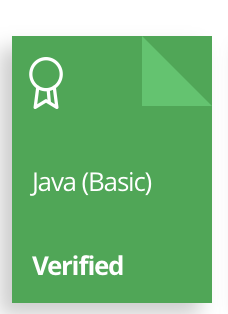

    

# HackerRank | Practice, Tutorials & Interview Preparation Solutions
This repository consists of solutions to HackerRank **practice**, **tutorials**, and **interview preparation** problems with **Algorithms**, **Data Structures**, **Python**, **mySQL**, **C#**, **C++**, **C** and **JavaScript**.

## Personal HackerRank Profile
[View Profile](https://www.hackerrank.com/llouis5314)

## HackerRank Badges

## HackerRank Certificates

## Table Of Contents
* [Practices Completed](#practices-completed)
* [Tutorials Completed](#tutorials-completed)
* [Interview Preparation Kit](#interview-preparation-kit)
* [Certificates](#certificates)

## Practices Solved (# Marks Not Solved)
* [Python](#python)
* [C++](#C++)
* [Java](#Java)
* [C](#C)
* [SQL](#sql)
* [Data Structures](data-structures)
* [Algorithms](algorithms)

### C++
|       Subdomain       |                 Challenge                 |                                             Problem                                                          | Difficulty |         Solution                                                                   |
| :-------------------: | :---------------------------------------: | :----------------------------------------------------------------------------------------------------------: | :--------: | :---------------------------------------------------------------------------------:|
|     Introduction      |   Say "Hello, World!" With C++            | [Problem](https://www.hackerrank.com/challenges/cpp-hello-world/problem?isFullScreen=true)                   |    Easy    | # |     [Solution](/CPP/)                                                             |
|     Introduction      |   Input And Output                        | [Problem](https://www.hackerrank.com/challenges/cpp-input-and-output/problem?isFullScreen=true)              |    Easy    | # |     [Solution](/CPP/)                                                             |
|     Introduction      |   Basic Data Types                        | [Problem](https://www.hackerrank.com/challenges/c-tutorial-basic-data-types/problem?isFullScreen=true)       |    Easy    | # |     [Solution](/CPP/)                                                             |
|     Introduction      |   Conditional Statements                  | [Problem](https://www.hackerrank.com/challenges/c-tutorial-conditional-if-else/problem?isFullScreen=true)    |    Easy    | # |     [Solution](/CPP/)                                                             |
|     Introduction      |   For Loop                                | [Problem](https://www.hackerrank.com/challenges/c-tutorial-for-loop/problem?isFullScreen=true)               |    Easy    | # |     [Solution](/CPP/)                                                             |
|     Introduction      |   Functions                               | [Problem](https://www.hackerrank.com/challenges/c-tutorial-functions/problem?isFullScreen=true)              |    Easy    | # |     [Solution](/CPP/)                                                             |
|     Introduction      |   Pointer                                 | [Problem](https://www.hackerrank.com/challenges/c-tutorial-pointer/problem?isFullScreen=true)                |    Easy    | # |     [Solution](/CPP/)                                                             |
|     Introduction      |   Arrays Introduction                     | [Problem](https://www.hackerrank.com/challenges/arrays-introduction/problem?isFullScreen=true)               |    Easy    | # |     [Solution](/CPP/)                                                             |
|     Introduction      |   Variable Sized Array                    | [Problem](https://www.hackerrank.com/challenges/variable-sized-arrays/problem?isFullScreen=true)             |    Easy    | # |     [Solution](/CPP/)                                                             |
|     Strings           |   Attribute Parser                        | [Problem](https://www.hackerrank.com/challenges/attribute-parser/problem?isFullScreen=true)                  |   Medium   | # |     [Solution](/CPP/)                                                             |
|     Strings           |   StringStream                            | [Problem](https://www.hackerrank.com/challenges/c-tutorial-stringstream/problem?isFullScreen=true)           |    Easy    | # |     [Solution](/CPP/)                                                             |
|     Strings           |   Strings                                 | [Problem](https://www.hackerrank.com/challenges/c-tutorial-strings/problem?isFullScreen=true)                |    Easy    | # |     [Solution](/CPP/)                                                             |
|     Classes           |   Structs                                 | [Problem](https://www.hackerrank.com/challenges/c-tutorial-struct/problem?isFullScreen=true)                 |    Easy    | # |     [Solution](/CPP/)                                                             |
|     Classes           |   Class                                   | [Problem](https://www.hackerrank.com/challenges/c-tutorial-class/problem?isFullScreen=true)                  |    Easy    | # |     [Solution](/CPP/)                                                             |
|     Classes           |   Classes and Objects                     | [Problem](https://www.hackerrank.com/challenges/classes-objects/problem?isFullScreen=true)                   |    Easy    |      [Solution](/CPP/Prepare_Cpp_Classes_ClassesAndObjects.cpp)                    |
|     Classes           |   Box It!                                 | [Problem](https://www.hackerrank.com/challenges/box-it/problem?isFullScreen=true)                            |    Easy    |      [Solution](/CPP/Prepare_Cpp_Classes_BoxIt!.cpp)                               |
|     Classes           |   Inherited Code                          | [Problem](https://www.hackerrank.com/challenges/inherited-code/problem?isFullScreen=true)                    |   Medium   |      [Solution](/CPP/Prepare_CPP_Classes_InheritedCode.cpp)                        |
|     Classes           |   Exceptional Server                      | [Problem](https://www.hackerrank.com/challenges/exceptional-server/problem?isFullScreen=true)                |   Medium   |      [Solution](/CPP/Prepare_Cpp_Classes_ExceptionalServer.cpp)                    |
|     Classes           |   Virtual Functions                       | [Problem](https://www.hackerrank.com/challenges/virtual-functions/problem?isFullScreen=true)                 |   Medium   |      [Solution](/CPP/Prepare_Cpp_Classes_VirtualFuncrtions.cpp)                    |
|     Classes           |   Abstract Classes - Polymorphism         | [Problem](https://www.hackerrank.com/challenges/abstract-classes-polymorphism/problem?isFullScreen=true)     |    Hard    |      [Solution](/CPP/Prepare_Cpp_Classes_AbstractClassesPolymorphism.cpp)          |
|     STL               |   Vector-Sort                             | [Problem](https://www.hackerrank.com/challenges/vector-sort/problem?isFullScreen=true)                       |    Easy    |      [Solution](/CPP/Prepare_Cpp_STL_VectorSort.cpp)                               |
|     STL               |   Vector-Erase                            | [Problem](https://www.hackerrank.com/challenges/vector-erase/problem?isFullScreen=true)                      |    Easy    | # |     [Solution](/CPP/)                                                             |
|     STL               |   Lower Bound-STL                         | [Problem](https://www.hackerrank.com/challenges/cpp-lower-bound/problem?isFullScreen=true)                   |    Easy    | # |     [Solution](/CPP/)                                                             |
|     STL               |   Sets-STL                                | [Problem](https://www.hackerrank.com/challenges/cpp-sets/problem?isFullScreen=true)                          |    Easy    |      [Solution](/CPP/Prepare_Cpp_STL_SetSTL.cpp)                                   |
|     STL               |   Maps-STL                                | [Problem](https://www.hackerrank.com/challenges/cpp-maps/problem?isFullScreen=true)                          |    Easy    |      [Solution](/CPP/Prepare_Cpp_STL_MapsSTL.cpp)                                  |
|     STL               |   Print Pretty                            | [Problem](https://www.hackerrank.com/challenges/prettyprint/problem?isFullScreen=true)                       |    Easy    |      [Solution](/CPP/Prepare_Cpp_STL_PrintPretty.cpp)                              |
|     STL               |   Deque-STL                               | [Problem](https://www.hackerrank.com/challenges/deque-stl/problem?isFullScreen=true)                         |   Medium   |      [Solution](/CPP/Prepare_Cpp_STL_DequeSTL.cpp)                                 |
|     Inheritance       |   Inheritance Introduction                | [Problem](https://www.hackerrank.com/challenges/inheritance-introduction/problem?isFullScreen=true)          |    Easy    |      [Solution](/CPP/Prepare_Cpp_Inheritance_InheritanceIntroduction.cpp)          |
|     Inheritance       |   Rectangle Area                          | [Problem](https://www.hackerrank.com/challenges/rectangle-area/problem?isFullScreen=true)                    |    Easy    |      [Solution](/CPP/Prepare_Cpp_Inheritance_RectangleArea.cpp)                    |
|     Inheritance       |   Multi Level Inheritance                 | [Problem](https://www.hackerrank.com/challenges/multi-level-inheritance-cpp/problem?isFullScreen=true)       |    Easy    | # |     [Solution](/CPP/)                                                             |
|     Inheritance       |   Accessing Inherited Functions           | [Problem](https://www.hackerrank.com/challenges/accessing-inherited-functions/problem?isFullScreen=true)     |   Medium   | # |     [Solution](/CPP/)                                                             |
|     Inheritance       |   Magic Spells                            | [Problem](https://www.hackerrank.com/challenges/magic-spells/problem?isFullScreen=true)                      |    Hard    |      [Solution](/CPP/Prepare_Cpp_Inheritance_MagicSpells.cpp)                      |
|     Debugging         |   Hotel Prices                            | [Problem](https://www.hackerrank.com/challenges/hotel-prices/problem?isFullScreen=true)                      |   Medium   |      [Solution](/CPP/Prepare_Cpp_Debugging_HotelPrices.cpp)                        |
|     Debugging         |   Cpp exception handling                  | [Problem](https://www.hackerrank.com/challenges/cpp-exception-handling/problem?isFullScreen=true)            |   Medium   |      [Solution](/CPP/Prepare_Cpp_Debugging_CppExceptionHandling.cpp)               |
|     Debugging         |   Overloading Ostream Operator            | [Problem](https://www.hackerrank.com/challenges/overloading-ostream-operator/problem?isFullScreen=true)      |   Medium   |      [Solution](/CPP/Prepare_Cpp_Debugging_OverloadingOstreamOperator.cpp)         |
|     Debugging         |   Messages Order                          | [Problem](https://www.hackerrank.com/challenges/messages-order/problem?isFullScreen=true)                    |   Medium   |      [Solution](/CPP/Prepare_Cpp_Debugging_MessagesOrder.cpp)                      |
|     Other Concepts    |   C++ Class Templates                     | [Problem](https://www.hackerrank.com/challenges/c-class-templates/problem?isFullScreen=true)                 |    Easy    |      [Solution](/CPP/Prepare_Cpp_OtjerConcepts_CppClassTemplates.cpp)              |
|     Other Concepts    |   Preprocessor Solution                   | [Problem](https://www.hackerrank.com/challenges/preprocessor-solution/problem?isFullScreen=true)             |    Easy    |      [Solution](/CPP/Prepare_Cpp_OtherConcepts_PreprocesssorSolition.cpp)          |
|     Other Concepts    |   Operator Overloading                    | [Problem](https://www.hackerrank.com/challenges/operator-overloading/problem?isFullScreen=true)              |   Medium   |      [Solution](/CPP/Prepare_Cpp_OtherConcepts_OperatorOverload.cpp)               |
|     Other Concepts    |   Overload Operators                      | [Problem](https://www.hackerrank.com/challenges/overload-operators/problem?isFullScreen=true)                |    Easy    | # |     [Solution](/CPP/)                                                             |
|     Other Concepts    |   Attending Workshops                     | [Problem](https://www.hackerrank.com/challenges/attending-workshops/problem?isFullScreen=true)               |   Medium   |      [Solution](/CPP/Prepare_Cpp_OtherConcpts_AttendingWorkshops.cpp)              |
|     Other Concepts    |   C++ Class Template Specialization       | [Problem](https://www.hackerrank.com/challenges/cpp-class-template-specialization/problem?isFullScreen=true) |   Medium   |      [Solution](/CPP/Prepare_Cpp_OtherConcepts_CppClassTemplateSpecialization.cpp) |
|     Other Concepts    |   C++ Variadics                           | [Problem](https://www.hackerrank.com/challenges/cpp-variadics/problem?isFullScreen=true)                     |    Hard    |      [Solution](/CPP/Prepare_Cpp_OtherConcepts_CppVariadics.cpp)                   |
|     Other Concepts    |   Bit Array                               | [Problem](https://www.hackerrank.com/challenges/bitset-1/problem?isFullScreen=true)                          |    Hard    |      [Solution](/CPP/Prepare_Cpp_OtherConcepts_BitArray.cpp)                       |

### Python
|       Subdomain         |                 Challenge                          |                                             Problem                                                                            | Difficulty |         Solution                                                                                              |
| :---------------------: | :------------------------------------------------: | :----------------------------------------------------------------------------------------------------------------------------: | :--------: | :-----------------------------------------------------------------------------------------------------------: |
|     Introduction        |      Say 'Hello, World!' With Python               |             [Problem](https://www.hackerrank.com/challenges/py-hello-world/problem)                                            |    Easy    |      [Solution](/Python/Prepare_Pyhton_Introduction_SayHelloWorldWithPython.py )                              |
|     Introduction        |              Python If-Else                        |               [Problem](https://www.hackerrank.com/challenges/py-if-else/problem)                                              |    Easy    |      [Solution](/Python/Prepare_Python_Introduction_PythonIfElse.py)                                          |
|     Introduction        |           Arithmetic Operators                     |       [Problem](https://www.hackerrank.com/challenges/python-arithmetic-operators/problem)                                     |    Easy    |      [Solution](/Python/Prepare_Python_Introduction_ArithmeticOpperators.py)                                  |
|     Introduction        |              Python Division                       |             [Problem](https://www.hackerrank.com/challenges/python-division/problem)                                           |    Easy    |      [Solution](/Python/Prepare_Python_Introduction_ArithmeticOpperators.py)                                  |
|     Introduction        |                   Loops                            |              [Problem](https://www.hackerrank.com/challenges/python-loops/problem)                                             |    Easy    |      [Solution](/Python/Prepare_Python_Introduction_Loop.py)                                                  |
|     Introduction        |             Write a function                       |            [Problem](https://www.hackerrank.com/challenges/write-a-function/problem)                                           |   Medium   |      [Solution](/Python/Prepare_Python_Introduction_WriteAFunction.py)                                        |
|     Introduction        |              Print Function                        |              [Problem](https://www.hackerrank.com/challenges/python-print/problem)                                             |    Easy    |      [Solution](/Python/Prepare_Python_Introduction_PrintFuction.py)                                          |
|   Basic Data Types      |            List Comprehensions                     |           [Problem](https://www.hackerrank.com/challenges/list-comprehensions/problem)                                         |    Easy    |      [Solution](/Python/Prepare_Python_BasicDataTypes_ListComprehensions.py)                                  |
|   Basic Data Types      |         Find the Runner-Up Score!                  |  [Problem](https://www.hackerrank.com/challenges/find-second-maximum-number-in-a-list/problem)                                 |    Easy    |      [Solution](/Python/Prepare_Python_BasicDataTypes_FindTheRunnerUpScore!.py)                               |
|   Basic Data Types      |               Nested Lists                         |               [Problem](https://www.hackerrank.com/challenges/nested-list/problem)                                             |    Easy    |      [Solution](/Python/Prepare_Python_BasicDataTypes_NestedLists.py)                                         |
|   Basic Data Types      |          Finding the percentage                    |         [Problem](https://www.hackerrank.com/challenges/finding-the-percentage/problem)                                        |    Easy    |      [Solution](/Python/Prepare_Python_BasicDataTypes_FindingTherPercentage.py)                               |
|   Basic Data Types      |                   Lists                            |              [Problem](https://www.hackerrank.com/challenges/python-lists/problem)                                             |    Easy    |      [Solution](/Python/Prepare_Python_BasicDataTypes_Lists.py)                                               |
|   Basic Data Types      |                  Tuples                            |              [Problem](https://www.hackerrank.com/challenges/python-tuples/problem)                                            |    Easy    |      [Solution](/Python/Prepare_Python_BasicDataTypes_Tuples.py)                                              |
|        Strings          |                 sWAP cASE                          |                [Problem](https://www.hackerrank.com/challenges/swap-case/problem)                                              |    Easy    |      [Solution](/Python/Prepare_Python_String_sWARcASE.py)                                                    |
|        Strings          |           String Split and Join                    |      [Problem](https://www.hackerrank.com/challenges/python-string-split-and-join/problem)                                     |    Easy    |      [Solution](/Python/Prepare_Python_Strings_StringSplitAndJoin.py)                                         |
|        Strings          |             What's Your Name?                      |             [Problem](https://www.hackerrank.com/challenges/whats-your-name/problem)                                           |    Easy    |      [Solution](/Python/Prepare_Python_Strings_WhatsYourName.py)                                              |
|        Strings          |                 Mutations                          |            [Problem](https://www.hackerrank.com/challenges/python-mutations/problem)                                           |    Easy    |      [Solution](/Python/Prepare_Python_String_Mutations.py)                                                   |
|        Strings          |               Find a string                        |              [Problem](https://www.hackerrank.com/challenges/find-a-string/problem)                                            |    Easy    |      [Solution](/Python/Prepare_Python_String_FindAString.py)                                                 |
|        Strings          |             String Validators                      |            [Problem](https://www.hackerrank.com/challenges/string-validators/problem)                                          |    Easy    |      [Solution](/Python/Prepare_Python_String_StringValdators.py)                                             |
|        Strings          |              Text Alignment                        |             [Problem](https://www.hackerrank.com/challenges/text-alignment/problem)                                            |    Easy    |      [Solution](/Python/Prepare_Python_String_TextAlignment.py)                                               |
|        Strings          |                 Text Wrap                          |                [Problem](https://www.hackerrank.com/challenges/text-wrap/problem)                                              |    Easy    |      [Solution](/Python/Prepare_Python_Strings_TextWrap.py)                                                   |
|        Strings          |             Designer Door Mat                      |            [Problem](https://www.hackerrank.com/challenges/designer-door-mat/problem)                                          |    Easy    |      [Solution](/Python/Prepare_Python_Strings_DegignerDoorMat.py)                                            |
|        Strings          |             String Formatting                      |        [Problem](https://www.hackerrank.com/challenges/python-string-formatting/problem)                                       |    Easy    |      [Solution](/Python/Prepare_Python_Strings_StringFormationg.py)                                           |
|        Strings          |             Alphabet Rangoli                       |            [Problem](https://www.hackerrank.com/challenges/alphabet-rangoli/problem)                                           |    Easy    |      [Solution](/Python/Prepare_Python_String_AlphabetRangoli.py)                                             |
|        Strings          |                Capitalize!                         |               [Problem](https://www.hackerrank.com/challenges/capitalize/problem)                                              |    Easy    |      [Solution](/Python/Prepare_Python_Strings_Capitalize.py)                                                 |
|        Strings          |              The Minion Game                       |             [Problem](https://www.hackerrank.com/challenges/the-minion-game/problem)                                           |   Medium   |      [Solution](/Python/Prepare_Python_Strings_TheMinionGame.py)                                              |
|        Strings          |             Merge the Tools!                       |             [Problem](https://www.hackerrank.com/challenges/merge-the-tools/problem)                                           |   Medium   |      [Solution](/Python/Prepare_Python_Strings_MergeTheTools.py)                                              |
|         Sets            |           Introduction to Sets                     |         [Problem](https://www.hackerrank.com/challenges/py-introduction-to-sets/problem)                                       |    Easy    |      [Solution](/Python/Prepare_Python_Sets_IntroductionToSets.py)                                            |
|         Sets            |                 No Idea!                           |                 [Problem](https://www.hackerrank.com/challenges/no-idea/problem)                                               |   Medium   |      [Solution](/Python/Prepare_Python_Sets_NoIdea.py)                                                        |
|         Sets            |           Symmetric Difference                     |          [Problem](https://www.hackerrank.com/challenges/symmetric-difference/problem)                                         |    Easy    |      [Solution](/Python/Prepare_Python_Sets_SymmetricDifference.py)                                           |
|         Sets            |                 Set add()                          |               [Problem](https://www.hackerrank.com/challenges/py-set-add/problem)                                              |    Easy    |      [Solution](/Python/Prepare_Python_Sets_SetAdd.py)                                                        |
|         Sets            |       Set discard() remove() pop()                 |        [Problem](https://www.hackerrank.com/challenges/py-set-discard-remove-pop/problem)                                      |    Easy    |      [Solution](/Python/Prepare_Python_Sets_SetDiscardRemovePop.py)                                           |
|         Sets            |           Set union() Operation                    |              [Problem](https://www.hackerrank.com/challenges/py-set-union/problem)                                             |    Easy    |      [Solution](/Python/Prepare_Python_Sets_SetUnionOperator.py)                                              |
|         Sets            |       Set intersection() Operation                 |      [Problem](https://www.hackerrank.com/challenges/py-set-intersection-operation/problem)                                    |    Easy    |      [Solution](/Python/Prepare_Python_Sets_SetIntersectionOperation.py)                                      |
|         Sets            |        Set difference() Operation                  |       [Problem](https://www.hackerrank.com/challenges/py-set-difference-operation/problem)                                     |    Easy    |      [Solution](/Python/Prepare_Python_Sets_SetDifferenceOperation.py)                                        |
|         Sets            |   Set symmetric_difference() Operation             |  [Problem](https://www.hackerrank.com/challenges/py-set-symmetric-difference-operation/problem)                                |    Easy    |      [Solution](/Python/Prepare_Python_Sets_SymmetricDifference.py)                                           |
|         Sets            |               Set Mutations                        |            [Problem](https://www.hackerrank.com/challenges/py-set-mutations/problem)                                           |    Easy    |      [Solution](/Python/Prepare_Python_Sets_SetMutations.py)                                                  |
|         Sets            |            The Captain's Room                      |          [Problem](https://www.hackerrank.com/challenges/py-the-captains-room/problem)                                         |    Easy    |      [Solution](/Python/Prepare_Python_Sets_TheCaptiansRoom.py)                                               |
|         Sets            |               Check Subset                         |             [Problem](https://www.hackerrank.com/challenges/py-check-subset/problem)                                           |    Easy    |      [Solution](/Python/Prepare_Python_Sets_CheckSubset.py)                                                   |
|         Sets            |           Check Strict Superset                    |        [Problem](https://www.hackerrank.com/challenges/py-check-strict-superset/problem)                                       |    Easy    |      [Solution](/Python/Prepare_Python_Sets_CheckStrictSuperset.py)                                           |
|         Math            |             Polar Coordinates                      |            [Problem](https://www.hackerrank.com/challenges/polar-coordinates/problem)                                          |    Easy    |      [Solution](/Python/Prepare_Python_Math_PolarCoordinates.py)                                              |
|         Math            |              Find Angle MBC                        |               [Problem](https://www.hackerrank.com/challenges/find-angle/problem)                                              |   Medium   |      [Solution](/Python/Prepare_Pyhton_Math_FindAngleMBC.py)                                                  |
|         Math            |             Triangle Quest 2                       |            [Problem](https://www.hackerrank.com/challenges/triangle-quest-2/problem)                                           |   Medium   |      [Solution](/Python/Prepare_Python_Math_TriangleQuest2.py)                                                |
|         Math            |                Mod Divmod                          |            [Problem](https://www.hackerrank.com/challenges/python-mod-divmod/problem)                                          |    Easy    |      [Solution](/Python/Prepare_Python_Math_ModDivmod.py)                                                     |
|         Math            |             Power - Mod Power                      |         [Problem](https://www.hackerrank.com/challenges/python-power-mod-power/problem)                                        |    Easy    |      [Solution](/Python/Prepare_Python_Math_PowerModPower.py)                                                 |
|         Math            |        Integers Come In All Sizes                  |    [Problem](https://www.hackerrank.com/challenges/python-integers-come-in-all-sizes/problem)                                  |    Easy    |      [Solution](/Python/Prepare_Python_Math_IntedersComeInAllSizes.py)                                        |
|         Math            |              Triangle Quest                        |             [Problem](https://www.hackerrank.com/challenges/python-quest-1/problem)                                            |   Medium   |      [Solution](/Python/Prepare_Python_Math_TriangleQuest.py)                                                 |
|       Itertools         |            itertools.product()                     |            [Problem](https://www.hackerrank.com/challenges/itertools-product/problem)                                          |    Easy    |      [Solution](/Python/Prepare_Python_Itertools_ItertoolsProduct.py)                                         |
|       Itertools         |         itertools.permutations()                   |         [Problem](https://www.hackerrank.com/challenges/itertools-permutations/problem)                                        |    Easy    |      [Solution](/Python/Prepare_Python_Itertools_itertoolsPermutations.py)                                    |
|       Itertools         |         itertools.combinations()                   |         [Problem](https://www.hackerrank.com/challenges/itertools-combinations/problem)                                        |    Easy    |      [Solution](/Python/Prepare_Python_itertools_itertoolsCombinstions.py)                                    |
|       Itertools         | itertools.combinations_with_replacement()          | [Problem](https://www.hackerrank.com/challenges/itertools-combinations-with-replacement/problem)                               |    Easy    |      [Solution](/Python/Prepare_Python_Itertools_itertoolsCombinationsWithReplacement.py)                     |
|       Itertools         |           Compress the String!                     |           [Problem](https://www.hackerrank.com/challenges/compress-the-string/problem)                                         |   Medium   |      [Solution](/Python/Prepare_Python_Itertools_CompressTheString.py)                                        |
|       Itertools         |          Iterables and Iterators                   |         [Problem](https://www.hackerrank.com/challenges/iterables-and-iterators/problem)                                       |   Medium   |      [Solution](/Python/Prepare_Python_Itertools_IterablesAdIterators.py)                                     |
|       Itertools         |               Maximize It!                         |               [Problem](https://www.hackerrank.com/challenges/maximize-it/problem)                                             |    Hard    |      [Solution](/Python/Prepare_Python_Itertools_MaximizeIt.py)                                               |
|      Collections        |           collections.Counter()                    |           [Problem](https://www.hackerrank.com/challenges/collections-counter/problem)                                         |    Easy    |      [Solution](/Python/Prepare_Python_Collections_collectionsCounter.py)                                     |
|      Collections        |           defaultdict Tutorial                     |          [Problem](https://www.hackerrank.com/challenges/defaultdict-tutorial/problem)                                         |    Easy    |      [Solution](/Python/Prepare_Python_Collections_DefaultdictTutorai.py)                                     |
|      Collections        |         collections.namedtuple()                   |        [Problem](https://www.hackerrank.com/challenges/py-collections-namedtuple/problem)                                      |    Easy    |      [Solution](/Python/Prepare_Python_Collections_CollectionsNamedtupples.py)                                |
|      Collections        |         collections.OrderedDict()                  |       [Problem](https://www.hackerrank.com/challenges/py-collections-ordereddict/problem)                                      |    Easy    |      [Solution](/Python/Prepare_Python_Collections_CollectionsOrderedDict.py)                                 |
|      Collections        |            collections.deque()                     |          [Problem](https://www.hackerrank.com/challenges/py-collections-deque/problem)                                         |    Easy    |      [Solution](/Python/Prepare_Python_Collections_CollectionsDeque.py)                                       |
|      Collections        |               Company Logo                         |              [Problem](https://www.hackerrank.com/challenges/most-commons/problem)                                             |   Medium   |      [Solution](/Python/Prepare_Python_Collections_CompanyLogo.py)                                            |
|      Collections        |                Word Order                          |               [Problem](https://www.hackerrank.com/challenges/word-order/problem)                                              |   Medium   |      [Solution](/Python/Prepare_Python_Collections_WordOrder.py)                                              |
|      Collections        |                Piling Up!                          |                [Problem](https://www.hackerrank.com/challenges/piling-up/problem)                                              |   Medium   |      [Solution](/Python/Prepare_Python_Collections_PillingUp.py)                                              |
|     Date and Time       |              Calendar Module                       |             [Problem](https://www.hackerrank.com/challenges/calendar-module/problem)                                           |    Easy    |      [Solution](/Python/Prepare_Python_DateAndTime_CalendarModule.py)                                         |
|     Date and Time       |                Time Delta                          |            [Problem](https://www.hackerrank.com/challenges/python-time-delta/problem)                                          |   Medium   |      [Solution](/Python/Prepare_Python_DateAndTime_timeDelta.py)                                              |
| Errors and Exceptions   |                Exceptions                          |               [Problem](https://www.hackerrank.com/challenges/exceptions/problem)                                              |    Easy    |      [Solution](/Python/Prepare_Python_ErrorsAndExceptions_Exceptions.py)                                     |
| Errors and Exceptions   |              Incorrect Regex                       |             [Problem](https://www.hackerrank.com/challenges/incorrect-regex/problem)                                           |    Easy    |      [Solution](/Python/Prepare_Python_ErrorsAndExceptions_IncorrectRegex.py)                                 |
|        Classes          |  Classes - Dealing with Complex Numbers            |  [Problem](https://www.hackerrank.com/challenges/class-1-dealing-with-complex-numbers/problem)                                 |   Medium   |      [Solution](/Python/Prepare_Python_Classes_ClassesDealingWithcomplexnumbers.py)                           |
|        Classes          |    Class 2 - Find the Torsional Angle              |    [Problem](https://www.hackerrank.com/challenges/class-2-find-the-torsional-angle/problem)                                   |    Easy    |      [Solution](/Python/Prepare_Python_Classes_Class2FindTheTorsionalAngle.py)                                |
|       Built-ins         |                  Zipped!                           |    [Problem](https://www.hackerrank.com/challenges/zipped/problem?isFullScreen=true)                                           |    Easy    |      [Solution](/Python/Prepare_Python_BuitIn_Zipped.py)                                                      |
|       Built-ins         |                  Input()                           |    [Problem](https://www.hackerrank.com/challenges/input/problem?isFullScreen=true)                                            |    Easy    |      [Solution](/Python/Prepare_Python_BuiltIns_Input.py)                                                     |
|       Built-ins         |         Python Evalution                           |    [Problem](https://www.hackerrank.com/challenges/python-eval/problem?isFullScreen=true)                                      |    Easy    |      [Solution](/Python/Prepare_Python_BuildIns_PythonEvaluation.py)                                          |
|       Built-ins         |         Athlete Sort                               |    [Problem](https://www.hackerrank.com/challenges/python-sort-sort/problem?isFullScreen=true)                                 |   Medium   |      [Solution](/Python/Prepare_Python_BuiltIns_AthleteSort.py)                                               |
|       Built-ins         |         Any or All                                 |    [Problem](https://www.hackerrank.com/challenges/any-or-all/problem?isFullScreen=true)                                       |    Easy    |      [Solution](/Python/Prepare_Python_BuiltIns_AnyOrAll.py)                                                  |
|       Built-ins         |         ginortS                                    |    [Problem](https://www.hackerrank.com/challenges/ginorts/problem?isFullScreen=true)                                          |   Medium   |      [Solution](/Python/Prepare_Python_BuiltIns_ginortS.py)                                                   |
| Python Functional       |    Map and Lambda Function                         |    [Problem](https://www.hackerrank.com/challenges/map-and-lambda-expression/problem?isFullScreen=true)                        |    Easy    |      [Solution](/Python/Prepare_Python_PythonFunctionals_MapAndLambdaFunciton.py)                             |
| Python Functional       |  Validating Email Addresses With a Filter          |    [Problem](https://www.hackerrank.com/challenges/validate-list-of-email-address-with-filter/problem?isFullScreen=true)       |   Medium   |      [Solution](/Python/Prepare_Python_PythonFunctionals_ValidatingEmailAddressesWithAFilter.py)              |
| Python Functional       |  Reduce Function                                   |    [Problem](https://www.hackerrank.com/challenges/reduce-function/problem?isFullScreen=true)                                  |   Medium   |      [Solution](/Python/Prepare_Python_PythonFunctionals_ReduceFuntion.py)                                    |
| Regex and Parsing       |  Detect Floating Point Number                      |    [Problem](https://www.hackerrank.com/challenges/introduction-to-regex/problem?isFullScreen=true)                            |    Easy    |      [Solution](/Python/Prepare_Python_RegexAndParsing_DetectFloatingPointNumber.py)                          |
| Regex and Parsing       |  Re.split()                                        |    [Problem](https://www.hackerrank.com/challenges/re-split/problem?isFullScreen=true)                                         |    Easy    |      [Solution](/Python/Prepare_Python_RegexAndParsing_ReSplit.py)                                            |
| Regex and Parsing       |  Group(), Groups(), & Groupdict()                  |    [Problem](https://www.hackerrank.com/challenges/re-group-groups/problem?isFullScreen=true)                                  |    Easy    |      [Solution](/Python/Prepare_Python_RegexAndParsing_GroupGroupsGroupdict.py)                               |
| Regex and Parsing       |  Re,findall() & Re.finditer()                      |    [Problem](https://www.hackerrank.com/challenges/re-findall-re-finditer/problem?isFullScreen=true)                           |    Easy    |      [Solution](/Python/Prepare_Python_RegexAndParsing_ReFindallReFinditer.py)                                |
| Regex and Parsing       |  Re.start() & Re.end()                             |    [Problem](https://www.hackerrank.com/challenges/re-start-re-end/problem?isFullScreen=true)                                  |    Easy    |      [Solution](/Python/Prepare_Python_RegexAndParsing_ReStartReEnd.py)                                       |
| Regex and Parsing       |  Regex Substitution                                |    [Problem](https://www.hackerrank.com/challenges/re-sub-regex-substitution/problem?isFullScreen=true)                        |   Medium   |      [Solution](/Python/Prepare_Python_RegexAndParsing_RegexSubstitution.py)                                  |
| Regex and Parsing       |  Validating Roman Numerals                         |    [Problem](https://www.hackerrank.com/challenges/validate-a-roman-number/problem?isFullScreen=true)                          |    Easy    |      [Solution](/Python/Prepare_Python_RegexAndParsing_ValidatingRomanNumerals.py)                            |
| Regex and Parsing       |  Validating phone numbers                          |    [Problem](https://www.hackerrank.com/challenges/validating-the-phone-number/problem?isFullScreen=true)                      |    Easy    |      [Solution](/Python/Prepare_Python_RegexAndParsing_ValidatingPhoneNumber.py)                              |
| Regex and Parsing       |  Validating and Parsing Email Addresses            |    [Problem](https://www.hackerrank.com/challenges/validating-named-email-addresses/problem?isFullScreen=true)                 |    Easy    |      [Solution](/Python/Prepare_Python_RegexAndParsing_ValidatingAndParsingEmailAddresses.py)                 |
| Regex and Parsing       |  Hex Color Code                                    |    [Problem](https://www.hackerrank.com/challenges/hex-color-code/problem?isFullScreen=true)                                   |    Easy    |      [Solution](/Python/Prepare_Python_RegexAndParsing_HexColorCode.py)                                       |
| Regex and Parsing       |  HTML Parser - Part 1                              |    [Problem](https://www.hackerrank.com/challenges/html-parser-part-1/problem?isFullScreen=true)                               |    Easy    |      [Solution](/Python/Prepare_Python_RegexAndParsing_HTMLParserPart1.py)                                    |
| Regex and Parsing       |  HTML Parser - Part 2                              |    [Problem](https://www.hackerrank.com/challenges/html-parser-part-2/problem?isFullScreen=true)                               |    Easy    |      [Solution](/Python/Prepare_Python_RegexAndParsing_HTMLParserPart2.py)                                    |
| Regex and Parsing       |  Detect HTML Tags, Attributes and Attribute Values |    [Problem](https://www.hackerrank.com/challenges/detect-html-tags-attributes-and-attribute-values/problem?isFullScreen=true) |    Easy    |      [Solution](/Python/Prepare_Python_RegexAndParsing_DetectHTMLTagsAttrsibutesAndAttriuteValues.py)         |
| Regex and Parsing       |  Validating UID                                    |    [Problem](https://www.hackerrank.com/challenges/validating-uid/problem?isFullScreen=true)                                   |    Easy    |      [Solution](/Python/Prepare_Python_RegexAndParsing_ValidatingUID.py)                                      |
| Regex and Parsing       |  Validating Credit Car Numbers                     |    [Problem](https://www.hackerrank.com/challenges/validating-credit-card-number/problem?isFullScreen=true)                    |   Medium   |      [Solution](/Python/Prepare_Python_RegexAndParsing_ValidatingCreditCardNumbers.py)                        |
| Regex and Parsing       |  Validating Postal Codes                           |    [Problem](https://www.hackerrank.com/challenges/validating-postalcode/problem?isFullScreen=true)                            |    Hard    |      [Solution](/Python/Prepare_Python_RegexAndParsing_ValidatingPostalCode.py)                               |
| Regex and Parsing       |  Matrix Script                                     |    [Problem](https://www.hackerrank.com/challenges/matrix-script/problem?isFullScreen=true)                                    |    Hard    |      [Solution](/Python/Prepare_Python_RegexAndParsing.py)                                                    |
| XML                     |  XML 1 - Find the Score                            |    [Problem](https://www.hackerrank.com/challenges/xml-1-find-the-score/problem?isFullScreen=true)                             |    Easy    |      [Solution](/Python/Prepare_Python_XML_XML1FindTheScore.py)                                               |
| XML                     |  XML 2 - Find the Maximum Depth                    |    [Problem](https://www.hackerrank.com/challenges/xml2-find-the-maximum-depth/problem?isFullScreen=true)                      |    Easy    |      [Solution](/Python/Prepare_Python_XML_XML2FindTheMaximunDepth.py)                                        |
| Closures and Decorators |  Standardize Mobile Number Using Decorators        |    [Problem](https://www.hackerrank.com/challenges/standardize-mobile-number-using-decorators/problem?isFullScreen=true)       |    Easy    |      [Solution](/Python/Prepare_Python_ClosuresAndDecorators_StandardizeMobileNumberUsingDecorators.py)       |
| Closures and Decorators |  Decorators 2 - Name Directory                     |    [Problem](https://www.hackerrank.com/challenges/decorators-2-name-directory/problem?isFullScreen=true)                      |    Easy    |      [Solution](/Python/Prepare_Python_ClosuresAndDecorators_Decoractors2NameDirectory.py)                    |
| Numpy                   | Arrays                                             |    [Problem](https://www.hackerrank.com/challenges/np-arrays/problem?isFullScreen=true)                                        |    Easy    |      [Solution](/Python/Prepare_Python_Numpy_Arrays.py)                                                       |
| Numpy                   | Shape and Reshape                                  |    [Problem](https://www.hackerrank.com/challenges/np-shape-reshape/problem?isFullScreen=true)                                 |    Easy    |      [Solution](/Python/Prepare_Python_Numpy_ShapeAndReshape.py)                                              |
| Numpy                   | Transpose and Flatten                              |    [Problem](https://www.hackerrank.com/challenges/np-transpose-and-flatten/problem?isFullScreen=true)                         |    Easy    |      [Solution](/Python/Prepare_Python_Numpy_TransposeAndFlatten.py)                                          |
| Numpy                   | Concatenate                                        |    [Problem](https://www.hackerrank.com/challenges/np-concatenate/problem?isFullScreen=true)                                   |    Easy    |      [Solution](/Python/Prepare_Python_Numpy_Concatenate.py)                                                  |
| Numpy                   | Zeros and Ones                                     |    [Problem](https://www.hackerrank.com/challenges/np-zeros-and-ones/problem?isFullScreen=true)                                |    Easy    |      [Solution](/Python/Prepare_Python_Numpy_ZerosAndOnes.py)                                                 |
| Numpy                   | Eye and Identity                                   |    [Problem](https://www.hackerrank.com/challenges/np-eye-and-identity/problem?isFullScreen=true)                              |    Easy    |      [Solution](/Python/Prepare_Python_Numpy_EyeAndIdentity.py)                                               |
| Numpy                   | Array Mathematics                                  |    [Problem](https://www.hackerrank.com/challenges/np-array-mathematics/problem?isFullScreen=true)                             |    Easy    |      [Solution](/Python/Prepare_Python_Numpy_ArrayMathematics.py)                                             |
| Numpy                   | Floor, Ceil, and Rint                              |    [Problem](https://www.hackerrank.com/challenges/floor-ceil-and-rint/problem?isFullScreen=true)                              |    Easy    |      [Solution](/Python/Prepare_Python_Numpy_FloorCeilRint.py)                                                |
| Numpy                   | Sum and Prod                                       |    [Problem](https://www.hackerrank.com/challenges/np-sum-and-prod/problem?isFullScreen=true)                                  |    Easy    |      [Solution](/Python/Prepare_Python_Numpy_SumAndProd.py)                                                   |
| Numpy                   | Min and Max                                        |    [Problem](https://www.hackerrank.com/challenges/np-min-and-max/problem?isFullScreen=true)                                   |    Easy    |      [Solution](/Python/Prepare_Python_Numpy_MinAndMax.py)                                                    |
| Numpy                   | Mean, Var, and Std                                 |    [Problem](https://www.hackerrank.com/challenges/np-mean-var-and-std/problem?isFullScreen=true)                              |    Easy    |      [Solution](/Python/Prepare_Python_Numpy_MeanVarStd.py)                                                   |
| Numpy                   | Dot and Cross                                      |    [Problem](https://www.hackerrank.com/challenges/np-dot-and-cross/problem?isFullScreen=true)                                 |    Easy    |      [Solution](/Python/Prepare_Python_Numpy_DotAndCross.py)                                                  |
| Numpy                   | Inner and Outer                                    |    [Problem](https://www.hackerrank.com/challenges/np-inner-and-outer/problem?isFullScreen=true)                               |    Easy    |      [Solution](/Python/Prepare_Python_Numpy_InnerAndOuter.py)                                                |
| Numpy                   | Polynormials                                       |    [Problem](https://www.hackerrank.com/challenges/np-polynomials/problem?isFullScreen=true)                                   |    Easy    |      [Solution](/Python/Prepare_Python_Numpy_Polynomials.py)                                                  |
| Numpy                   | Linear Algebra                                     |    [Problem](https://www.hackerrank.com/challenges/np-linear-algebra/problem?isFullScreen=true)                                |    Easy    |      [Solution](/Python/Prepare_Python_Numpy_LinearAlgebra.py)                                                |
| Debugging               | Words Score                                        |    [Problem](https://www.hackerrank.com/challenges/words-score/problem?isFullScreen=true)                                      |   Medium   |      [Solution](/Python/Prepare_Python_Debugging_WordsScore.py)                                               |
| Debugging               | Default Arguments                                  |    [Problem](https://www.hackerrank.com/challenges/default-arguments/problem?isFullScreen=true)                                |   Medium   |      [Solution](/Python/Prepare_Python_Debugging_DefaultArguments.py)                                         |

### Java
|       Subdomain             |                   Challenge                    |                                                Problem                                                            | Difficulty |                                                  Solution                                        |
| :-------------------------: | :--------------------------------------------: | :---------------------------------------------------------------------------------------------------------------: | :--------: | :----------------------------------------------------------------------------------------------: |
|    Introduction             |         Welcome to Java!                       | [Problem](https://www.hackerrank.com/challenges/welcome-to-java/problem?isFullScreen=true)                        |  Easy      |  [Solution](/Java/Prepare_Java_Introduction_WelcomeToJava.java)                                  |
|    Introduction             |     Java Stdin and Stout I                     | [Problem](https://www.hackerrank.com/challenges/java-stdin-and-stdout-1/problem?isFullScreen=true)                |  Easy      |  [Solution](/Java/Prepare_Java_Introduction_JavaStdinAndStdout1.java)                            |   
|    Introduction             |     Java If-Else                               | [Problem](https://www.hackerrank.com/challenges/java-if-else/problem?isFullScreen=true)                           |  Easy      |  [Solution](/Java/Prepare_Java_Introduction_JavaIfElse.java)                                     |
|    Introduction             |     Java Stdin and Stout II                    | [Problem](https://www.hackerrank.com/challenges/java-stdin-stdout/problem?isFullScreen=true)                      |  Easy      |  [Solution](/Java/Prepare_Java_Introduction_JavaStdinAndStdout2.java)                            |
|    Introduction             |     Java Output Formatting                     | [Problem](https://www.hackerrank.com/challenges/java-output-formatting/problem?isFullScreen=true)                 |  Easy      |  [Solution](/Java/Prepare_Java_Introjuction_JavaOutputFormatting.java)                           |
|    Introduction             |     Java Loops I                               | [Problem](https://www.hackerrank.com/challenges/java-loops-i/problem?isFullScreen=true)                           |  Easy      |  [Solution](/Java/Prepare_Java_Introuction_JavaLoops1.java)                                      |
|    Introduction             |     Java Loops II                              | [Problem](https://www.hackerrank.com/challenges/java-loops/problem?isFullScreen=true)                             |  Easy      |  [Solution](/Java/Prepare_Java_Introduction_JavaLoops2.java)                                     |
|    Introduction             |     Java Datatypes                             | [Problem](https://www.hackerrank.com/challenges/java-datatypes/problem?isFullScreen=true)                         |  Easy      |  [Solution](/Java/Prepare_Java_Introduction_JavaDatatypes.java)                                  |
|    Introduction             |     Java End-of-file                           | [Problem](https://www.hackerrank.com/challenges/java-end-of-file/problem?isFullScreen=true)                       |  Easy      |  [Solution](/Java/Prepare_Java_Introduction_JavaEndOfFile.java)                                  |
|    Introduction             |     Java Static Initializer Block              | [Problem](https://www.hackerrank.com/challenges/java-static-initializer-block/problem?isFullScreen=true)          |  Easy      |  [Solution](/Java/Prepare_Java_Introduction_JavaStaticInitializerBlock.java)                     |
|    Introduction             |     Java Int to String                         | [Problem](https://www.hackerrank.com/challenges/java-int-to-string/problem?isFullScreen=true)                     |  Easy      |  [Solution](/Java/Prepare_Java_Introduction_JavaIntToString.java)                                |
|    Introduction             |     Java Date and Time                         | [Problem](https://www.hackerrank.com/challenges/java-date-and-time/problem?isFullScreen=true)                     |  Easy      |  [Solution](/Java/Prepare_Java_Introduction_JavaDateAndTime.java)                                |
|    Introduction             |     Java Currency Formatter                    | [Problem](https://www.hackerrank.com/challenges/java-currency-formatter/problem?isFullScreen=true)                |  Easy      |  [Solution](/Java/Prepare_Java_Introduction_JavaCurrencyFormatter.java )                         |
|    String                   |     Java Strings Introduction                  | [Problem](https://www.hackerrank.com/challenges/java-strings-introduction/problem?isFullScreen=true)              |  Easy      |  [Solution](/Java/Prepare_Java_String_JavaStringsIntroduction.java)                              |
|    String                   |     Java Substring                             | [Problem](https://www.hackerrank.com/challenges/java-substring/problem?isFullScreen=true)                         |  Easy      |  [Solution](/Java/Prepare_Java_Stings_JavaSubstring.java)                                        |
|    String                   |     Java Substring Comparisons                 | [Problem](https://www.hackerrank.com/challenges/java-string-compare/problem?isFullScreen=true)                    |  Easy      |  [Solution](/Java/Prepare_Java_Strings_JavaSubstringComparisons.java)                            |
|    String                   |     Java String Reverse                        | [Problem](https://www.hackerrank.com/challenges/java-string-reverse/problem?isFullScreen=true)                    |  Easy      |  [Solution](/Java/Prepare_Java_Strings_JavaStringReverse.java)                                   |
|    String                   |     Java Anagrams                              | [Problem](https://www.hackerrank.com/challenges/java-anagrams/problem?isFullScreen=true)                          |  Easy      |  [Solution](/Java/Prepare_Java_Strings_JavaAnagrams.java)                                        |
|    String                   |     Java String Tokens                         | [Problem](https://www.hackerrank.com/challenges/java-string-tokens/problem?isFullScreen=true)                     |  Easy      |  [Solution](/Java/Prepare_Java_Strings_JavaStringTokens.java)                                    |
|    String                   |     Pattern Syntax checker                     | [Problem](https://www.hackerrank.com/challenges/pattern-syntax-checker/problem?isFullScreen=true)                 |  Easy      |  [Solution](/Java/Prepare_Java_Strings_PatternSyntaxChecker.java)                                |
|    String                   |     Java Regex                                 | [Problem](https://www.hackerrank.com/challenges/java-regex/problem?isFullScreen=true)                             |   Medium   |  [Solution](/Java/Prepare_Java_Strings_JavaRegex.java)                                           |
|    String                   |     Java Regex 2 - Duplicate Words             | [Problem](https://www.hackerrank.com/challenges/duplicate-word/problem?isFullScreen=true)                         |   Medium   |  [Solution](/Java/Prepare_Java_Strings_JavaRegex2DuplicateWords.java)                            |
|    String                   |     Valid Username regular Expressions         | [Problem](https://www.hackerrank.com/challenges/valid-username-checker/problem?isFullScreen=true)                 |  Easy      |  [Solution](/Java/Prepare_Java_Strings_ValidUsernameRegularExpression.java)                      |
|    String                   |     Tag Content Extractor                      | [Problem](https://www.hackerrank.com/challenges/tag-content-extractor/problem?isFullScreen=true)                  |   Medium   |  [Solution](/Java/Prepare_Java_Strings_TagContentExtractor.java)                                 |
|    Big Number               |     Java BigDecimal                            | [Problem](https://www.hackerrank.com/challenges/java-bigdecimal/problem?isFullScreen=true)                        |   Medium   |  [Solution](/Java/Prepare_Java_BigNumber_JavaBigDecimal.java)                                    |
|    Big Number               |     Java Primality Test                        | [Problem](https://www.hackerrank.com/challenges/java-primality-test/problem?isFullScreen=true)                    |  Easy      |  [Solution](/Java/Prepare_Java_BigNumber_JavaPrimalityTest.java)                                 |
|    Big Number               |     Java BigInteger                            | [Problem](https://www.hackerrank.com/challenges/java-biginteger/problem?isFullScreen=true)                        |  Easy      |  [Solution](/Java/Prepare_Java_BigNumber_JavaBigInteger.java)                                    |
|    Data Structures          |     Java 1D Array                              | [Problem](https://www.hackerrank.com/challenges/java-1d-array-introduction/problem?isFullScreen=true)             |  Easy      |  [Solution](/Java/Prepare_Java_DataStructures_Java1DArray.java)                                  |
|    Data Structures          |     Java 2D Array                              | [Problem](https://www.hackerrank.com/challenges/java-2d-array/problem?isFullScreen=true)                          |  Easy      |  [Solution](/Java/Prepare_Java_DataStructures_Java2DArray.java)                                  |
|    Data Structures          |     Java Subarray                              | [Problem](https://www.hackerrank.com/challenges/java-negative-subarray/problem?isFullScreen=true)                 |  Easy      |  [Solution](/Java/Prepare_Java_DataStructures_JavaSubarray.java)                                 |
|    Data Structures          |     Java Arraylist                             | [Problem](https://www.hackerrank.com/challenges/java-arraylist/problem?isFullScreen=true)                         |  Easy      |  [Solution](/Java/Prepare_Java_DataStructures_JavaArraylist.java)                                |
|    Data Structures          |     Java 1D Array (Part 2)                     | [Problem](https://www.hackerrank.com/challenges/java-1d-array/problem?isFullScreen=true)                          |   Medium   |  [Solution](/Java/Prepare_Java_DataStructures_Java1DArrayPart2.java)                             |
|    Data Structures          |     Java List                                  | [Problem](https://www.hackerrank.com/challenges/java-list/problem?isFullScreen=true)                              |  Easy      |  [Solution](/Java/Prepare_Java_DataStructures_JavaList.java)                                     |
|    Data Structures          |     Java Map                                   | [Problem](https://www.hackerrank.com/challenges/phone-book/problem?isFullScreen=true)                             |  Easy      |  [Solution](/Java/Prepare_Java_DataStructures_JavaMaps.java)                                     |
|    Data Structures          |     Java Stack                                 | [Problem](https://www.hackerrank.com/challenges/java-stack/problem?isFullScreen=true)                             |   Medium   |  [Solution](/Java/Prepare_Java_DataStructures_JavaStack.java)                                    |
|    Data Structures          |     Java Hashset                               | [Problem](https://www.hackerrank.com/challenges/java-hashset/problem?isFullScreen=true)                           |  Easy      |  [Solution](/Java/Prepare_Java_DataStructures_JavaHashset.java)                                  |
|    Data Structures          |     Java Generics                              | [Problem](https://www.hackerrank.com/challenges/java-generics/problem?isFullScreen=true)                          |  Easy      |  [Solution](/Java/Prepare_Java_DataStructures_JavaGenerics.java)                                 |
|    Data Structures          |     Java Compactor                             | [Problem](https://www.hackerrank.com/challenges/java-comparator/problem?isFullScreen=true)                        |   Medium   |  [Solution](/Java/Prepare_Java_DataStructures_JavaComparator.java)                               |
|    Data Structures          |     Java Sort                                  | [Problem](https://www.hackerrank.com/challenges/java-sort/problem?isFullScreen=true)                              |  Easy      |  [Solution](/Java/Prepare_Java_DataStructures.JavaSort.java)                                     |
|    Data Structures          |     Java Dequeque                              | [Problem](https://www.hackerrank.com/challenges/java-dequeue/problem?isFullScreen=true)                           |   Medium   |  [Solution](/Java/Prepare_Java_DataStructures_JavaDeqeue.java)                                   |
|    Data Structures          |     Java BitSet                                | [Problem](https://www.hackerrank.com/challenges/java-bitset/problem?isFullScreen=true)                            |  Easy      |  [Solution](/Java/Prepare_Java_DataStructures_JavaBitSet.java)                                   |
|    Data Structures          |     Java Priority Queue                        | [Problem](https://www.hackerrank.com/challenges/java-priority-queue/problem?isFullScreen=true)                    |   Medium   |  [Solution](/Java/Prepare_Java_DataStructures_JavaPriorityQueue.java)                            |
| Object Oriented Programming |     Java Inheritance I                         | [Problem](https://www.hackerrank.com/challenges/java-inheritance-1/problem?isFullScreen=true)                     |  Easy      |  [Solution](/Java/Prepare_Java_ObjectOrientedProgramming_JavaInheritiance1.java)                 |
| Object Oriented Programming |     Java Inheritance II                        | [Problem](https://www.hackerrank.com/challenges/java-inheritance-2/problem?isFullScreen=true)                     |  Easy      |  [Solution](/Java/Prepare_Java_ObjectOrientedProgramming_JavaInheritance2.java)                  |
| Object Oriented Programming |     Java Abstract Class                        | [Problem](https://www.hackerrank.com/challenges/java-abstract-class/problem?isFullScreen=true)                    |  Easy      |  [Solution](/Java/Prepare_Java_ObjectOrientedProgramming_JavaAbstractCalss.java)                 |
| Object Oriented Programming |     Java Interface                             | [Problem](https://www.hackerrank.com/challenges/java-interface/problem?isFullScreen=true)                         |  Easy      |  [Solution](/Java/Prepare_Java_ObjectORientedProgramming_JavaInterface.java)                     |
| Object Oriented Programming |     Java Method Overriding                     | [Problem](https://www.hackerrank.com/challenges/java-method-overriding/problem?isFullScreen=true)                 |  Easy      |  [Solution](/Java/Prepare_Java_ObjectOrientedProgramming_JavaMethodsOverloading.java)            |
| Object Oriented Programming |     Java Method Overriding 2 (Super Keyword)   | [Problem](https://www.hackerrank.com/challenges/java-method-overriding-2-super-keyword/problem?isFullScreen=true) |  Easy      |  [Solution](/Java/Prepare_Java_ObjectOrientedProgramming_JavaMethodOverriding2SuperKeyword.java) |
| Object Oriented Programming |     Java instanceof keyword                    | [Problem](https://www.hackerrank.com/challenges/java-instanceof-keyword/problem?isFullScreen=true)                |  Easy      |  [Solution](/Java/Prepare_Java_ObjectOrientedProgramming_JavaInstanceKeyword.java)               |
| Object Oriented Programming |     Java Iterator                              | [Problem](https://www.hackerrank.com/challenges/java-iterator/problem?isFullScreen=true)                          |  Easy      |  [Solution](/Java/Prepare_Java_ObjectOrientedProgramming_JavaIterator.java)                      |
| Exception Handling          |     Java Exception Handling (Try-catch)        | [Problem](https://www.hackerrank.com/challenges/java-exception-handling-try-catch/problem?isFullScreen=true)      |  Easy      |  [Solution](/Java/Prepare_Java_ExceptionHandling_JavaExceptinHandlingTryCatch.java )             |
| Exception Handling          |     Java Exception Handling                    | [Problem](https://www.hackerrank.com/challenges/java-exception-handling/problem?isFullScreen=true)                |  Easy      |  [Solution](/Java/Prepare_Java_ExceptionHandling_JavaExceptionHandling.java)                     |
| Advanced                    |     Java Varargs - Simple Additio              | [Problem](https://www.hackerrank.com/challenges/simple-addition-varargs/problem?isFullScreen=true)                |  Easy      |  [Solution](/Java/Prepare_Java_Advanced_JavaVarargsSimpleAddition.java)                          |
| Advanced                    |     Java Reflection - Attributes               | [Problem](https://www.hackerrank.com/challenges/java-reflection-attributes/problem?isFullScreen=true)             |  Easy      |  [Solution](/Java/Perepare_Java_Advanced_JavaReflectionAttributes.java)                          |
| Advanced                    |     Can You Access?                            | [Problem](https://www.hackerrank.com/challenges/can-you-access/problem?isFullScreen=true)                         |   Medium   |  [Solution](/Java/Prepare_Java_Advanced_CanYouAccess.java)                                       |
| Advanced                    |     Prime Checker                              | [Problem](https://www.hackerrank.com/challenges/prime-checker/problem?isFullScreen=true)                          |   Medium   |  [Solution](/Java/Prepare_Java_Advanced_PrimeChecker.java)                                       |
| Advanced                    |     Java Factory Pattern                       | [Problem](https://www.hackerrank.com/challenges/java-factory/problem?isFullScreen=true)                           |  Easy      |  [Solution](/Java/Prepare_Java_Advanced_JavaFactoryPatter.java)                                  |
| Advanced                    |     Java Singleton Pattern                     | [Problem](https://www.hackerrank.com/challenges/java-singleton/problem?isFullScreen=true)                         |  Easy      |  [Solution](/Java/Prepare_Java_Advanced_JavaSingletonPattern.java)                               |
| Advanced                    |     Java Visitor Pattern                       | [Problem](https://www.hackerrank.com/challenges/java-vistor-pattern/problem?isFullScreen=true)                    |   Medium   |  [Solution](/Java/Prepare_Java_Advanced_JavaVisitorPattern.java)                                 |
| Advanced                    |     Java Annotations                           | [Problem](https://www.hackerrank.com/challenges/java-annotations/problem?isFullScreen=true)                       |   Medium   |  [Solution](/Java/Prepare_Java_Advanced_JavaAnnotations.java)                                    |
| Advanced                    |     Covariant Return Types                     | [Problem](https://www.hackerrank.com/challenges/java-covariance/problem?isFullScreen=true)                        |  Easy      |  [Solution](/Java/Prepare_Java_Advanced_CovariantReturnTypes.java)                               |
| Advanced                    |     Java Lambda Expressions                    | [Problem](https://www.hackerrank.com/challenges/java-lambda-expressions/problem?isFullScreen=true)                |   Medium   |  [Solution](/Java/Prepare_Java_Advanced_JavaLamdaExpressions.java)                               |
| Advanced                    |     Java MD5                                   | [Problem](https://www.hackerrank.com/challenges/java-md5/problem?isFullScreen=true)                               |   Medium   |  [Solution](/Java/Prepare_Java_Advanced_JavaMD5.java)                                            |
| Advanced                    |     Java SHA-256                               | [Problem](https://www.hackerrank.com/challenges/sha-256/problem?isFullScreen=true)                                |   Medium   |  [Solution](/Java/Prepare_Java_Advanced_JavaSha256.java)                                         |

### C
|       Subdomain        |                   Challenge          |                                                Problem                                                           | Difficulty |                                                  Solution                     |
| :--------------------: | :----------------------------------: | :--------------------------------------------------------------------------------------------------------------: | :--------: | :---------------------------------------------------------------------------: |
|      Introduction      | "Hello World" in C                   |  [Problem](https://www.hackerrank.com/challenges/hello-world-c/problem?isFullScreen=true)                        |    Easy    | # | [Solution](/C/)              |
|      Introduction      | Playing With Characters              |  [Problem](https://www.hackerrank.com/challenges/playing-with-characters/problem?isFullScreen=true)              |    Easy    | # | [Solution](/C/)              |
|      Introduction      | Sum and Difference of Two Numbers    |  [Problem](https://www.hackerrank.com/challenges/sum-numbers-c/problem?isFullScreen=true)                        |    Easy    | # | [Solution](/C/)              |
|      Introduction      | Functions in C                       |  [Problem](https://www.hackerrank.com/challenges/functions-in-c/problem?isFullScreen=true)                       |    Easy    |  [Solution](/C/Prepare_C_Introduction_FunctionsInC.c)                         |
|      Introduction      | Pointers in C                        |  [Problem](https://www.hackerrank.com/challenges/pointer-in-c/problem?isFullScreen=true)                         |    Easy    |  [Solution](/C/Prepare_C_Introduction_PointersInC.c)                          |
| Conditionals and Loops | Conditional Statements in C          |  [Problem](https://www.hackerrank.com/challenges/conditional-statements-in-c/problem?isFullScreen=true)          |    Easy    |  [Solution](/C/Prepare_C_ConditionalsAndLoops._ConditionalStatmentsInC.c)     |
| Conditionals and Loops | For Loop in C                        |  [Problem](https://www.hackerrank.com/challenges/for-loop-in-c/problem?isFullScreen=true)                        |    Easy    |  [Solution](/C/Prepare_C_ConditionalsAndLoops_ForLoopInC.c)                   |
| Conditionals and Loops | Sum of Digits of a Five Digit Number |  [Problem](https://www.hackerrank.com/challenges/sum-of-digits-of-a-five-digit-number/problem?isFullScreen=true) |    Easy    |  [Solution](/C/Prepare_C_ConditionalAndLoops_SumOfDigitsOfAFiveDigitNumber.c) |
| Conditionals and Loops | Bitwise Operators                    |  [Problem](https://www.hackerrank.com/challenges/bitwise-operators-in-c/problem?isFullScreen=true)               |    Easy    |  [Solution](/C/Prepare_C_ConditionalsAndLoops_BitwiseOperators.c)             |
| Conditionals and Loops | Printing Pattern Using Loops         |  [Problem](https://www.hackerrank.com/challenges/printing-pattern-2/problem?isFullScreen=true)                   |   Medium   |  [Solution](/C/Prepare_C_ConditionalsAndLoops_PrintingPatternUsingLoops.c)    |
|   Arrays and Strings   | 1D Arrays in C                       |  [Problem](https://www.hackerrank.com/challenges/1d-arrays-in-c/problem?isFullScreen=true)                       |   Medium   |  [Solution](/C/Prepare_C_ArraysAndStrings_1DArraysInC.c)                      |
|   Arrays and Strings   | Array Reversal                       |  [Problem](https://www.hackerrank.com/challenges/reverse-array-c/problem?isFullScreen=true)                      |   Medium   |  [Solution](/C/Prepare_C_ArraysAndStrings_ArrayReversal.c)                    |
|   Arrays and Strings   | Printing Tokens                      |  [Problem](https://www.hackerrank.com/challenges/printing-tokens-/problem?isFullScreen=true)                     |   Medium   |  [Solution](/C/Prepare_C_ArraysAndStrings_PrintingTokens.c)                   |
|   Arrays and Strings   | Digit Frequency                      |  [Problem](https://www.hackerrank.com/challenges/frequency-of-digits-1/problem?isFullScreen=true)                |   Medium   |  [Solution](/C/Prepare_C_ArraysAndAtrings_DigitFrequency.c)                   |
|   Arrays and Strings   | Dynamic Array in C                   |  [Problem](https://www.hackerrank.com/challenges/dynamic-array-in-c/problem?isFullScreen=true)                   |   Medium   |  [Solution](/C/Prepare_C_ArraysAndStrings_DynamicArrayInC.c)                  |
|       Functions        | Calculate the Nth term               |  [Problem](https://www.hackerrank.com/challenges/recursion-in-c/problem?isFullScreen=true)                       |    Easy    |  [Solution](/C/Prepare_C_Funcions_CalculateTheNthTerm.c)                      |
|       Functions        | Students Marks Sum                   |  [Problem](https://www.hackerrank.com/challenges/students-marks-sum/problem?isFullScreen=true)                   |    Easy    |  [Solution](/C/Prepare_C_Functions_StudentsMarksSum.c)                        |
|       Functions        | Sorting Array of Strings             |  [Problem](https://www.hackerrank.com/challenges/sorting-array-of-strings/problem?isFullScreen=true)             |    Hard    |  [Solution](/C/Prepare_C_Function_SortingArrayOfStrings.c)                    |
|       Functions        | Permutations of Strings              |  [Problem](https://www.hackerrank.com/challenges/permutations-of-strings/problem?isFullScreen=true)              |   Medium   |  [Solution](/C/Prepare_C_Function_PermutationsOfStrings.c)                    |
|       Functions        | Variadic functions in C              |  [Problem](https://www.hackerrank.com/challenges/variadic-functions-in-c/problem?isFullScreen=true)              |   Medium   |  [Solution](/C/Prepare_C_Functions_VaridicFunctionsInC.c)                     |
|       Functions        | Querying the Document                |  [Problem](https://www.hackerrank.com/challenges/querying-the-document/problem?isFullScreen=true)                |    Hard    |  [Solution](/C/Prepare_C_Functions_QueryingTheDocument.c)                     |
|   Structs and Enums    | Boxes through a Tunnel               |  [Problem](https://www.hackerrank.com/challenges/too-high-boxes/problem?isFullScreen=true)                       |    Easy    |  [Solution](/C/Prepare_C_StructursAndEnums_BoxesThroughATunnel.c)             |
|   Structs and Enums    | Small Triangles, Large Triangles     |  [Problem](https://www.hackerrank.com/challenges/small-triangles-large-triangles/problem?isFullScreen=true)      |   Medium   |  [Solution](/C/Prepare_C_StructsAndEnums_SmallTrianglesLarTriangles.c)        |
|   Structs and Enums    | Post Transition                      |  [Problem](https://www.hackerrank.com/challenges/post-transition/problem?isFullScreen=true)                      |    Hard    |  [Solution](/C/Prepare_C_StructsAndEnums_PostTransition.c)                    |
|   Structs and Enums    | Structuring the Document             |  [Problem](https://www.hackerrank.com/challenges/structuring-the-document/problem?isFullScreen=true)             |    Hard    |  [Solution](/C/Prepare_C_StructsAndEnums_StructiringTheDocument.c)            |

### SQL
|    Subdomain    |                 Challenge                  |                                               Problem                                               | Difficulty |                                                Solution                                                 |
| :-------------: | :----------------------------------------: | :-------------------------------------------------------------------------------------------------: | :--------: | :-----------------------------------------------------------------------------------------------------: |
|  Basic Select   |        Reversing the Select Query I        |         [Problem](https://www.hackerrank.com/challenges/revising-the-select-query/problem)          |    Easy    | # |      [Solution](/SQL/)        |
|  Basic Select   |        Revising the Select Query II        |        [Problem](https://www.hackerrank.com/challenges/revising-the-select-query-2/problem)         |    Easy    | # |      [Solution](/SQL/)        |
|  Basic Select   |                 Select All                 |               [Problem](https://www.hackerrank.com/challenges/select-all-sql/problem)               |    Easy    | # |      [Solution](/SQL/)        |
|  Basic Select   |                Select By ID                |                [Problem](https://www.hackerrank.com/challenges/select-by-id/problem)                |    Easy    | # |      [Solution](/SQL/)        |
|  Basic Select   |        Japanese Cities' Attributes         |         [Problem](https://www.hackerrank.com/challenges/japanese-cities-attributes/problem)         |    Easy    | # |      [Solution](/SQL/)        |
|  Basic Select   |           Japanese Cities' Names           |            [Problem](https://www.hackerrank.com/challenges/japanese-cities-name/problem)            |    Easy    | # |      [Solution](/SQL/)        |
|  Basic Select   |       Weather Observation Station 1        |       [Problem](https://www.hackerrank.com/challenges/weather-observation-station-1/problem)        |    Easy    | # |      [Solution](/SQL/)        |
|  Basic Select   |       Weather Observation Station 3        |       [Problem](https://www.hackerrank.com/challenges/weather-observation-station-3/problem)        |    Easy    | # |      [Solution](/SQL/)        |
|  Basic Select   |       Weather Observation Station 4        |       [Problem](https://www.hackerrank.com/challenges/weather-observation-station-4/problem)        |    Easy    | # |      [Solution](/SQL/)        |
|  Basic Select   |       Weather Observation Station 5        |       [Problem](https://www.hackerrank.com/challenges/weather-observation-station-5/problem)        |    Easy    | # |      [Solution](/SQL/)        |
|  Basic Select   |       Weather Observation Station 6        |       [Problem](https://www.hackerrank.com/challenges/weather-observation-station-6/problem)        |    Easy    | # |      [Solution](/SQL/)        |
|  Basic Select   |       Weather Observation Station 7        |       [Problem](https://www.hackerrank.com/challenges/weather-observation-station-7/problem)        |    Easy    | # |      [Solution](/SQL/)        |
|  Basic Select   |       Weather Observation Station 8        |       [Problem](https://www.hackerrank.com/challenges/weather-observation-station-8/problem)        |    Easy    | # |      [Solution](/SQL/)        |
|  Basic Select   |       Weather Observation Station 9        |       [Problem](https://www.hackerrank.com/challenges/weather-observation-station-9/problem)        |    Easy    | # |      [Solution](/SQL/)        |
|  Basic Select   |       Weather Observation Station 10       |       [Problem](https://www.hackerrank.com/challenges/weather-observation-station-10/problem)       |    Easy    | # |      [Solution](/SQL/)        |
|  Basic Select   |       Weather Observation Station 11       |       [Problem](https://www.hackerrank.com/challenges/weather-observation-station-11/problem)       |    Easy    | # |      [Solution](/SQL/)        |
|  Basic Select   |       Weather Observation Station 12       |       [Problem](https://www.hackerrank.com/challenges/weather-observation-station-12/problem)       |    Easy    | # |      [Solution](/SQL/)        |
|  Basic Select   |            Higher Than 75 Marks            |             [Problem](https://www.hackerrank.com/challenges/more-than-75-marks/problem)             |    Easy    | # |      [Solution](/SQL/)        |
|  Basic Select   |               Employee Names               |             [Problem](https://www.hackerrank.com/challenges/name-of-employees/problem)              |    Easy    | # |      [Solution](/SQL/)        |
|  Basic Select   |             Employee Salaries              |            [Problem](https://www.hackerrank.com/challenges/salary-of-employees/problem)             |    Easy    | # |      [Solution](/SQL/)        |
| Advanced Select |              Type of Triangle              |           [Problem](https://www.hackerrank.com/challenges/what-type-of-triangle/problem)            |    Easy    | # |      [Solution](/SQL/)        |
| Advanced Select |                Occupations                 |                [Problem](https://www.hackerrank.com/challenges/occupations/problem)                 |   Medium   | # |      [Solution](/SQL/)        |
| Advanced Select |             Binary Tree Nodes              |            [Problem](https://www.hackerrank.com/challenges/binary-search-tree-1/problem)            |   Medium   | # |      [Solution](/SQL/)        |
| Advanced Select |               New Companies                |                [Problem](https://www.hackerrank.com/challenges/the-company/problem)                 |   Medium   | # |      [Solution](/SQL/)        |
|   Aggregation   | Revising Aggregations - The Count Function |  [Problem](https://www.hackerrank.com/challenges/revising-aggregations-the-count-function/problem)  |    Easy    | # |      [Solution](/SQL/)        |
|   Aggregation   |  Revising Aggregations - The Sum Function  |         [Problem](https://www.hackerrank.com/challenges/revising-aggregations-sum/problem)          |    Easy    | # |      [Solution](/SQL/)        |
|   Aggregation   |      Revising Aggregations - Averages      | [Problem](https://www.hackerrank.com/challenges/revising-aggregations-the-average-function/problem) |    Easy    | # |      [Solution](/SQL/)        |
|   Aggregation   |             Average Population             |             [Problem](https://www.hackerrank.com/challenges/average-population/problem)             |    Easy    | # |      [Solution](/SQL/)        |
|   Aggregation   |              Japan Population              |              [Problem](https://www.hackerrank.com/challenges/japan-population/problem)              |    Easy    | # |      [Solution](/SQL/)        |
|   Aggregation   |       Population Density Difference        |       [Problem](https://www.hackerrank.com/challenges/population-density-difference/problem)        |    Easy    | # |      [Solution](/SQL/)        |
|   Aggregation   |                The Blunder                 |                [Problem](https://www.hackerrank.com/challenges/the-blunder/problem)                 |    Easy    | # |      [Solution](/SQL/)        |
|   Aggregation   |                Top Earners                 |           [Problem](https://www.hackerrank.com/challenges/earnings-of-employees/problem)            |    Easy    | # |      [Solution](/SQL/)        |
|   Aggregation   |       Weather Observation Station 2        |       [Problem](https://www.hackerrank.com/challenges/weather-observation-station-2/problem)        |    Easy    | # |      [Solution](/SQL/)        |
|   Aggregation   |       Weather Observation Station 13       |       [Problem](https://www.hackerrank.com/challenges/weather-observation-station-13/problem)       |    Easy    | # |      [Solution](/SQL/)        |
|   Aggregation   |       Weather Observation Station 14       |       [Problem](https://www.hackerrank.com/challenges/weather-observation-station-14/problem)       |    Easy    | # |      [Solution](/SQL/)        |
|   Aggregation   |       Weather Observation Station 15       |       [Problem](https://www.hackerrank.com/challenges/weather-observation-station-15/problem)       |    Easy    | # |      [Solution](/SQL/)        |
|   Aggregation   |       Weather Observation Station 16       |       [Problem](https://www.hackerrank.com/challenges/weather-observation-station-16/problem)       |    Easy    | # |      [Solution](/SQL/)        |
|   Aggregation   |       Weather Observation Station 17       |       [Problem](https://www.hackerrank.com/challenges/weather-observation-station-17/problem)       |    Easy    | # |      [Solution](/SQL/)        |
|   Aggregation   |       Weather Observation Station 18       |       [Problem](https://www.hackerrank.com/challenges/weather-observation-station-18/problem)       |   Medium   | # |      [Solution](/SQL/)        |
|   Aggregation   |       Weather Observation Station 19       |       [Problem](https://www.hackerrank.com/challenges/weather-observation-station-19/problem)       |   Medium   | # |      [Solution](/SQL/)        |
|   Aggregation   |       Weather Observation Station 20       |       [Problem](https://www.hackerrank.com/challenges/weather-observation-station-20/problem)       |   Medium   | # |      [Solution](/SQL/)        |

### Data Structures
|    Subdomain    |                 Challenge                               |                                               Problem                                                                                           | Difficulty |                                                Solution                                                              |
| :-------------: | :-----------------------------------------------------: | :---------------------------------------------------------------------------------------------------------------------------------------------: | :--------: | :------------------------------------------------------------------------------------------------------------------: |
| Arrays          |  Arrays - DS                                            |       [Problem](https://www.hackerrank.com/challenges/arrays-ds/problem?isFullScreen=true)                                                      |   Medium   | # |      [Solution](/DataStructures/)                                                                                   |
| Arrays          |  2D Array - DS                                          |       [Problem](https://www.hackerrank.com/challenges/2d-array/problem?isFullScreen=true)                                                       |    Easy    | # |      [Solution](/DataStructures/)                                                                                   |
| Arrays          |  Dynamic Array                                          |       [Problem](https://www.hackerrank.com/challenges/dynamic-array/problem?isFullScreen=true)                                                  |    Easy    |       [Solution](/DataStructures/Prepare_DataStructures_Arrays_DynamicArray.py)                                      |
| Arrays          |  Left Rotation                                          |       [Problem](https://www.hackerrank.com/challenges/array-left-rotation/problem?isFullScreen=true)                                            |    Easy    |       [Solution](/DataStructures/Prepare_DataStructures_Arrays_LeftRotation.cpp)                                     |
| Arrays          |  Sparse Arrays                                          |       [Problem](https://www.hackerrank.com/challenges/sparse-arrays/problem?isFullScreen=true)                                                  |   Medium   |       [Solution](/DataStructures/Prepare_DataStructures_Array_SparseArrays.cpp)                                      |
| Arrays          |  Array Manipulation                                     |       [Problem](https://www.hackerrank.com/challenges/crush/problem?isFullScreen=true)                                                          |    Hard    |       [Solution](/DataStructures/Prepare_DataStructures_Arrays_ArrayManipulation.cpp)                                |
| Linked Lists    |  Print the Elements of a Linked Lists                   |       [Problem](https://www.hackerrank.com/challenges/print-the-elements-of-a-linked-list/problem?isFullScreen=true)                            |    Easy    |       [Solution](/DataStructures/Prepare_DataStructures_LinkedLists_PrintTheElementsOfALinkedList.cpp)               |
| Linked Lists    |  Insert a Node at the Tail of a Linked List             |       [Problem](https://www.hackerrank.com/challenges/insert-a-node-at-the-tail-of-a-linked-list/problem?isFullScreen=true)                     |    Easy    |       [Solution](/DataStructures/Prepare_DataStructures_LinkedLists_InsertANodeAtTheTailOfaLinkedList.cpp)           |
| Linked Lists    |  Insert a node at the head of a Linked List             |       [Problem](https://www.hackerrank.com/challenges/insert-a-node-at-the-head-of-a-linked-list/problem?isFullScreen=true)                     |    Easy    |       [Solution](/DataStructures/Prepare_DataStructures_LinkedLists_InsertANodeAtTheHeadOfALinkedList.cpp)           |
| Linked Lists    |  Insert a node at a specific position in a Linked List  |       [Problem](https://www.hackerrank.com/challenges/insert-a-node-at-a-specific-position-in-a-linked-list/problem?isFullScreen=true)          |    Easy    |       [Solution](/DataStructures/Prepare_DataStructures_LinkedLists_InsertANodeAtASpecificPositionInALinkedList.cpp) |
| Linked Lists    |  Delete a Node                                          |       [Problem](https://www.hackerrank.com/challenges/delete-a-node-from-a-linked-list/problem?isFullScreen=true)                               |    Easy    |       [Solution](/DataStructures/Prepare_DataStructures_LinkedLists_DeleteNode.cpp)                                  |
| Linked Lists    |  Print in Reverse                                       |       [Problem](https://www.hackerrank.com/challenges/delete-a-node-from-a-linked-list/problem?isFullScreen=true)                               |    Easy    |       [Solution](/DataStructures/Prepare_DataStructures_LinkedLists_PrintInReverse.cpp)                              |
| Linked Lists    |  Reverse a Linked List                                  |       [Problem](https://www.hackerrank.com/challenges/reverse-a-linked-list/problem?isFullScreen=true)                                          |    Easy    |       [Solution](/DataStructures/Prepare_DataStructure_LinkedLists_ReverseALinkedList.cpp)                           |
| Linked Lists    |  Compare Two Linked Lists                               |       [Problem](https://www.hackerrank.com/challenges/compare-two-linked-lists/problem?isFullScreen=true)                                       |    Easy    |       [Solution](/DataStructures/Prepare_DataStructures_LinkedLists_CompareTwoLinkedLists.cpp)                       |
| Linked Lists    |  Merge Two Sorted Linked Lists                          |       [Problem](https://www.hackerrank.com/challenges/merge-two-sorted-linked-lists/problem?isFullScreen=true)                                  |    Easy    |       [Solution](/DataStructures/Prepare_DataStructures_LinkedLists_MergeTwoSortedLinkedLists.cpp)                   |
| Linked Lists    |  Get Node Value                                         |       [Problem](https://www.hackerrank.com/challenges/get-the-value-of-the-node-at-a-specific-position-from-the-tail/problem?isFullScreen=true) |    Easy    |       [Solution](/DataStructures/Prepare_DataStrucutres_LinkedLists_GetNodeValue.cpp)                                |
| Linked Lists    |  Delete Duplicate-value nodes from a Sorted Linked List |       [Problem](https://www.hackerrank.com/challenges/delete-duplicate-value-nodes-from-a-sorted-linked-list/problem?isFullScreen=true)         |    Easy    |       [Solution](/DataStructures/Prepare_DataStructures_LinkedLists_DeleteDuplicateNodesFromSortedLinkedList.cpp)    |
| Linked Lists    |  Cycle Detection                                        |       [Problem](https://www.hackerrank.com/challenges/detect-whether-a-linked-list-contains-a-cycle/problem?isFullScreen=true)                  |   Medium   |       [Solution](/DataStructures/Prepare_DataStrucutre_LinkedList_CycleDetection.cpp)                                |
| Linked Lists    |  Find Merge Point of Two Lists                          |       [Problem](https://www.hackerrank.com/challenges/find-the-merge-point-of-two-joined-linked-lists/problem?isFullScreen=true)                |    Easy    |       [Solution](/DataStructures/Prepare_DataStrucutures_LinkedLists_FindMergePointOfTwoLists.cpp)                   |
| Linked Lists    |  Inserting a Node Into a Sorted Doubly Linked List      |       [Problem](https://www.hackerrank.com/challenges/insert-a-node-into-a-sorted-doubly-linked-list/problem?isFullScreen=true)                 |    Easy    |       [Solution](/DataStructures/Prepare_DataStructures_LinkedLists_InsertingANodeIntoASortedDoublyLinkedList.cpp)   |
| Linked Lists    |  Reverse a Doubly Linked List                           |       [Problem](https://www.hackerrank.com/challenges/reverse-a-doubly-linked-list/problem?isFullScreen=true)                                   |    Easy    |       [Solution](/DataStructures/Prepare_DataStructures_LinkedList_ReverseDoublyLinkedList.cpp)                      |
| Trees           |  Tree: Preorder Traversal                               |       [Problem](https://www.hackerrank.com/challenges/tree-preorder-traversal/problem?isFullScreen=true)                                        |    Easy    |       [Solution](/DataStructures/Prepare_DataStructures_Trees_TreePreorderTraversal.cpp)                             |
| Trees           |  Tree: Postorder Traversal                              |       [Problem](https://www.hackerrank.com/challenges/tree-postorder-traversal/problem?isFullScreen=true)                                       |    Easy    |       [Solution](/DataStructures/Prepare_DataStructures_Trees_TreePostorderTraversal.cpp)                            |
| Trees           |  Tree: Inorder Traversal                                |       [Problem](https://www.hackerrank.com/challenges/tree-inorder-traversal/problem?isFullScreen=true)                                         |    Easy    |       [Solution](/DataStructures/Prepare_DataStructures_Trees_TreeInorderTraversal.cpp)                              |
| Trees           |  Tree: Height of a Binary Tree                          |       [Problem](https://www.hackerrank.com/challenges/tree-height-of-a-binary-tree/problem?isFullScreen=true)                                   |    Easy    |       [Solution](/DataStructures/Prepare_DataStructures_Trees_TreeHieghtOfABinaryTree.cpp)                           |
| Trees           |  Tree: Top View                                         |       [Problem](https://www.hackerrank.com/challenges/tree-top-view/problem?isFullScreen=true)                                                  |    Easy    |       [Solution](/DataStructures/Prepare_DataStructures_Trees_TreeTopView.cpp)                                       |
| Trees           |  Tree: Level Order Traversal                            |       [Problem](https://www.hackerrank.com/challenges/tree-level-order-traversal/problem?isFullScreen=true)                                     |    Easy    |       [Solution](/DataStructures/Prepare_DataStructures_Trees_TreeLevelOrderTraversal.cpp)                           |
| Trees           |  Binary Search Tree: Insertion                          |       [Problem](https://www.hackerrank.com/challenges/binary-search-tree-insertion/problem?isFullScreen=true)                                   |    Easy    |       [Solution](/DataStructures/Prepare_DataStructures_Trees_BiniarySearchTreeInsertion.cpp)                        |
| Trees           |  Tree: Huffman Decoding                                 |       [Problem](https://www.hackerrank.com/challenges/tree-huffman-decoding/problem?isFullScreen=true)                                          |   Medium   |       [Solution](/DataStructures/Prepare_DataStructures_Trees_TreeHuffmanDecoding.cpp)                               |
| Trees           |  Binary Search Tree: Loswest Common Ancestor            |       [Problem](https://www.hackerrank.com/challenges/binary-search-tree-lowest-common-ancestor/problem?isFullScreen=true)                      |    Easy    |       [Solution](/DataStructures/Prepare_DataStructrues_Trees_BinarySearchTreeLowestCommonAncestor.cpp)              |
| Trees           |  Kitty's Calculations on a Tree                         |       [Problem](https://www.hackerrank.com/challenges/kittys-calculations-on-a-tree/problem?isFullScreen=true)                                  |  Advanced  |       [Solution](/DataStructures/Prepare_DataStrucutres_Trees_KittysCalculationsOnATree.cpp)                         |
| Trees           |  Is This a Binary Search Tree                           |       [Problem](https://www.hackerrank.com/challenges/is-binary-search-tree/problem?isFullScreen=true)                                          |   Medium   |       [Solution](/DataStructures/Prepare_DataStructures_Trees_IsThisABinarySearchTree.cpp)                           |
| Trees           |  Swap Nodes [Algo]                                      |       [Problem](https://www.hackerrank.com/challenges/swap-nodes-algo/problem?isFullScreen=true)                                                |   Medium   | # |      [Solution](/DataStructures/)                                                                                   |
| Trees           |  Square-Ten Tree                                        |       [Problem](https://www.hackerrank.com/challenges/square-ten-tree/problem?isFullScreen=true)                                                |    Hard    | # |      [Solution](/DataStructures/)                                                                                   |
| Trees           |  Balanced Forest                                        |       [Problem](https://www.hackerrank.com/challenges/balanced-forest/problem?isFullScreen=true)                                                |    Hard    | # |      [Solution](/DataStructures/)                                                                                   |
| Trees           |  Jenny's Subtrees                                       |       [Problem](https://www.hackerrank.com/challenges/jenny-subtrees/problem?isFullScreen=true)                                                 |    Hard    | # |      [Solution](/DataStructures/)                                                                                   |
| Trees           |  Tree Coordinates                                       |       [Problem](https://www.hackerrank.com/challenges/tree-coordinates/problem?isFullScreen=true)                                               |   Expert   | # |      [Solution](/DataStructures/)                                                                                   |
| Trees           |  Array Pairs                                            |       [Problem](https://www.hackerrank.com/challenges/array-pairs/problem?isFullScreen=true)                                                    |  Advanced  | # |      [Solution](/DataStructures/)                                                                                   |
| Balanced Trees  |  Self Balancing Tree                                    |       [Problem](https://www.hackerrank.com/challenges/self-balancing-tree/problem?isFullScreen=true)                                            |   Medium   | # |      [Solution](/DataStructures/)                                                                                   |
| Balanced Trees  |  Array and Simople Queries                              |       [Problem](https://www.hackerrank.com/challenges/array-and-simple-queries/problem?isFullScreen=true)                                       |    Hard    | # |      [Solution](/DataStructures/)                                                                                   |
| Balanced Trees  |  Median Updates                                         |       [Problem](https://www.hackerrank.com/challenges/median/problem?isFullScreen=true)                                                         |    Hard    | # |      [Solution](/DataStructures/)                                                                                   |
| Stacks          |  Maximum Element                                        |       [Problem](https://www.hackerrank.com/challenges/maximum-element/problem?isFullScreen=true)                                                |    Easy    |       [Solution](/DataStructures/Prepare_DataStrucutres_Stacks_MaximumElement.cpp)                                   |
| Stacks          |  Balanced Brackets                                      |       [Problem](https://www.hackerrank.com/challenges/balanced-brackets/problem?isFullScreen=true)                                              |   Medium   |       [Solution](/DataStructures/Prepare_DataStructures_Stacks_BalancedBrackets.cpp)                                 |
| Stacks          |  Equal Stacks                                           |       [Problem](https://www.hackerrank.com/challenges/equal-stacks/problem?isFullScreen=true)                                                   |    Easy    |       [Solution](/DataStructures/Prepare_DataStrucutres_Stacks_EqualStacks.cpp)                                      |
| Stacks          |  Largest Rectangle                                      |       [Problem](https://www.hackerrank.com/challenges/largest-rectangle/problem?isFullScreen=true)                                              |   Medium   | # |      [Solution](/DataStructures/)                                                                                   |
| Stacks          |  Simple Text Editor                                     |       [Problem](https://www.hackerrank.com/challenges/simple-text-editor/problem?isFullScreen=true)                                             |   Medium   |       [Solution](/DataStructures/Prepare_DataStructures_Stacks_SimpleTextEditor.cpp)                                 |
| Stacks          |  Game of Two Stacks                                     |       [Problem](https://www.hackerrank.com/challenges/game-of-two-stacks/problem?isFullScreen=true)                                             |   Medium   | # |      [Solution](/DataStructures/)                                                                                   |
| Stacks          |  Poisonous Plants                                       |       [Problem](https://www.hackerrank.com/challenges/poisonous-plants/problem?isFullScreen=true)                                               |    Hard    | # |      [Solution](/DataStructures/)                                                                                   |
| Stacks          |  AND xor OR                                             |       [Problem](https://www.hackerrank.com/challenges/and-xor-or/problem?isFullScreen=true)                                                     |    Hard    | # |      [Solution](/DataStructures/)                                                                                   |
| Stacks          |  Waiter                                                 |       [Problem](https://www.hackerrank.com/challenges/waiter/problem?isFullScreen=true)                                                         |   Medium   |       [Solution](/DataStructures/Prepare_DataStrucutres_Stacks_Waiter.cpp)                                           |
| Queues          |  Castle on the Grid                                     |       [Problem](https://www.hackerrank.com/challenges/castle-on-the-grid/problem?isFullScreen=true)                                             |   Medium   |       [Solution](/DataStructures/Prepare_DataStrctures_Queues_Queues_CastleOnTheGrid.cpp)                            |
| Queues          |  Queue using Two Stacks                                 |       [Problem](https://www.hackerrank.com/challenges/queue-using-two-stacks/problem?isFullScreen=true)                                         |   Medium   | # |     [Solution](/DataStructures/)                                                                                   |
| Queues          |  Down to Zero II                                        |       [Problem](https://www.hackerrank.com/challenges/down-to-zero-ii/problem?isFullScreen=true)                                                |   Medium   | # |     [Solution](/DataStructures/)                                                                                   |
| Queues          |  Truck Tour                                             |       [Problem](https://www.hackerrank.com/challenges/truck-tour/problem?isFullScreen=true)                                                     |    Hard    | # |     [Solution](/DataStructures/)                                                                                   |
| Queues          |  Queries with Fixed Length                              |       [Problem](https://www.hackerrank.com/challenges/queries-with-fixed-length/problem?isFullScreen=true)                                      |    Hard    | # |     [Solution](/DataStructures/)                                                                                   |
| Heap            |  QHEAP1                                                 |       [Problem](https://www.hackerrank.com/challenges/qheap1/problem?isFullScreen=true)                                                         |    Easy    |       [Solution](/DataStructures/Prepare_DataStrucutres_Heap_QHeap1.cpp)                                             |
| Heap            |  Jesse and Cookies                                      |       [Problem](https://www.hackerrank.com/challenges/jesse-and-cookies/problem?isFullScreen=true)                                              |    Easy    |       [Solution](/DataStructures/Prepare_DataStructures_Heap_JesseAndCookies.cpp)                                    |
| Heap            |  Find the Running Median                                |       [Problem](https://www.hackerrank.com/challenges/find-the-running-median/problem?isFullScreen=true)                                        |    Hard    | # |      [Solution](/DataStructures/)                                                                                   |
| Heap            |  Minimum Average Waiting Time                           |       [Problem](https://www.hackerrank.com/challenges/minimum-average-waiting-time/problem?isFullScreen=true)                                   |    Hard    | # |      [Solution](/DataStructures/)                                                                                   |
| Disjoint Set    |  Merging Communities                                    |       [Problem](https://www.hackerrank.com/challenges/merging-communities/problem?isFullScreen=true)                                            |    Hard    | # |      [Solution](/DataStructures/)                                                                                   |
| Disjoint Set    |  Components in a Graph                                  |       [Problem](https://www.hackerrank.com/challenges/components-in-graph/problem?isFullScreen=true)                                            |   Medium   | # |      [Solution](/DataStructures/)                                                                                   |
| Disjoint Set    |  Kundu and Tree                                         |       [Problem](https://www.hackerrank.com/challenges/kundu-and-tree/problem?isFullScreen=true)                                                 |    Hard    | # |      [Solution](/DataStructures/)                                                                                   |
| Disjoint Set    |  Super Maximum Cost Queries                             |       [Problem](https://www.hackerrank.com/challenges/maximum-cost-queries/problem?isFullScreen=true)                                           |    Hard    | # |      [Solution](/DataStructures/)                                                                                   |
| Multiple Choice |  Data Structures MCQ 1                                  |       [Problem](https://www.hackerrank.com/challenges/how-well-do-you-know-trees/problem?isFullScreen=true)                                     |    Easy    |       [Solution](/DataStructures/Prepare_DataStructures_MultipleChoice_DataStrucutresMCQ1.txt)                       |
| Multiple Choice |  Data Structures MCQ 2                                  |       [Problem](https://www.hackerrank.com/challenges/are-you-an-expert-on-data-structures/problem?isFullScreen=true)                           |    Easy    |       [Solution](/DataStructures/Prepare_DataStructures_MultipleChoice_DataStrucutresMCQ2.txt)                       |
| Multiple Choice |  Data Structures MCQ 3                                  |       [Problem](https://www.hackerrank.com/challenges/are-you-an-expert-on-data-structures-1/problem?isFullScreen=true)                         |    Easy    |       [Solution](/DataStructures/Prepare_DataStructure_MultipleChoice_DataStructuresMCQ3.txt)                        |
| Trie            |  Contacts                                               |       [Problem](https://www.hackerrank.com/challenges/contacts/problem?isFullScreen=true)                                                       |   Medium   | # |      [Solution](/DataStructures/)                                                                                   |
| Trie            |  No Prfix Set                                           |       [Problem](https://www.hackerrank.com/challenges/no-prefix-set/problem?isFullScreen=true)                                                  |    Hard    | # |      [Solution](/DataStructures/)                                                                                   |
| Advanced        |  Kindergarten Adventures                                |       [Problem](https://www.hackerrank.com/challenges/kindergarten-adventures/problem?isFullScreen=true)                                        |   Medium   | # |      [Solution](/DataStructures/)                                                                                   |
| Advanced        |  Cube Summation                                         |       [Problem](https://www.hackerrank.com/challenges/cube-summation/problem?isFullScreen=true)                                                 |    Hard    | # |      [Solution](/DataStructures/)                                                                                   |
| Advanced        |  Mr. X and His Shots                                    |       [Problem](https://www.hackerrank.com/challenges/x-and-his-shots/problem?isFullScreen=true)                                                |   Medium   | # |      [Solution](/DataStructures/)                                                                                   |
| Advanced        |  Direct Connections                                     |       [Problem](https://www.hackerrank.com/challenges/direct-connections/problem?isFullScreen=true)                                             |    Hard    | # |      [Solution](/DataStructures/)                                                                                   |
| Advanced        |  Subsequence Weighting                                  |       [Problem](https://www.hackerrank.com/challenges/subsequence-weighting/problem?isFullScreen=true)                                          |  Advanced  | # |      [Solution](/DataStructures/)                                                                                   |
| Advanced        |  Jim and the Skyscrapers                                |       [Problem](https://www.hackerrank.com/challenges/jim-and-the-skyscrapers/problem?isFullScreen=true)                                        |   Medium   | # |      [Solution](/DataStructures/)                                                                                   |
| Advanced        |  Palindromic Subsets                                    |       [Problem](https://www.hackerrank.com/challenges/palindromic-subsets/problem?isFullScreen=true)                                            |    Hard    | # |      [Solution](/DataStructures/)                                                                                   |
| Advanced        |  Counting On a Tree                                     |       [Problem](https://www.hackerrank.com/challenges/counting-on-a-tree/problem?isFullScreen=true)                                             |   Expert   | # |      [Solution](/DataStructures/)                                                                                   |
| Advanced        |  Polynomial Division                                    |       [Problem](https://www.hackerrank.com/challenges/polynomial-division/problem?isFullScreen=true)                                            |    Hard    | # |      [Solution](/DataStructures/)                                                                                   |
| Advanced        |  Costly Intervals                                       |       [Problem](https://www.hackerrank.com/challenges/costly-intervals/problem?isFullScreen=true)                                               |    Hard    | # |      [Solution](/DataStructures/)                                                                                   |
| Advanced        |  The Strange Function                                   |       [Problem](https://www.hackerrank.com/challenges/the-strange-function/problem?isFullScreen=true)                                           |    Hard    | # |      [Solution](/DataStructures/)                                                                                   |
| Advanced        |  Self-Driving Bus                                       |       [Problem](https://www.hackerrank.com/challenges/self-driving-bus/problem?isFullScreen=true)                                               |  Advanced  | # |      [Solution](/DataStructures/)                                                                                   |
| Advanced        |  Unique Colors                                          |       [Problem](https://www.hackerrank.com/challenges/unique-colors/problem?isFullScreen=true)                                                  |  Advanced  | # |      [Solution](/DataStructures/)                                                                                   |
| Advanced        |  Fibonacci Numbers Tree                                 |       [Problem](https://www.hackerrank.com/challenges/fibonacci-numbers-tree/problem?isFullScreen=true)                                         |   Expert   | # |      [Solution](/DataStructures/)                                                                                   |
| Advanced        |  Pair Sums                                              |       [Problem](https://www.hackerrank.com/challenges/pair-sums/problem?isFullScreen=true)                                                      |   Expert   | # |      [Solution](/DataStructures/)                                                                                   |
| Advanced        |  Functional Palindromes                                 |       [Problem](https://www.hackerrank.com/challenges/functional-palindromes/problem?isFullScreen=true)                                         |  Advanced  | # |      [Solution](/DataStructures/)                                                                                   |
| Advanced        |  Lazy White Falcon                                      |       [Problem](https://www.hackerrank.com/challenges/lazy-white-falcon/problem?isFullScreen=true)                                              |    Hard    | # |      [Solution](/DataStructures/)                                                                                   |
| Advanced        |  Ticket to Ride                                         |       [Problem](https://www.hackerrank.com/challenges/ticket-to-ride/problem?isFullScreen=true)                                                 |   Expert   | # |      [Solution](/DataStructures/)                                                                                   |
| Advanced        |  Heavy Light White Falcon                               |       [Problem](https://www.hackerrank.com/challenges/heavy-light-white-falcon/problem?isFullScreen=true)                                       |    Hard    | # |      [Solution](/DataStructures/)                                                                                   |
| Advanced        |  Sum of the Maximums                                    |       [Problem](https://www.hackerrank.com/challenges/little-alexey-and-sum-of-maximums/problem?isFullScreen=true)                              |  Advanced  | # |      [Solution](/DataStructures/)                                                                                   |
| Advanced        |  Number Game on a Tree                                  |       [Problem](https://www.hackerrank.com/challenges/number-game-on-a-tree/problem?isFullScreen=true)                                          |   Expert   | # |      [Solution](/DataStructures/)                                                                                   |
| Advanced        |  Heavy Light 2 White Falcon                             |       [Problem](https://www.hackerrank.com/challenges/heavy-light-2-white-falcon/problem?isFullScreen=true)                                     |    Hard    | # |      [Solution](/DataStructures/)                                                                                   |
| Advanced        |  Library Query                                          |       [Problem](https://www.hackerrank.com/challenges/library-query/problem?isFullScreen=true)                                                  |  Advanced  | # |      [Solution](/DataStructures/)                                                                                   |
| Advanced        |  Starfleet                                              |       [Problem](https://www.hackerrank.com/challenges/starfleet/problem?isFullScreen=true)                                                      |  Advanced  | # |      [Solution](/DataStructures/)                                                                                   |
| Advanced        |  Almost Equal - Advanced                                |       [Problem](https://www.hackerrank.com/challenges/almost-equal-advanced/problem?isFullScreen=true)                                          |   Expert   | # |      [Solution](/DataStructures/)                                                                                   |
| Advanced        |  Almost sorted interval                                 |       [Problem](https://www.hackerrank.com/challenges/almost-sorted-interval/problem?isFullScreen=true)                                         |   Expert   | # |      [Solution](/DataStructures/)                                                                                   |
| Advanced        |  Burger Happiness                                       |       [Problem](https://www.hackerrank.com/challenges/burger-happiness/problem?isFullScreen=true)                                               |    Hard    | # |      [Solution](/DataStructures/)                                                                                   |
| Advanced        |  Roy and alpha-beta trees                               |       [Problem](https://www.hackerrank.com/challenges/roy-and-alpha-beta-trees/problem?isFullScreen=true)                                       |    Hard    | # |      [Solution](/DataStructures/)                                                                                   |
| Advanced        |  Coloring Tree                                          |       [Problem](https://www.hackerrank.com/challenges/coloring-tree/problem?isFullScreen=true)                                                  |    Hard    | # |      [Solution](/DataStructures/)                                                                                   |
| Advanced        |  Recalling Early Days GP with Trees                     |       [Problem](https://www.hackerrank.com/challenges/recalling-early-days-gp-with-trees/problem?isFullScreen=true)                             |    Hard    | # |      [Solution](/DataStructures/)                                                                                   |
| Advanced        |  Swaps and Sum                                          |       [Problem](https://www.hackerrank.com/challenges/swaps-and-sum/problem?isFullScreen=true)                                                  |  Advanced  | # |      [Solution](/DataStructures/)                                                                                   |
| Advanced        |  Arithmetic Progressions                                |       [Problem](https://www.hackerrank.com/challenges/arithmetic-progressions/problem?isFullScreen=true)                                        |  Advanced  | # |      [Solution](/DataStructures/)                                                                                   |
| Advanced        |  Coolguy and Two Subsequences                           |       [Problem](https://www.hackerrank.com/challenges/coolguy-and-two-subsequences/problem?isFullScreen=true)                                   |  Advanced  | # |      [Solution](/DataStructures/)                                                                                   |
| Advanced        |  White Falcon And Tree                                  |       [Problem](https://www.hackerrank.com/challenges/white-falcon-and-tree/problem?isFullScreen=true)                                          |    Hard    | # |      [Solution](/DataStructures/)                                                                                   |
| Advanced        |  Subtrees And Paths                                     |       [Problem](https://www.hackerrank.com/challenges/subtrees-and-paths/problem?isFullScreen=true)                                             |  Advanced  | # |      [Solution](/DataStructures/)                                                                                   |
| Advanced        |  Triplets                                               |       [Problem](https://www.hackerrank.com/challenges/triplets/problem?isFullScreen=true)                                                       |  Advanced  | # |      [Solution](/DataStructures/)                                                                                   |
| Advanced        |  Beautiful Segments                                     |       [Problem](https://www.hackerrank.com/challenges/beautiful-segments/problem?isFullScreen=true)                                             |   Expert   | # |      [Solution](/DataStructures/)                                                                                   |
| Advanced        |  Divisibility                                           |       [Problem](https://www.hackerrank.com/challenges/ab0/problem?isFullScreen=true)                                                            |   Expert   | # |      [Solution](/DataStructures/)                                                                                   |
| Advanced        |  BST maintenance                                        |       [Problem](https://www.hackerrank.com/challenges/bst-maintenance/problem?isFullScreen=true)                                                |  Advanced  | # |      [Solution](/DataStructures/)                                                                                   |
| Advanced        |  Find Maximum Index Product                             |       [Problem](https://www.hackerrank.com/challenges/find-maximum-index-product/problem?isFullScreen=true)                                     |   Medium   | # |      [Solution](/DataStructures/)                                                                                   |
| Advanced        |  Taxicab Driver's Problem                               |       [Problem](https://www.hackerrank.com/challenges/taxicab-drivers-problem/problem?isFullScreen=true)                                        |  Advanced  | # |      [Solution](/DataStructures/)                                                                                   |
| Advanced        |  Jaggu Playing with Balloons                            |       [Problem](https://www.hackerrank.com/challenges/jagia-playing-with-numbers/problem?isFullScreen=true)                                     |  Advanced  | # |      [Solution](/DataStructures/)                                                                                   |
| Advanced        |  Dynamic Summation                                      |       [Problem](https://www.hackerrank.com/challenges/dynamic-summation/problem?isFullScreen=true)                                              |    Hard    | # |      [Solution](/DataStructures/)                                                                                   |
| Advanced        |  Two Array Problem                                      |       [Problem](https://www.hackerrank.com/challenges/weird-queries/problem?isFullScreen=true)                                                  |    Hard    | # |      [Solution](/DataStructures/)                                                                                   |
| Advanced        |  Rooted Tree                                            |       [Problem](https://www.hackerrank.com/challenges/rooted-tree/problem?isFullScreen=true)                                                    |    Hard    | # |      [Solution](/DataStructures/)                                                                                   |
| Advanced        |  The crazy helix                                        |       [Problem](https://www.hackerrank.com/challenges/helix/problem?isFullScreen=true)                                                          |  Advanced  | # |      [Solution](/DataStructures/)                                                                                   |
| Advanced        |  Network administration                                 |       [Problem](https://www.hackerrank.com/challenges/net-admin/problem?isFullScreen=true)                                                      |    Hard    | # |      [Solution](/DataStructures/)                                                                                   |
| Advanced        |  Easy Addition                                          |       [Problem](https://www.hackerrank.com/challenges/easy-addition/problem?isFullScreen=true)                                                  |   Expert   | # |      [Solution](/DataStructures/)                                                                                   |
| Advanced        |  Find the permutation                                   |       [Problem](https://www.hackerrank.com/challenges/find-the-permutation/problem?isFullScreen=true)                                           |   Expert   | # |      [Solution](/DataStructures/)                                                                                   |
| Advanced        |  Company Retreat                                        |       [Problem](https://www.hackerrank.com/challenges/company-retreat/problem?isFullScreen=true)                                                |  Advanced  | # |      [Solution](/DataStructures/)                                                                                   |
| Advanced        |  Box Operations                                         |       [Problem](https://www.hackerrank.com/challenges/box-operations/problem?isFullScreen=true)                                                 |   Expert   | # |      [Solution](/DataStructures/)                                                                                   |
| Advanced        |  Max Transform                                          |       [Problem](https://www.hackerrank.com/challenges/max-transform/problem?isFullScreen=true)                                                  |   Expert   | # |      [Solution](/DataStructures/)                                                                                   |
| Advanced        |  Array and Queries                                      |       [Problem](https://www.hackerrank.com/challenges/array-and-queries-1/problem?isFullScreen=true)                                            |    Hard    | # |      [Solution](/DataStructures/)                                                                                   |

### Algorithms
|    Subdomain            |                 Challenge                  |                                               Problem                                                                                | Difficulty |                                                Solution                                                 |
| :---------------------: | :----------------------------------------: | :----------------------------------------------------------------------------------------------------------------------------------: | :--------: | :-----------------------------------------------------------------------------------------------------: |
| Warmup                  | Solve Me First                             |       [Problem](https://www.hackerrank.com/challenges/solve-me-first/problem?isFullScreen=true)                                      |    Easy    | # |      [Solution](/Algorithms/)        |
| Warmup                  | Simple Array Sum                           |       [Problem](https://www.hackerrank.com/challenges/simple-array-sum/problem?isFullScreen=true)                                    |    Easy    | # |      [Solution](/Algorithms/)        |
| Warmup                  | Compare the Triplets                       |       [Problem](https://www.hackerrank.com/challenges/compare-the-triplets/problem?isFullScreen=true)                                |    Easy    |       [Solution](/Algorithms/Prepare_Algorithms_Warmup_CompareTheTriplets.cpp)        |
| Warmup                  | A Very Big Sum                             |       [Problem](https://www.hackerrank.com/challenges/a-very-big-sum/problem?isFullScreen=true)                                      |    Easy    |       [Solution](/Algorithms/Prepare_Algorithms_Warmup_AVeryBigSum.cpp)        |
| Warmup                  | Diagonal Difference                        |       [Problem](https://www.hackerrank.com/challenges/diagonal-difference/problem?isFullScreen=true)                                 |    Easy    |       [Solution](/Algorithms/Prepare_Algorithms_Warmup_DiagonalDifference.cpp)        |
| Warmup                  | Plus Minus                                 |       [Problem](https://www.hackerrank.com/challenges/plus-minus/problem?isFullScreen=true)                                          |    Easy    |       [Solution](/Algorithms/Prepare_Algorithms_Warmup_PlusMinus.py)        |
| Warmup                  | Staircase                                  |       [Problem](https://www.hackerrank.com/challenges/staircase/problem?isFullScreen=true)                                           |    Easy    |       [Solution](/Algorithms/Prepare_Algorithms_Warmuup_Staircase.py)        |
| Warmup                  | Min-Max Sum                                |       [Problem](https://www.hackerrank.com/challenges/mini-max-sum/problem?isFullScreen=true)                                        |    Easy    | # |      [Solution](/Algorithms/)        |
| Warmup                  | Birthday Cake Candles                      |       [Problem](https://www.hackerrank.com/challenges/birthday-cake-candles/problem?isFullScreen=true)                               |    Easy    | # |      [Solution](/Algorithms/)        |
| Warmup                  | Time Conversion                            |       [Problem](https://www.hackerrank.com/challenges/time-conversion/problem?isFullScreen=true)                                     |    Easy    |       [Solution](/Algorithms/Prepare_Algorithms_Warmup_TimeConversion.py)        |
| Implementation          | Grading Students                           |       [Problem](https://www.hackerrank.com/challenges/grading/problem?isFullScreen=true)                                             |    Easy    | # |      [Solution](/Algorithms/)        |
| Implementation          | Apple and Orange                           |       [Problem](https://www.hackerrank.com/challenges/apple-and-orange/problem?isFullScreen=true)                                    |    Easy    | # |      [Solution](/Algorithms/)        |
| Implementation          | Number Line Jumps                          |       [Problem](https://www.hackerrank.com/challenges/kangaroo/problem?isFullScreen=true)                                            |    Easy    | # |      [Solution](/Algorithms/)        |
| Implementation          | Between Two Sets                           |       [Problem](https://www.hackerrank.com/challenges/between-two-sets/problem?isFullScreen=true)                                    |    Easy    | # |      [Solution](/Algorithms/)        |
| Implementation          | Breaking the Records                       |       [Problem](https://www.hackerrank.com/challenges/breaking-best-and-worst-records/problem?isFullScreen=true)                     |    Easy    | # |      [Solution](/Algorithms/)        |
| Implementation          | Subarray Division                          |       [Problem](https://www.hackerrank.com/challenges/the-birthday-bar/problem?isFullScreen=true)                                    |    Easy    | # |      [Solution](/Algorithms/)        |
| Implementation          | Divisible Sum Pairs                        |       [Problem](https://www.hackerrank.com/challenges/divisible-sum-pairs/problem?isFullScreen=true)                                 |    Easy    | # |      [Solution](/Algorithms/)        |
| Implementation          | Migratory Birds                            |       [Problem](https://www.hackerrank.com/challenges/migratory-birds/problem?isFullScreen=true)                                     |    Easy    | # |      [Solution](/Algorithms/)        |
| Implementation          | Day of the Programmer                      |       [Problem](https://www.hackerrank.com/challenges/day-of-the-programmer/problem?isFullScreen=true)                               |    Easy    | # |      [Solution](/Algorithms/)        |
| Implementation          | Bill Division                              |       [Problem](https://www.hackerrank.com/challenges/bon-appetit/problem?isFullScreen=true)                                         |    Easy    | # |      [Solution](/Algorithms/)        |
| Implementation          | Sales by Match                             |       [Problem](https://www.hackerrank.com/challenges/sock-merchant/problem?isFullScreen=true)                                       |    Easy    | # |      [Solution](/Algorithms/)        |
| Implementation          | Drawing Book                               |       [Problem](https://www.hackerrank.com/challenges/drawing-book/problem?isFullScreen=true)                                        |    Easy    | # |      [Solution](/Algorithms/)        |
| Implementation          | Counting Valleys                           |       [Problem](https://www.hackerrank.com/challenges/counting-valleys/problem?isFullScreen=true)                                    |    Easy    | # |      [Solution](/Algorithms/)        |
| Implementation          | Electronics Shop                           |       [Problem](https://www.hackerrank.com/challenges/electronics-shop/problem?isFullScreen=true)                                    |    Easy    | # |      [Solution](/Algorithms/)        |
| Implementation          | Cats and a Mouse                           |       [Problem](https://www.hackerrank.com/challenges/cats-and-a-mouse/problem?isFullScreen=true)                                    |    Easy    | # |      [Solution](/Algorithms/)        |
| Implementation          | Forming a Magic Square                     |       [Problem](https://www.hackerrank.com/challenges/magic-square-forming/problem?isFullScreen=true)                                |   Medium   | # |      [Solution](/Algorithms/)        |
| Implementation          | Picking Numbers                            |       [Problem](https://www.hackerrank.com/challenges/picking-numbers/problem?isFullScreen=true)                                     |    Easy    | # |      [Solution](/Algorithms/)        |
| Implementation          | Climbing the Leaderboard                   |       [Problem](https://www.hackerrank.com/challenges/climbing-the-leaderboard/problem?isFullScreen=true)                            |   Medium   | # |      [Solution](/Algorithms/)        |
| Implementation          | The Hurdle Race                            |       [Problem](https://www.hackerrank.com/challenges/the-hurdle-race/problem?isFullScreen=true)                                     |    Easy    | # |      [Solution](/Algorithms/)        |
| Implementation          | Designer PDF Viewer                        |       [Problem](https://www.hackerrank.com/challenges/designer-pdf-viewer/problem?isFullScreen=true)                                 |    Easy    | # |      [Solution](/Algorithms/)        |
| Implementation          | Utopian Tree                               |       [Problem](https://www.hackerrank.com/challenges/utopian-tree/problem?isFullScreen=true)                                        |    Easy    | # |      [Solution](/Algorithms/)        |
| Implementation          | Angry Professor                            |       [Problem](https://www.hackerrank.com/challenges/angry-professor/problem?isFullScreen=true)                                     |    Easy    | # |      [Solution](/Algorithms/)        |
| Implementation          | Beautiful Days at the Movies               |       [Problem](https://www.hackerrank.com/challenges/beautiful-days-at-the-movies/problem?isFullScreen=true)                        |    Easy    | # |      [Solution](/Algorithms/)        |
| Implementation          | Viral Advertising                          |       [Problem](https://www.hackerrank.com/challenges/strange-advertising/problem?isFullScreen=true)                                 |    Easy    | # |      [Solution](/Algorithms/)        |
| Implementation          | Save the Prisoner!                         |       [Problem](https://www.hackerrank.com/challenges/save-the-prisoner/problem?isFullScreen=true)                                   |    Easy    | # |      [Solution](/Algorithms/)        |
| Implementation          | Circular Array Rotation                    |       [Problem](https://www.hackerrank.com/challenges/circular-array-rotation/problem?isFullScreen=true)                             |    Easy    | # |      [Solution](/Algorithms/)        |
| Implementation          | Sequence Equation                          |       [Problem](https://www.hackerrank.com/challenges/permutation-equation/problem?isFullScreen=true)                                |    Easy    | # |      [Solution](/Algorithms/)        |
| Implementation          | Jumping on the Clouds: Revisited           |       [Problem](https://www.hackerrank.com/challenges/jumping-on-the-clouds-revisited/problem?isFullScreen=true)                     |    Easy    | # |      [Solution](/Algorithms/)        |
| Implementation          | Find Digits                                |       [Problem](https://www.hackerrank.com/challenges/find-digits/problem?isFullScreen=true)                                         |    Easy    | # |      [Solution](/Algorithms/)        |
| Implementation          | Extra Long Factorials                      |       [Problem](https://www.hackerrank.com/challenges/extra-long-factorials/problem?isFullScreen=true)                               |   Medium   | # |      [Solution](/Algorithms/)        |
| Implementation          | Append and Delete                          |       [Problem](https://www.hackerrank.com/challenges/append-and-delete/problem?isFullScreen=true)                                   |    Easy    | # |      [Solution](/Algorithms/)        |
| Implementation          | Sherlock and Squares                       |       [Problem](https://www.hackerrank.com/challenges/sherlock-and-squares/problem?isFullScreen=true)                                |    Easy    | # |      [Solution](/Algorithms/)        |
| Implementation          | Library Fine                               |       [Problem](https://www.hackerrank.com/challenges/library-fine/problem?isFullScreen=true)                                        |    Easy    | # |      [Solution](/Algorithms/)        |
| Implementation          | Cut the sticks                             |       [Problem](https://www.hackerrank.com/challenges/cut-the-sticks/problem?isFullScreen=true)                                      |    Easy    | # |      [Solution](/Algorithms/)        |
| Implementation          | Non-Divisible Subset                       |       [Problem](https://www.hackerrank.com/challenges/non-divisible-subset/problem?isFullScreen=true)                                |   Medium   | # |      [Solution](/Algorithms/)        |
| Implementation          | Repeated String                            |       [Problem](https://www.hackerrank.com/challenges/repeated-string/problem?isFullScreen=true)                                     |    Easy    | # |      [Solution](/Algorithms/)        |
| Implementation          | Jumping on the Clouds                      |       [Problem](https://www.hackerrank.com/challenges/jumping-on-the-clouds/problem?isFullScreen=true)                               |    Easy    | # |      [Solution](/Algorithms/)        |
| Implementation          | Equalize the Array                         |       [Problem](https://www.hackerrank.com/challenges/equality-in-a-array/problem?isFullScreen=true)                                 |    Easy    |       [Solution](/Algorithms/Prepare_Algorithms_Implementation_EqualizeTheArray.py)        |
| Implementation          | Queen's Attack II                          |       [Problem](https://www.hackerrank.com/challenges/queens-attack-2/problem?isFullScreen=true)                                     |   Medium   | # |      [Solution](/Algorithms/)        |
| Implementation          | ACM ICPC Team                              |       [Problem](https://www.hackerrank.com/challenges/acm-icpc-team/problem?isFullScreen=true)                                       |    Easy    | # |      [Solution](/Algorithms/)        |
| Implementation          | Taum and B'day                             |       [Problem](https://www.hackerrank.com/challenges/taum-and-bday/problem?isFullScreen=true)                                       |    Easy    | # |      [Solution](/Algorithms/)        |
| Implementation          | Organizing Containers of Balls             |       [Problem](https://www.hackerrank.com/challenges/organizing-containers-of-balls/problem?isFullScreen=true)                      |   Medium   | # |      [Solution](/Algorithms/)        |
| Implementation          | Encryption                                 |       [Problem](https://www.hackerrank.com/challenges/encryption/problem?isFullScreen=true)                                          |   Medium   | # |      [Solution](/Algorithms/)        |
| Implementation          | Bigger is Greater                          |       [Problem](https://www.hackerrank.com/challenges/bigger-is-greater/problem?isFullScreen=true)                                   |   Medium   | # |      [Solution](/Algorithms/)        |
| Implementation          | Modified Kaprekar Numbers                  |       [Problem](https://www.hackerrank.com/challenges/kaprekar-numbers/problem?isFullScreen=true)                                    |    Easy    | # |      [Solution](/Algorithms/)        |
| Implementation          | Beautiful Triplets                         |       [Problem](https://www.hackerrank.com/challenges/beautiful-triplets/problem?isFullScreen=true)                                  |    Easy    | # |      [Solution](/Algorithms/)        |
| Implementation          | Minimum Distances                          |       [Problem](https://www.hackerrank.com/challenges/minimum-distances/problem?isFullScreen=true)                                   |    Easy    |       [Solution](/Algorithms/Prepare_Algorithms_Implementation_MinimumDistances.py)        |
| Implementation          | Halloween Sale                             |       [Problem](https://www.hackerrank.com/challenges/halloween-sale/problem?isFullScreen=true)                                      |    Easy    | # |      [Solution](/Algorithms/)        |
| Implementation          | The Time in Words                          |       [Problem](https://www.hackerrank.com/challenges/the-time-in-words/problem?isFullScreen=true)                                   |   Medium   | # |      [Solution](/Algorithms/)        |
| Implementation          | Chocolate Feast                            |       [Problem](https://www.hackerrank.com/challenges/chocolate-feast/problem?isFullScreen=true)                                     |    Easy    | # |      [Solution](/Algorithms/)        |
| Implementation          | Service Lane                               |       [Problem](https://www.hackerrank.com/challenges/service-lane/problem?isFullScreen=true)                                        |    Easy    | # |      [Solution](/Algorithms/)        |
| Implementation          | Lisa's Workbook                            |       [Problem](https://www.hackerrank.com/challenges/lisa-workbook/problem?isFullScreen=true)                                       |    Easy    | # |      [Solution](/Algorithms/)        |
| Implementation          | Flatland Space Stations                    |       [Problem](https://www.hackerrank.com/challenges/flatland-space-stations/problem?isFullScreen=true)                             |    Easy    | # |      [Solution](/Algorithms/)        |
| Implementation          | Fair Rations                               |       [Problem](https://www.hackerrank.com/challenges/fair-rations/problem?isFullScreen=true)                                        |    Easy    | # |      [Solution](/Algorithms/)        |
| Implementation          | Cavity Map                                 |       [Problem](https://www.hackerrank.com/challenges/cavity-map/problem?isFullScreen=true)                                          |    Easy    | # |      [Solution](/Algorithms/)        |
| Implementation          | Manasa and Stones                          |       [Problem](https://www.hackerrank.com/challenges/manasa-and-stones/problem?isFullScreen=true)                                   |    Easy    | # |      [Solution](/Algorithms/)        |
| Implementation          | The Grid Search                            |       [Problem](https://www.hackerrank.com/challenges/the-grid-search/problem?isFullScreen=true)                                     |   Medium   | # |      [Solution](/Algorithms/)        |
| Implementation          | Happy Ladybugs                             |       [Problem](https://www.hackerrank.com/challenges/happy-ladybugs/problem?isFullScreen=true)                                      |    Easy    | # |      [Solution](/Algorithms/)        |
| Implementation          | Strange Counter                            |       [Problem](https://www.hackerrank.com/challenges/strange-code/problem?isFullScreen=true)                                        |    Easy    | # |      [Solution](/Algorithms/)        |
| Implementation          | 3D Surface Area                            |       [Problem](https://www.hackerrank.com/challenges/3d-surface-area/problem?isFullScreen=true)                                     |   Medium   | # |      [Solution](/Algorithms/)        |
| Implementation          | Absolute Permutation                       |       [Problem](https://www.hackerrank.com/challenges/absolute-permutation/problem?isFullScreen=true)                                |   Medium   | # |      [Solution](/Algorithms/)        |
| Implementation          | The Bomberman Game                         |       [Problem](https://www.hackerrank.com/challenges/bomber-man/problem?isFullScreen=true)                                          |   Medium   | # |      [Solution](/Algorithms/)        |
| Implementation          | Ema's Supercomputer                        |       [Problem](https://www.hackerrank.com/challenges/two-pluses/problem?isFullScreen=true)                                          |   Medium   | # |      [Solution](/Algorithms/)        |
| Implementation          | Larry's Array                              |       [Problem](https://www.hackerrank.com/challenges/larrys-array/problem?isFullScreen=true)                                        |   Medium   | # |      [Solution](/Algorithms/)        |
| Implementation          | Almost Sorted                              |       [Problem](https://www.hackerrank.com/challenges/almost-sorted/problem?isFullScreen=true)                                       |   Medium   | # |      [Solution](/Algorithms/)        |
| Implementation          | Matrix Layer Rotation                      |       [Problem](https://www.hackerrank.com/challenges/matrix-rotation-algo/problem?isFullScreen=true)                                |    Hard    | # |      [Solution](/Algorithms/)        |
| Strings                 | CamelCase                                  |       [Problem](https://www.hackerrank.com/challenges/camelcase?isFullScreen=true)                                                   |    Easy    | # |      [Solution](/Algorithms/)        |
| Strings                 | Strong Password                            |       [Problem](https://www.hackerrank.com/challenges/strong-password?isFullScreen=true)                                             |    Easy    | # |      [Solution](/Algorithms/)        |
| Strings                 | Super Reduced String                       |       [Problem](https://www.hackerrank.com/challenges/reduced-string?isFullScreen=true)                                              |    Easy    | # |      [Solution](/Algorithms/)        |
| Strings                 | Two Characters                             |       [Problem](https://www.hackerrank.com/challenges/two-characters?isFullScreen=true)                                              |    Easy    | # |      [Solution](/Algorithms/)        |
| Strings                 | Caesar Cipher                              |       [Problem](https://www.hackerrank.com/challenges/caesar-cipher-1?isFullScreen=true)                                             |    Easy    | # |      [Solution](/Algorithms/)        |
| Strings                 | Mars Exploration                           |       [Problem](https://www.hackerrank.com/challenges/mars-exploration?isFullScreen=true)                                            |    Easy    | # |      [Solution](/Algorithms/)        |
| Strings                 | HckerRank in a String!                     |       [Problem](https://www.hackerrank.com/challenges/hackerrank-in-a-string?isFullScreen=true)                                      |    Easy    | # |      [Solution](/Algorithms/)        |
| Strings                 | Pangrams                                   |       [Problem](https://www.hackerrank.com/challenges/pangrams?isFullScreen=true)                                                    |    Easy    | # |      [Solution](/Algorithms/)        |
| Strings                 | Weighted Uniform Strings                   |       [Problem](https://www.hackerrank.com/challenges/weighted-uniform-string?isFullScreen=true)                                     |    Easy    | # |      [Solution](/Algorithms/)        |
| Strings                 | Separate the Number                        |       [Problem](https://www.hackerrank.com/challenges/separate-the-numbers?isFullScreen=true)                                        |    Easy    | # |      [Solution](/Algorithms/)        |
| Strings                 | Funny String                               |       [Problem](https://www.hackerrank.com/challenges/funny-string?isFullScreen=true)                                                |    Easy    | # |      [Solution](/Algorithms/)        |
| Strings                 | Gemstones                                  |       [Problem](https://www.hackerrank.com/challenges/gem-stones?isFullScreen=true)                                                  |    Easy    | # |      [Solution](/Algorithms/)        |
| Strings                 | Alternating Characters                     |       [Problem](https://www.hackerrank.com/challenges/alternating-characters?isFullScreen=true)                                      |    Easy    | # |      [Solution](/Algorithms/)        |
| Strings                 | Beautiful Binary String                    |       [Problem](https://www.hackerrank.com/challenges/beautiful-binary-string?isFullScreen=true)                                     |    Easy    | # |      [Solution](/Algorithms/)        |
| Strings                 | The Love-Letter Mystery                    |       [Problem](https://www.hackerrank.com/challenges/the-love-letter-mystery?isFullScreen=true)                                     |    Easy    | # |      [Solution](/Algorithms/)        |
| Strings                 | Determining DNA Health                     |       [Problem](https://www.hackerrank.com/challenges/determining-dna-health?isFullScreen=true)                                      |    Hard    | # |      [Solution](/Algorithms/)        |
| Strings                 | Palindrome Index                           |       [Problem](https://www.hackerrank.com/challenges/palindrome-index?isFullScreen=true)                                            |    Easy    | # |      [Solution](/Algorithms/)        |
| Strings                 | Anagram                                    |       [Problem](https://www.hackerrank.com/challenges/anagram?isFullScreen=true)                                                     |    Easy    | # |      [Solution](/Algorithms/)        |
| Strings                 | Making Anagrams                            |       [Problem](https://www.hackerrank.com/challenges/making-anagrams?isFullScreen=true)                                             |    Easy    | # |      [Solution](/Algorithms/)        |
| Strings                 | Game of Thrones - I                        |       [Problem](https://www.hackerrank.com/challenges/game-of-thrones?isFullScreen=true)                                             |    Easy    | # |      [Solution](/Algorithms/)        |
| Strings                 | Two Strings                                |       [Problem](https://www.hackerrank.com/challenges/two-strings?isFullScreen=true)                                                 |    Easy    | # |      [Solution](/Algorithms/)        |
| Strings                 | String Construction                        |       [Problem](https://www.hackerrank.com/challenges/string-construction?isFullScreen=true)                                         |    Easy    | # |      [Solution](/Algorithms/)        |
| Strings                 | Sherlock and the Valid String              |       [Problem](https://www.hackerrank.com/challenges/sherlock-and-valid-string?isFullScreen=true)                                   |   Medium   | # |      [Solution](/Algorithms/)        |
| Strings                 | Highest Value Palindrome                   |       [Problem](https://www.hackerrank.com/challenges/richie-rich?isFullScreen=true)                                                 |   Medium   | # |      [Solution](/Algorithms/)        |
| Strings                 | Maximum Palidrome                          |       [Problem](https://www.hackerrank.com/challenges/maximum-palindromes?isFullScreen=true)                                         |   Medium   | # |      [Solution](/Algorithms/)        |
| Strings                 | Sherlock and Anagrams                      |       [Problem](https://www.hackerrank.com/challenges/sherlock-and-anagrams?isFullScreen=true)                                       |   Medium   | # |      [Solution](/Algorithms/)        |
| Strings                 | Common Child                               |       [Problem](https://www.hackerrank.com/challenges/common-child?isFullScreen=true)                                                |   Medium   | # |      [Solution](/Algorithms/)        |
| Strings                 | Bear and Steady Gene                       |       [Problem](https://www.hackerrank.com/challenges/bear-and-steady-gene?isFullScreen=true)                                        |   Medium   | # |      [Solution](/Algorithms/)        |
| Strings                 | Morgan and a String                        |       [Problem](https://www.hackerrank.com/challenges/morgan-and-a-string?isFullScreen=true)                                         |   Expert   | # |      [Solution](/Algorithms/)        |
| Strings                 | Cout Strings                               |       [Problem](https://www.hackerrank.com/challenges/count-strings?isFullScreen=true)                                               |    Hard    | # |      [Solution](/Algorithms/)        |
| Strings                 | String Function Calculation                |       [Problem](https://www.hackerrank.com/challenges/string-function-calculation?isFullScreen=truee)                                |  Advanced  | # |      [Solution](/Algorithms/)        |
| Strings                 | Build a Palindrome                         |       [Problem](https://www.hackerrank.com/challenges/challenging-palindromes?isFullScreen=true)                                     |  Advanced  | # |      [Solution](/Algorithms/)        |
| Strings                 | Build a String                             |       [Problem](https://www.hackerrank.com/challenges/build-a-string?isFullScreen=true)                                              |    Hard    | # |      [Solution](/Algorithms/)        |
| Strings                 | Gridland Provinces                         |       [Problem](https://www.hackerrank.com/challenges/gridland-provinces?isFullScreen=true)                                          |    Hard    | # |      [Solution](/Algorithms/)        |
| Strings                 | Cards Permutation                          |       [Problem](https://www.hackerrank.com/challenges/cards-permutation?isFullScreen=true)                                           |   Expert   | # |      [Solution](/Algorithms/)        |
| Strings                 | Ashton and String                          |       [Problem](https://www.hackerrank.com/challenges/ashton-and-string?isFullScreen=true)                                           |  Advanced  | # |      [Solution](/Algorithms/)        |
| Strings                 | String Similarity                          |       [Problem](https://www.hackerrank.com/challenges/string-similarity?isFullScreen=true)                                           |   Expert   | # |      [Solution](/Algorithms/)        |
| Strings                 | Super Functional Strings                   |       [Problem](https://www.hackerrank.com/challenges/super-functional-strings?isFullScreen=true)                                    |  Advanced  | # |      [Solution](/Algorithms/)        |
| Strings                 | Circular Palindromes                       |       [Problem](https://www.hackerrank.com/challenges/circular-palindromes?isFullScreen=true)                                        |  Advanced  | # |      [Solution](/Algorithms/)        |
| Strings                 | Similar Strings                            |       [Problem](https://www.hackerrank.com/challenges/similar-strings?isFullScreen=true)                                             |  Advanced  | # |      [Solution](/Algorithms/)        |
| Strings                 | Save Humanity                              |       [Problem](https://www.hackerrank.com/challenges/save-humanity?isFullScreen=true)                                               |   Expert   | # |      [Solution](/Algorithms/)        |
| Strings                 | Find Strings                               |       [Problem](https://www.hackerrank.com/challenges/find-strings?isFullScreen=true)                                                |   Expert   | # |      [Solution](/Algorithms/)        |
| Strings                 | Palindromic Border                         |       [Problem](https://www.hackerrank.com/challenges/palindromic-border?isFullScreen=true)                                          |   Expert   | # |      [Solution](/Algorithms/)        |
| Strings                 | Two Two                                    |       [Problem](https://www.hackerrank.com/challenges/two-two?isFullScreen=true)                                                     |  Advanced  | # |      [Solution](/Algorithms/)        |
| Strings                 | Two Strings Game                           |       [Problem](https://www.hackerrank.com/challenges/two-strings-game?isFullScreen=true)                                            |   Expert   | # |      [Solution](/Algorithms/)        |
| Strings                 | Letter Islands                             |       [Problem](https://www.hackerrank.com/challenges/letter-islands?isFullScreen=true)                                              |   Expert   | # |      [Solution](/Algorithms/)        |
| Strings                 | Pseudo-Isomorphic Substrings               |       [Problem](https://www.hackerrank.com/challenges/pseudo-isomorphic-substrings?isFullScreen=true)                                |   Expert   | # |      [Solution](/Algorithms/)        |
| Strings                 | How Many Substrings?                       |       [Problem](https://www.hackerrank.com/challenges/how-many-substrings?isFullScreen=true)                                         |   Expert   | # |      [Solution](/Algorithms/)        |
| Sorting                 | Big Sorting                                |       [Problem](https://www.hackerrank.com/challenges/tutorial-intro?isFullScreen=true)                                              |    Easy    | # |      [Solution](/Algorithms/)        |
| Sorting                 | Intro to Tutorial Challenges               |       [Problem](https://www.hackerrank.com/challenges/big-sorting?isFullScreen=true)                                                 |    Easy    | # |      [Solution](/Algorithms/)        |
| Sorting                 | Insertion Sort - Part 1                    |       [Problem](https://www.hackerrank.com/challenges/insertionsort1?isFullScreen=true)                                              |    Easy    | # |      [Solution](/Algorithms/)        |
| Sorting                 | Insertion Sort - Part 2                    |       [Problem](https://www.hackerrank.com/challenges/insertionsort2?isFullScreen=true)                                              |    Easy    | # |      [Solution](/Algorithms/)        |
| Sorting                 | Correctness and the Loop Invariant         |       [Problem](https://www.hackerrank.com/challenges/correctness-invariant?isFullScreen=true)                                       |    Easy    | # |      [Solution](/Algorithms/)        |
| Sorting                 | Running Time of Algorithms                 |       [Problem](https://www.hackerrank.com/challenges/runningtime?isFullScreen=true)                                                 |    Easy    | # |      [Solution](/Algorithms/)        |
| Sorting                 | Quicksort 1 - Partition                    |       [Problem](https://www.hackerrank.com/challenges/quicksort1?isFullScreen=true)                                                  |    Easy    | # |      [Solution](/Algorithms/)        |
| Sorting                 | Counting Sort 1                            |       [Problem](https://www.hackerrank.com/challenges/countingsort1?isFullScreen=true)                                               |    Easy    | # |      [Solution](/Algorithms/)        |
| Sorting                 | Counting Sort 2                            |       [Problem](https://www.hackerrank.com/challenges/countingsort2?isFullScreen=true)                                               |    Easy    | # |      [Solution](/Algorithms/)        |
| Sorting                 | The Full Counting Sort                     |       [Problem](https://www.hackerrank.com/challenges/countingsort4?isFullScreen=true)                                               |   Medium   | # |      [Solution](/Algorithms/)        |
| Sorting                 | Closest Numbers                            |       [Problem](https://www.hackerrank.com/challenges/closest-numbers?isFullScreen=true)                                             |    Easy    | # |      [Solution](/Algorithms/)        |
| Sorting                 | Find the Median                            |       [Problem](https://www.hackerrank.com/challenges/find-the-median?isFullScreen=true)                                             |    Easy    | # |      [Solution](/Algorithms/)        |
| Sorting                 | Insertion Sort Advanced Analysis           |       [Problem](https://www.hackerrank.com/challenges/insertion-sort?isFullScreen=true)                                              |  Advanced  | # |      [Solution](/Algorithms/)        |
| Sorting                 | Fraudulent Activity Notifications          |       [Problem](https://www.hackerrank.com/challenges/fraudulent-activity-notifications?isFullScreen=true)                           |   Medium   | # |      [Solution](/Algorithms/)        |
| Sorting                 | Lily's Homework                            |       [Problem](https://www.hackerrank.com/challenges/lilys-homework?isFullScreen=true)                                              |   Medium   | # |      [Solution](/Algorithms/)        |
| Search                  | Hackerland Radio Transmitters              |       [Problem](https://www.hackerrank.com/challenges/hackerland-radio-transmitters?isFullScreen=true)                               |   Medium   | # |      [Solution](/Algorithms/)        |
| Search                  | Gridland Metro                             |       [Problem](https://www.hackerrank.com/challenges/gridland-metro?isFullScreen=true)                                              |   Medium   | # |      [Solution](/Algorithms/)        |
| Search                  | Ice Cream Parlor                           |       [Problem](https://www.hackerrank.com/challenges/icecream-parlor?isFullScreen=true)                                             |    Easy    | # |      [Solution](/Algorithms/)        |
| Search                  | KnightL on a Shessboard                    |       [Problem](https://www.hackerrank.com/challenges/knightl-on-chessboard?isFullScreen=true)                                       |   Medium   | # |      [Solution](/Algorithms/)        |
| Search                  | Minimum Loss                               |       [Problem](https://www.hackerrank.com/challenges/minimum-loss?isFullScreen=true)                                                |   Medium   | # |      [Solution](/Algorithms/)        |
| Search                  | Missing Numbers                            |       [Problem](https://www.hackerrank.com/challenges/missing-numbers?isFullScreen=true)                                             |    Easy    | # |      [Solution](/Algorithms/)        |
| Search                  | Pairs                                      |       [Problem](https://www.hackerrank.com/challenges/pairs?isFullScreen=true)                                                       |   Medium   | # |      [Solution](/Algorithms/)        |
| Search                  | Sherlock and Array                         |       [Problem](https://www.hackerrank.com/challenges/sherlock-and-array?isFullScreen=true)                                          |    Easy    | # |      [Solution](/Algorithms/)        |
| Search                  | Maximum Subarray Sum                       |       [Problem](https://www.hackerrank.com/challenges/maximum-subarray-sum?isFullScreen=true)                                        |    Hard    | # |      [Solution](/Algorithms/)        |
| Search                  | Connected Cells in a Grid                  |       [Problem](https://www.hackerrank.com/challenges/connected-cell-in-a-grid?isFullScreen=true)                                    |   Medium   | # |      [Solution](/Algorithms/)        |
| Search                  | Short Palindrome                           |       [Problem](https://www.hackerrank.com/challenges/short-palindrome?isFullScreen=true)                                            |   Medium   | # |      [Solution](/Algorithms/)        |
| Search                  | Maximizong Mission Points                  |       [Problem](https://www.hackerrank.com/challenges/maximizing-mission-points?isFullScreen=true)                                   |    Hard    | # |      [Solution](/Algorithms/)        |
| Search                  | Count Luck                                 |       [Problem](https://www.hackerrank.com/challenges/count-luck?isFullScreen=true)                                                  |   Medium   | # |      [Solution](/Algorithms/)        |
| Search                  | Cut the Tree                               |       [Problem](https://www.hackerrank.com/challenges/cut-the-tree?isFullScreen=true)                                                |   Medium   | # |      [Solution](/Algorithms/)        |
| Search                  | Making Candies                             |       [Problem](https://www.hackerrank.com/challenges/making-candies?isFullScreen=true)                                              |    Hard    | # |      [Solution](/Algorithms/)        |
| Search                  | Gena Playing Hanoi                         |       [Problem](https://www.hackerrank.com/challenges/gena?isFullScreen=true)                                                        |   Medium   | # |      [Solution](/Algorithms/)        |
| Search                  | Beautiful Quadruples                       |       [Problem](https://www.hackerrank.com/challenges/xor-quadruples?isFullScreen=true)                                              |   Medium   | # |      [Solution](/Algorithms/)        |
| Search                  | Red Kight;s Shortest Path                  |       [Problem](https://www.hackerrank.com/challenges/red-knights-shortest-path?isFullScreen=true)                                   |   Medium   | # |      [Solution](/Algorithms/)        |
| Search                  | Bike Racers                                |       [Problem](https://www.hackerrank.com/challenges/bike-racers?isFullScreen=true)                                                 |    Hard    | # |      [Solution](/Algorithms/)        |
| Search                  | Task Scheduling                            |       [Problem](https://www.hackerrank.com/challenges/task-scheduling?isFullScreen=true)                                             |  Advanced  | # |      [Solution](/Algorithms/)        |
| Search                  | Similar Pair                               |       [Problem](https://www.hackerrank.com/challenges/similarpair?isFullScreen=true)                                                 |  Advanced  | # |      [Solution](/Algorithms/)        |
| Search                  | Absolute Element Sum                       |       [Problem](https://www.hackerrank.com/challenges/playing-with-numbers?isFullScreen=true)                                        |    Hard    | # |      [Solution](/Algorithms/)        |
| Search                  | Almost Integer Rock Garden                 |       [Problem](https://www.hackerrank.com/challenges/almost-integer-rock-garden?isFullScreen=true)                                  |   Expert   | # |      [Solution](/Algorithms/)        |
| Search                  | Sorted Subsegments                         |       [Problem](https://www.hackerrank.com/challenges/sorted-subsegments?isFullScreen=true)                                          |    Hard    | # |      [Solution](/Algorithms/)        |
| Search                  | Distant Pairs                              |       [Problem](https://www.hackerrank.com/challenges/distant-pairs?isFullScreen=true)                                               |   Expert   | # |      [Solution](/Algorithms/)        |
| Search                  | King Richard's Kinghts                     |       [Problem](https://www.hackerrank.com/challenges/king-richards-knights?isFullScreen=true)                                       |    Hard    | # |      [Solution](/Algorithms/)        |
| Graph Theory            | Fog in Maze                                |       [Problem](https://www.hackerrank.com/challenges/frog-in-maze?isFullScreen=true)                                                |    Hard    | # |      [Solution](/Algorithms/)        |
| Graph Theory            | Roads and Libraries                        |       [Problem](https://www.hackerrank.com/challenges/torque-and-development?isFullScreen=true)                                      |   Medium   | # |      [Solution](/Algorithms/)        |
| Graph Theory            | Journey to the Moon                        |       [Problem](https://www.hackerrank.com/challenges/journey-to-the-moon?isFullScreen=true)                                         |   Medium   | # |      [Solution](/Algorithms/)        |
| Graph Theory            | Synchronous Shopping                       |       [Problem](https://www.hackerrank.com/challenges/synchronous-shopping?isFullScreen=true)                                        |   Medium   | # |      [Solution](/Algorithms/)        |
| Graph Theory            | Subset Component                           |       [Problem](https://www.hackerrank.com/challenges/subset-component?isFullScreen=true)                                            |    Hard    | # |      [Solution](/Algorithms/)        |
| Graph Theory            | Breadth First Search: Shortest Reach       |       [Problem](https://www.hackerrank.com/challenges/bfsshortreach?isFullScreen=true)                                               |   Medium   | # |      [Solution](/Algorithms/)        |
| Graph Theory            | Kruskal (MST): Really Special Subtree      |       [Problem](https://www.hackerrank.com/challenges/kruskalmstrsub?isFullScreen=true)                                              |   Medium   | # |      [Solution](/Algorithms/)        |
| Graph Theory            | Even Tree                                  |       [Problem](https://www.hackerrank.com/challenges/even-tree?isFullScreen=true)                                                   |   Medium   | # |      [Solution](/Algorithms/)        |
| Graph Theory            | Snakes and Ladders: The Quickest Way Up    |       [Problem](https://www.hackerrank.com/challenges/the-quickest-way-up?isFullScreen=true)                                         |   Medium   | # |      [Solution](/Algorithms/)        |
| Graph Theory            | Dijkstra: Shortest Reach 2                 |       [Problem](https://www.hackerrank.com/challenges/dijkstrashortreach?isFullScreen=true)                                          |    Hard    | # |      [Solution](/Algorithms/)        |
| Graph Theory            | The Story of a Tree                        |       [Problem](https://www.hackerrank.com/challenges/the-story-of-a-tree?isFullScreen=true)                                         |   Medium   | # |      [Solution](/Algorithms/)        |
| Graph Theory            | Prim's(MST): Special Subtree               |       [Problem](https://www.hackerrank.com/challenges/primsmstsub?isFullScreen=true)                                                 |   Medium   | # |      [Solution](/Algorithms/)        |
| Graph Theory            | Toll Cost Digits                           |       [Problem](https://www.hackerrank.com/challenges/toll-cost-digits?isFullScreen=true)                                            |    Hard    | # |      [Solution](/Algorithms/)        |
| Graph Theory            | Real Estate Broker                         |       [Problem](https://www.hackerrank.com/challenges/real-estate-broker?isFullScreen=true)                                          |    Hard    | # |      [Solution](/Algorithms/)        |
| Graph Theory            | Clique                                     |       [Problem](https://www.hackerrank.com/challenges/clique?isFullScreen=true)                                                      |   Medium   | # |      [Solution](/Algorithms/)        |
| Graph Theory            | Minimum Penalty Path                       |       [Problem](https://www.hackerrank.com/challenges/beautiful-path?isFullScreen=true)                                              |   Medium   | # |      [Solution](/Algorithms/)        |
| Graph Theory            | Demanding Money                            |       [Problem](https://www.hackerrank.com/challenges/borrowing-money?isFullScreen=true)                                             |    Hard    | # |      [Solution](/Algorithms/)        |
| Graph Theory            | The Value of Friendship                    |       [Problem](https://www.hackerrank.com/challenges/value-of-friendship?isFullScreen=true)                                         |    Hard    | # |      [Solution](/Algorithms/)        |
| Graph Theory            | Coprime Paths                              |       [Problem](https://www.hackerrank.com/challenges/coprime-paths?isFullScreen=true)                                               |   Expert   | # |      [Solution](/Algorithms/)        |
| Graph Theory            | Minimum MST Graph                          |       [Problem](https://www.hackerrank.com/challenges/minimum-mst-graph?isFullScreen=true)                                           |   Expert   | # |      [Solution](/Algorithms/)        |
| Graph Theory            | Jack goes to Rapture                       |       [Problem](https://www.hackerrank.com/challenges/jack-goes-to-rapture?isFullScreen=true)                                        |   Medium   | # |      [Solution](/Algorithms/)        |
| Graph Theory            | Crab Graphs                                |       [Problem](https://www.hackerrank.com/challenges/crab-graphs?isFullScreen=true)                                                 |   Medium   | # |      [Solution](/Algorithms/)        |
| Graph Theory            | Bead Ornaments                             |       [Problem](https://www.hackerrank.com/challenges/beadornaments?isFullScreen=true)                                               |  Advanced  | # |      [Solution](/Algorithms/)        |
| Graph Theory            | Jeanie's Route                             |       [Problem](https://www.hackerrank.com/challenges/jeanies-route?isFullScreen=true)                                               |   Medium   | # |      [Solution](/Algorithms/)        |
| Graph Theory            | Floyd: City of Blinding Light              |       [Problem](https://www.hackerrank.com/challenges/floyd-city-of-blinding-lights?isFullScreen=true)                               |    Hard    | # |      [Solution](/Algorithms/)        |
| Graph Theory            | Roads in HackerLand                        |       [Problem](https://www.hackerrank.com/challenges/johnland?isFullScreen=true)                                                    |   Medium   | # |      [Solution](/Algorithms/)        |
| Graph Theory            | Kingdom Connectivity                       |       [Problem](https://www.hackerrank.com/challenges/kingdom-connectivity?isFullScreen=true)                                        |   Medium   | # |      [Solution](/Algorithms/)        |
| Graph Theory            | Computer Game                              |       [Problem](https://www.hackerrank.com/challenges/computer-game?isFullScreen=true)                                               |    Hard    | # |      [Solution](/Algorithms/)        |
| Graph Theory            | Rust & Murderer                            |       [Problem](https://www.hackerrank.com/challenges/rust-murderer?isFullScreen=true)                                               |   Medium   | # |      [Solution](/Algorithms/)        |
| Graph Theory            | Problem solving                            |       [Problem](https://www.hackerrank.com/challenges/problem-solving?isFullScreen=true)                                             |    Hard    | # |      [Solution](/Algorithms/)        |
| Graph Theory            | Journey Scheduling                         |       [Problem](https://www.hackerrank.com/challenges/journey-scheduling?isFullScreen=true)                                          |    Hard    | # |      [Solution](/Algorithms/)        |
| Graph Theory            | Matrix                                     |       [Problem](https://www.hackerrank.com/challenges/matrix?isFullScreen=true)                                                      |    Hard    | # |      [Solution](/Algorithms/)        |
| Graph Theory            | Recording Episodes                         |       [Problem](https://www.hackerrank.com/challenges/episode-recording?isFullScreen=true)                                           |    Hard    | # |      [Solution](/Algorithms/)        |
| Graph Theory            | Repair Roads                               |       [Problem](https://www.hackerrank.com/challenges/repair-roads?isFullScreen=true)                                                |    Hard    | # |      [Solution](/Algorithms/)        |
| Graph Theory            | Kth Ancestor                               |       [Problem](https://www.hackerrank.com/challenges/kth-ancestor?isFullScreen=true)                                                |    Hard    | # |      [Solution](/Algorithms/)        |
| Graph Theory            | ByteLandian Tours                          |       [Problem](https://www.hackerrank.com/challenges/bytelandian-tours?isFullScreen=true)                                           |    Hard    | # |      [Solution](/Algorithms/)        |
| Graph Theory            | Find the Path                              |       [Problem](https://www.hackerrank.com/challenges/shortest-path?isFullScreen=true)                                               |    Hard    | # |      [Solution](/Algorithms/)        |
| Graph Theory            | Savita and Friends                         |       [Problem](https://www.hackerrank.com/challenges/savita-and-friends?isFullScreen=true)                                          |    Hard    | # |      [Solution](/Algorithms/)        |
| Graph Theory            | Liars                                      |       [Problem](https://www.hackerrank.com/challenges/liars?isFullScreen=true)                                                       |  Advanced  | # |      [Solution](/Algorithms/)        |
| Graph Theory            | Jumping Rooks                              |       [Problem](https://www.hackerrank.com/challenges/jumping-rooks?isFullScreen=true)                                               |  Advanced  | # |      [Solution](/Algorithms/)        |
| Graph Theory            | Tripartite Matching                        |       [Problem](https://www.hackerrank.com/challenges/tripartite-matching?isFullScreen=true)                                         |    Hard    | # |      [Solution](/Algorithms/)        |
| Graph Theory            | Tree Flow                                  |       [Problem](https://www.hackerrank.com/challenges/tree-flow?isFullScreen=true)                                                   |    Hard    | # |      [Solution](/Algorithms/)        |
| Graph Theory            | DAG Queries                                |       [Problem](https://www.hackerrank.com/challenges/dag-queries?isFullScreen=true)                                                 |   Expert   | # |      [Solution](/Algorithms/)        |
| Graph Theory            | Favorite sequence                          |       [Problem](https://www.hackerrank.com/challenges/favourite-sequence?isFullScreen=true)                                          |  Advanced  | # |      [Solution](/Algorithms/)        |
| Graph Theory            | Jogging Cats                               |       [Problem](https://www.hackerrank.com/challenges/cat-jogging?isFullScreen=true)                                                 |  Advanced  | # |      [Solution](/Algorithms/)        |
| Graph Theory            | Quadrant Quieries                          |       [Problem](https://www.hackerrank.com/challenges/quadrant-queries?isFullScreen=true)                                            |  Advanced  | # |      [Solution](/Algorithms/)        |
| Graph Theory            | Hacker Country                             |       [Problem](https://www.hackerrank.com/challenges/hacker-country?isFullScreen=true)                                              |    Hard    | # |      [Solution](/Algorithms/)        |
| Graph Theory            | HackerX                                    |       [Problem](https://www.hackerrank.com/challenges/missile-defend?isFullScreen=true)                                              |    Hard    | # |      [Solution](/Algorithms/)        |
| Graph Theory            | Huarongdao                                 |       [Problem](https://www.hackerrank.com/challenges/huarongdao?isFullScreen=true)                                                  |   Expert   | # |      [Solution](/Algorithms/)        |
| Graph Theory            | Training the Army                          |       [Problem](https://www.hackerrank.com/challenges/training-the-army?isFullScreen=true)                                           |    Hard    | # |      [Solution](/Algorithms/)        |
| Graph Theory            | Jim and His LAN Party                      |       [Problem](https://www.hackerrank.com/challenges/jim-and-his-lan-party?isFullScreen=true)                                       |    Hard    | # |      [Solution](/Algorithms/)        |
| Graph Theory            | Travel in HackerLand                       |       [Problem](https://www.hackerrank.com/challenges/travel-in-hackerland?isFullScreen=true)                                        |    Hard    | # |      [Solution](/Algorithms/)        |
| Graph Theory            | Alex vs Fedor                              |       [Problem](https://www.hackerrank.com/challenges/alex-vs-fedor?isFullScreen=true)                                               |   Expert   | # |      [Solution](/Algorithms/)        |
| Graph Theory            | Vertical Paths                             |       [Problem](https://www.hackerrank.com/challenges/vertical-paths?isFullScreen=true)                                              |   Expert   | # |      [Solution](/Algorithms/)        |
| Graph Theory            | Drive                                      |       [Problem](https://www.hackerrank.com/challenges/drive?isFullScreen=true)                                                       |   Expert   | # |      [Solution](/Algorithms/)        |
| Graph Theory            | Travelling Salesman in a Grid              |       [Problem](https://www.hackerrank.com/challenges/tsp-grid?isFullScreen=true)                                                    |   Expert   | # |      [Solution](/Algorithms/)        |
| Graph Theory            | Road Network                               |       [Problem](https://www.hackerrank.com/challenges/road-network?isFullScreen=true)                                                |   Expert   | # |      [Solution](/Algorithms/)        |
| Graph Theory            | Going to the Office                        |       [Problem](https://www.hackerrank.com/challenges/going-office?isFullScreen=true)                                                |   Expert   | # |      [Solution](/Algorithms/)        |
| Graph Theory            | Tree Splitting                             |       [Problem](https://www.hackerrank.com/challenges/tree-splitting?isFullScreen=true)                                              |  Advanced  | # |      [Solution](/Algorithms/)        |
| Graph Theory            | Ticket                                     |       [Problem](https://www.hackerrank.com/challenges/ticket?isFullScreen=true)                                                      |   Expert   | # |      [Solution](/Algorithms/)        |
| Graph Theory            | DFS Edges                                  |       [Problem](https://www.hackerrank.com/challenges/dfs-edges?isFullScreen=true)                                                   |   Expert   | # |      [Solution](/Algorithms/)        |
| Graph Theory            | Diameter Minimization                      |       [Problem](https://www.hackerrank.com/challenges/diameter-minimization?isFullScreen=true)                                       |   Expert   | # |      [Solution](/Algorithms/)        |
| Graph Theory            | Airports                                   |       [Problem](https://www.hackerrank.com/challenges/airports?isFullScreen=true)                                                    |   Expert   | # |      [Solution](/Algorithms/)        |
| Graph Theory            | Definite Random Walks                      |       [Problem](https://www.hackerrank.com/challenges/definite-random-walks?isFullScreen=true)                                       |   Expert   | # |      [Solution](/Algorithms/)        |
| Greedy                  | Marc's Cakewalk                            |       [Problem](https://www.hackerrank.com/challenges/marcs-cakewalk?isFullScreen=true)                                              |    Easy    | # |      [Solution](/Algorithms/)        |
| Greedy                  | Minimum Absolute Difference in an Array    |       [Problem](https://www.hackerrank.com/challenges/minimum-absolute-difference-in-an-array?isFullScreen=true)                     |   Medium   | # |      [Solution](/Algorithms/)        |
| Greedy                  | Grid Challenge                             |       [Problem](https://www.hackerrank.com/challenges/grid-challenge?isFullScreen=true)                                              |    Easy    | # |      [Solution](/Algorithms/)        |
| Greedy                  | Luck Balance                               |       [Problem](https://www.hackerrank.com/challenges/luck-balance?isFullScreen=true)                                                |    Easy    | # |      [Solution](/Algorithms/)        |
| Greedy                  | Maximum Perimeter Triangle                 |       [Problem](https://www.hackerrank.com/challenges/maximum-perimeter-triangle?isFullScreen=true)                                  |    Easy    | # |      [Solution](/Algorithms/)        |
| Greedy                  | Beautiful Pairs                            |       [Problem](https://www.hackerrank.com/challenges/beautiful-pairs?isFullScreen=true)                                             |    Easy    | # |      [Solution](/Algorithms/)        |
| Greedy                  | Candies                                    |       [Problem](https://www.hackerrank.com/challenges/candies?isFullScreen=true)                                                     |   Medium   | # |      [Solution](/Algorithms/)        |
| Greedy                  | Sherlock and the Beast                     |       [Problem](https://www.hackerrank.com/challenges/sherlock-and-the-beast?isFullScreen=true)                                      |    Easy    | # |      [Solution](/Algorithms/)        |
| Greedy                  | Priyanka and Toys                          |       [Problem](https://www.hackerrank.com/challenges/priyanka-and-toys?isFullScreen=true)                                           |    Easy    | # |      [Solution](/Algorithms/)        |
| Greedy                  | Largest Permutation                        |       [Problem](https://www.hackerrank.com/challenges/largest-permutation?isFullScreen=true)                                         |    Easy    | # |      [Solution](/Algorithms/)        |
| Greedy                  | Mark and Toys                              |       [Problem](https://www.hackerrank.com/challenges/mark-and-toys?isFullScreen=true)                                               |    Easy    | # |      [Solution](/Algorithms/)        |
| Greedy                  | Greedy Florist                             |       [Problem](https://www.hackerrank.com/challenges/greedy-florist?isFullScreen=true)                                              |   Medium   | # |      [Solution](/Algorithms/)        |
| Greedy                  | Max Min                                    |       [Problem](https://www.hackerrank.com/challenges/angry-children?isFullScreen=true)                                              |   Medium   | # |      [Solution](/Algorithms/)        |
| Greedy                  | Jim and the Orders                         |       [Problem](https://www.hackerrank.com/challenges/jim-and-the-orders?isFullScreen=true)                                          |    Easy    | # |      [Solution](/Algorithms/)        |
| Greedy                  | Permuting Two Arrays                       |       [Problem](https://www.hackerrank.com/challenges/two-arrays?isFullScreen=true)                                                  |    Easy    | # |      [Solution](/Algorithms/)        |
| Greedy                  | Cutting Boards                             |       [Problem](https://www.hackerrank.com/challenges/board-cutting?isFullScreen=true)                                               |    Hard    | # |      [Solution](/Algorithms/)        |
| Greedy                  | Reverse Shuffle Merge                      |       [Problem](https://www.hackerrank.com/challenges/reverse-shuffle-merge?isFullScreen=true)                                       |  Advanced  | # |      [Solution](/Algorithms/)        |
| Greedy                  | Goodland Electricity                       |       [Problem](https://www.hackerrank.com/challenges/pylons?isFullScreen=true)                                                      |   Medium   | # |      [Solution](/Algorithms/)        |
| Greedy                  | Cloudy Day                                 |       [Problem](https://www.hackerrank.com/challenges/cloudy-day?isFullScreen=true)                                                  |   Medium   | # |      [Solution](/Algorithms/)        |
| Greedy                  | Chief Hopper                               |       [Problem](https://www.hackerrank.com/challenges/chief-hopper?isFullScreen=true)                                                |    Hard    | # |      [Solution](/Algorithms/)        |
| Greedy                  | Sherlock and MiniMax                       |       [Problem](https://www.hackerrank.com/challenges/sherlock-and-minimax?isFullScreen=true)                                        |    Hard    | # |      [Solution](/Algorithms/)        |
| Greedy                  | Accessory Collection                       |       [Problem](https://www.hackerrank.com/challenges/accessory-collection?isFullScreen=true)                                        |    Hard    | # |      [Solution](/Algorithms/)        |
| Greedy                  | Team Formation                             |       [Problem](https://www.hackerrank.com/challenges/team-formation?isFullScreen=true)                                              |  Advanced  | # |      [Solution](/Algorithms/)        |
| Greedy                  | Fighting Pits                              |       [Problem](https://www.hackerrank.com/challenges/fighting-pits?isFullScreen=true)                                               |    Hard    | # |      [Solution](/Algorithms/)        |
| Dynamic Programming     | The Coin Change Problem                    |       [Problem](https://www.hackerrank.com/challenges/coin-change?isFullScreen=true)                                                 |   Medium   | # |      [Solution](/Algorithms/)        |
| Dynamic Programming     | Equal                                      |       [Problem](https://www.hackerrank.com/challenges/equal?isFullScreen=true)                                                       |   Medium   | # |      [Solution](/Algorithms/)        |
| Dynamic Programming     | Sherlock and Cost                          |       [Problem](https://www.hackerrank.com/challenges/sherlock-and-cost?isFullScreen=true)                                           |   Medium   | # |      [Solution](/Algorithms/)        |
| Dynamic Programming     | Construct the Array                        |       [Problem](https://www.hackerrank.com/challenges/construct-the-array?isFullScreen=true)                                         |   Medium   | # |      [Solution](/Algorithms/)        |
| Dynamic Programming     | Kingdom Division                           |       [Problem](https://www.hackerrank.com/challenges/kingdom-division?isFullScreen=true)                                            |   Medium   | # |      [Solution](/Algorithms/)        |
| Dynamic Programming     | Sam and substrings                         |       [Problem](https://www.hackerrank.com/challenges/sam-and-substrings?isFullScreen=true)                                          |   Medium   | # |      [Solution](/Algorithms/)        |
| Dynamic Programming     | Fibonacci Modified                         |       [Problem](https://www.hackerrank.com/challenges/fibonacci-modified?isFullScreen=true)                                          |   Medium   | # |      [Solution](/Algorithms/)        |
| Dynamic Programming     | Abbreviation                               |       [Problem](https://www.hackerrank.com/challenges/abbr?isFullScreen=true)                                                        |   Medium   | # |      [Solution](/Algorithms/)        |
| Dynamic Programming     | Prime XOR                                  |       [Problem](https://www.hackerrank.com/challenges/prime-xor?isFullScreen=true)                                                   |   Medium   | # |      [Solution](/Algorithms/)        |
| Dynamic Programming     | Decibinary Numbers                         |       [Problem](https://www.hackerrank.com/challenges/decibinary-numbers?isFullScreen=true)                                          |    Hard    | # |      [Solution](/Algorithms/)        |
| Dynamic Programming     | Fair Cut                                   |       [Problem](https://www.hackerrank.com/challenges/fair-cut?isFullScreen=true)                                                    |   Medium   | # |      [Solution](/Algorithms/)        |
| Dynamic Programming     | The Maximum Subarray                       |       [Problem](https://www.hackerrank.com/challenges/maxsubarray?isFullScreen=true)                                                 |   Medium   | # |      [Solution](/Algorithms/)        |
| Dynamic Programming     | Angry Children 2                           |       [Problem](https://www.hackerrank.com/challenges/angry-children-2?isFullScreen=true)                                            |    Hard    | # |      [Solution](/Algorithms/)        |
| Dynamic Programming     | Sherlock's Array Merging Algorithm         |       [Problem](https://www.hackerrank.com/challenges/sherlocks-array-merging-algorithm?isFullScreen=true)                           |    Hard    | # |      [Solution](/Algorithms/)        |
| Dynamic Programming     | Prime Digit Sums                           |       [Problem](https://www.hackerrank.com/challenges/prime-digit-sums?isFullScreen=true)                                            |   Medium   | # |      [Solution](/Algorithms/)        |
| Dynamic Programming     | HackerRank City                            |       [Problem](https://www.hackerrank.com/challenges/hr-city?isFullScreen=true)                                                     |   Medium   | # |      [Solution](/Algorithms/)        |
| Dynamic Programming     | Summing Pieces                             |       [Problem](https://www.hackerrank.com/challenges/summing-pieces?isFullScreen=true)                                              |   Medium   | # |      [Solution](/Algorithms/)        |
| Dynamic Programming     | Mr K marsh                                 |       [Problem](https://www.hackerrank.com/challenges/mr-k-marsh?isFullScreen=true)                                                  |   Medium   | # |      [Solution](/Algorithms/)        |
| Dynamic Programming     | Substring Diff                             |       [Problem](https://www.hackerrank.com/challenges/substring-diff?isFullScreen=true)                                              |   Medium   | # |      [Solution](/Algorithms/)        |
| Dynamic Programming     | Xor and Sum                                |       [Problem](https://www.hackerrank.com/challenges/xor-and-sum?isFullScreen=true)                                                 |   Medium   | # |      [Solution](/Algorithms/)        |
| Dynamic Programming     | Lego Blocks                                |       [Problem](https://www.hackerrank.com/challenges/lego-blocks?isFullScreen=true)                                                 |   Medium   | # |      [Solution](/Algorithms/)        |
| Dynamic Programming     | Brick Tiling                               |       [Problem](https://www.hackerrank.com/challenges/brick-tiling?isFullScreen=true)                                                |    Hard    | # |      [Solution](/Algorithms/)        |
| Dynamic Programming     | Alien Languages                            |       [Problem](https://www.hackerrank.com/challenges/alien-languages?isFullScreen=true)                                             |    Hard    | # |      [Solution](/Algorithms/)        |
| Dynamic Programming     | Stock Maximize                             |       [Problem](https://www.hackerrank.com/challenges/stockmax?isFullScreen=true)                                                    |   Medium   | # |      [Solution](/Algorithms/)        |
| Dynamic Programming     | Two Robots                                 |       [Problem](https://www.hackerrank.com/challenges/two-robots?isFullScreen=true)                                                  |   Medium   | # |      [Solution](/Algorithms/)        |
| Dynamic Programming     | Cut Tree                                   |       [Problem](https://www.hackerrank.com/challenges/cuttree?isFullScreen=true)                                                     |   Medium   | # |      [Solution](/Algorithms/)        |
| Dynamic Programming     | Tara's Beautiful Permutations              |       [Problem](https://www.hackerrank.com/challenges/taras-beautiful-permutations?isFullScreen=true)                                |    Hard    | # |      [Solution](/Algorithms/)        |
| Dynamic Programming     | Wet Shark and Two Subsequences             |       [Problem](https://www.hackerrank.com/challenges/wet-shark-and-two-subsequences?isFullScreen=true)                              |   Medium   | # |      [Solution](/Algorithms/)        |
| Dynamic Programming     | Mikita and the Game                        |       [Problem](https://www.hackerrank.com/challenges/array-splitting?isFullScreen=true)                                             |   Medium   | # |      [Solution](/Algorithms/)        |
| Dynamic Programming     | Choosing White Balls                       |       [Problem](https://www.hackerrank.com/challenges/choosing-white-balls?isFullScreen=true)                                        |    Hard    | # |      [Solution](/Algorithms/)        |
| Dynamic Programming     | Mandragora Forest                          |       [Problem](https://www.hackerrank.com/challenges/mandragora?isFullScreen=true)                                                  |   Medium   | # |      [Solution](/Algorithms/)        |
| Dynamic Programming     | Red John is Back                           |       [Problem](https://www.hackerrank.com/challenges/red-john-is-back?isFullScreen=true)                                            |   Medium   | # |      [Solution](/Algorithms/)        |
| Dynamic Programming     | LCS returns                                |       [Problem](https://www.hackerrank.com/challenges/tutzki-and-lcs?isFullScreen=true)                                              |   Medium   | # |      [Solution](/Algorithms/)        |
| Dynamic Programming     | Grid Waling                                |       [Problem](https://www.hackerrank.com/challenges/grid-walking?isFullScreen=true)                                                |   Medium   | # |      [Solution](/Algorithms/)        |
| Dynamic Programming     | Matrix Land                                |       [Problem](https://www.hackerrank.com/challenges/matrix-land?isFullScreen=true)                                                 |    Hard    | # |      [Solution](/Algorithms/)        |
| Dynamic Programming     | Knapsack                                   |       [Problem](https://www.hackerrank.com/challenges/unbounded-knapsack?isFullScreen=true)                                          |   Medium   | # |      [Solution](/Algorithms/)        |
| Dynamic Programming     | Bricks Game                                |       [Problem](https://www.hackerrank.com/challenges/play-game?isFullScreen=true)                                                   |   Medium   | # |      [Solution](/Algorithms/)        |
| Dynamic Programming     | The Longest Increasing Subsequence         |       [Problem](https://www.hackerrank.com/challenges/longest-increasing-subsequent?isFullScreen=true)                               |  Advanced  | # |      [Solution](/Algorithms/)        |
| Dynamic Programming     | Coin on the Table                          |       [Problem](https://www.hackerrank.com/challenges/coin-on-the-table?isFullScreen=true)                                           |   Medium   | # |      [Solution](/Algorithms/)        |
| Dynamic Programming     | The Longest Common Subsequence             |       [Problem](https://www.hackerrank.com/challenges/dynamic-programming-classics-the-longest-common-subsequence?isFullScreen=true) |   Medium   | # |      [Solution](/Algorithms/)        |
| Dynamic Programming     | Play with words                            |       [Problem](https://www.hackerrank.com/challenges/strplay?isFullScreen=true)                                                     |   Medium   | # |      [Solution](/Algorithms/)        |
| Dynamic Programming     | Black and White Tree                       |       [Problem](https://www.hackerrank.com/challenges/black-n-white-tree-1?isFullScreen=true)                                        |    Hard    | # |      [Solution](/Algorithms/)        |
| Dynamic Programming     | Coutning Special Sub-Cubes                 |       [Problem](https://www.hackerrank.com/challenges/counting-special-sub-cubes?isFullScreen=true)                                  |   Medium   | # |      [Solution](/Algorithms/)        |
| Dynamic Programming     | Interval Selection                         |       [Problem](https://www.hackerrank.com/challenges/interval-selection?isFullScreen=true)                                          |   Medium   | # |      [Solution](/Algorithms/)        |
| Dynamic Programming     | String Reduction                           |       [Problem](https://www.hackerrank.com/challenges/string-reduction?isFullScreen=true)                                            |    Hard    | # |      [Solution](/Algorithms/)        |
| Dynamic Programming     | Far Vertices                               |       [Problem](https://www.hackerrank.com/challenges/far-vertices?isFullScreen=true)                                                |    Hard    | # |      [Solution](/Algorithms/)        |
| Dynamic Programming     | Counting Road Networks                     |       [Problem](https://www.hackerrank.com/challenges/counting-road-networks?isFullScreen=true)                                      |   Expert   | # |      [Solution](/Algorithms/)        |
| Dynamic Programming     | Superman Celebrates Diwali                 |       [Problem](https://www.hackerrank.com/challenges/superman-celebrates-diwali?isFullScreen=true)                                  |    Hard    | # |      [Solution](/Algorithms/)        |
| Dynamic Programming     | Hexagonal Grid                             |       [Problem](https://www.hackerrank.com/challenges/hexagonal-grid?isFullScreen=true)                                              |    Hard    | # |      [Solution](/Algorithms/)        |
| Dynamic Programming     | Queens on Board                            |       [Problem](https://www.hackerrank.com/challenges/queens-on-board?isFullScreen=true)                                             |    Hard    | # |      [Solution](/Algorithms/)        |
| Dynamic Programming     | Shashank and the Palindromic Strings       |       [Problem](https://www.hackerrank.com/challenges/shashank-and-palindromic-strings?isFullScreen=true)                            |  Advanced  | # |      [Solution](/Algorithms/)        |
| Dynamic Programming     | Points in a Plane                          |       [Problem](https://www.hackerrank.com/challenges/points-in-a-plane?isFullScreen=true)                                           |  Advanced  | # |      [Solution](/Algorithms/)        |
| Dynamic Programming     | Turn Off the Lights                        |       [Problem](https://www.hackerrank.com/challenges/turn-off-the-lights?isFullScreen=true)                                         |    Hard    | # |      [Solution](/Algorithms/)        |
| Dynamic Programming     | Animal Transport                           |       [Problem](https://www.hackerrank.com/challenges/animal-transport?isFullScreen=true)                                            |    Hard    | # |      [Solution](/Algorithms/)        |
| Dynamic Programming     | The Indian Job                             |       [Problem](https://www.hackerrank.com/challenges/the-indian-job?isFullScreen=true)                                              |   Medium   | # |      [Solution](/Algorithms/)        |
| Dynamic Programming     | Requirement                                |       [Problem](https://www.hackerrank.com/challenges/requirement?isFullScreen=true)                                                 |  Advanced  | # |      [Solution](/Algorithms/)        |
| Dynamic Programming     | A Super Hero                               |       [Problem](https://www.hackerrank.com/challenges/a-super-hero?isFullScreen=true)                                                |    Hard    | # |      [Solution](/Algorithms/)        |
| Dynamic Programming     | Clues on a Binary Path                     |       [Problem](https://www.hackerrank.com/challenges/clues-on-a-binary-path?isFullScreen=true)                                      |    Hard    | # |      [Solution](/Algorithms/)        |
| Dynamic Programming     | Road Maintenance                           |       [Problem](https://www.hackerrank.com/challenges/road-maintenance?isFullScreen=true)                                            |    Hard    | # |      [Solution](/Algorithms/)        |
| Dynamic Programming     | Billboards                                 |       [Problem](https://www.hackerrank.com/challenges/billboards?isFullScreen=true)                                                  |  Advanced  | # |      [Solution](/Algorithms/)        |
| Dynamic Programming     | Beautiful Strings                          |       [Problem](https://www.hackerrank.com/challenges/beautiful-string?isFullScreen=true)                                            |    Hard    | # |      [Solution](/Algorithms/)        |
| Dynamic Programming     | Covering the Stains                        |       [Problem](https://www.hackerrank.com/challenges/covering-the-stains?isFullScreen=true)                                         |    Hard    | # |      [Solution](/Algorithms/)        |
| Dynamic Programming     | GCD Matrix                                 |       [Problem](https://www.hackerrank.com/challenges/gcd-matrix?isFullScreen=true)                                                  |    Hard    | # |      [Solution](/Algorithms/)        |
| Dynamic Programming     | Fairy Chess                                |       [Problem](https://www.hackerrank.com/challenges/fairy-chess?isFullScreen=true)                                                 |  Advanced  | # |      [Solution](/Algorithms/)        |
| Dynamic Programming     | Suffix Rotation                            |       [Problem](https://www.hackerrank.com/challenges/suffix-rotation?isFullScreen=true)                                             |   Expert   | # |      [Solution](/Algorithms/)        |
| Dynamic Programming     | New Year Present                           |       [Problem](https://www.hackerrank.com/challenges/newyear-present?isFullScreen=true)                                             |    Hard    | # |      [Solution](/Algorithms/)        |
| Dynamic Programming     | Travel Around The World                    |       [Problem](https://www.hackerrank.com/challenges/travel-around-the-world?isFullScreen=true)                                     |   Medium   | # |      [Solution](/Algorithms/)        |
| Dynamic Programming     | Longest Palindromic Subsequence            |       [Problem](https://www.hackerrank.com/challenges/longest-palindromic-subsequence?isFullScreen=true)                             |    Hard    | # |      [Solution](/Algorithms/)        |
| Dynamic Programming     | Candles Counting                           |       [Problem](https://www.hackerrank.com/challenges/candles-2?isFullScreen=true)                                                   |   Medium   | # |      [Solution](/Algorithms/)        |
| Dynamic Programming     | Hyper Strings                              |       [Problem](https://www.hackerrank.com/challenges/hyper-strings?isFullScreen=true)                                               |  Advanced  | # |      [Solution](/Algorithms/)        |
| Dynamic Programming     | Swap Permutation                           |       [Problem](https://www.hackerrank.com/challenges/swappermutation?isFullScreen=true)                                             |   Medium   | # |      [Solution](/Algorithms/)        |
| Dynamic Programming     | Extremum Permutations                      |       [Problem](https://www.hackerrank.com/challenges/extremum-permutations?isFullScreen=true)                                       |   Medium   | # |      [Solution](/Algorithms/)        |
| Dynamic Programming     | Square Subsequences                        |       [Problem](https://www.hackerrank.com/challenges/square-subsequences?isFullScreen=true)                                         |    Hard    | # |      [Solution](/Algorithms/)        |
| Dynamic Programming     | Dorsey Thief                               |       [Problem](https://www.hackerrank.com/challenges/dorsey-thief?isFullScreen=true)                                                |  Advanced  | # |      [Solution](/Algorithms/)        |
| Dynamic Programming     | Minning                                    |       [Problem](https://www.hackerrank.com/challenges/mining?isFullScreen=true)                                                      |  Advanced  | # |      [Solution](/Algorithms/)        |
| Dynamic Programming     | Police Operation                           |       [Problem](https://www.hackerrank.com/challenges/police-operation?isFullScreen=true)                                            |    Hard    | # |      [Solution](/Algorithms/)        |
| Dynamic Programming     | Zurikela's Graph                           |       [Problem](https://www.hackerrank.com/challenges/zurikela?isFullScreen=true)                                                    |    Hard    | # |      [Solution](/Algorithms/)        |
| Dynamic Programming     | Modify the Sequence                        |       [Problem](https://www.hackerrank.com/challenges/modify-the-sequence?isFullScreen=true)                                         |  Advanced  | # |      [Solution](/Algorithms/)        |
| Dynamic Programming     | Longest Mod Path                           |       [Problem](https://www.hackerrank.com/challenges/longest-mod-path?isFullScreen=true)                                            |    Hard    | # |      [Solution](/Algorithms/)        |
| Dynamic Programming     | P-sequences                                |       [Problem](https://www.hackerrank.com/challenges/p-sequences?isFullScreen=true)                                                 |    Hard    | # |      [Solution](/Algorithms/)        |
| Dynamic Programming     | Robot                                      |       [Problem](https://www.hackerrank.com/challenges/robot?isFullScreen=true)                                                       |  Advanced  | # |      [Solution](/Algorithms/)        |
| Dynamic Programming     | Lucky Numbers                              |       [Problem](https://www.hackerrank.com/challenges/lucky-numbers?isFullScreen=true)                                               |   Expert   | # |      [Solution](/Algorithms/)        |
| Dynamic Programming     | Unfair Game                                |       [Problem](https://www.hackerrank.com/challenges/unfair-game?isFullScreen=true)                                                 |  Advanced  | # |      [Solution](/Algorithms/)        |
| Dynamic Programming     | Oil Well                                   |       [Problem](https://www.hackerrank.com/challenges/oil-well?isFullScreen=true)                                                    |    Hard    | # |      [Solution](/Algorithms/)        |
| Dynamic Programming     | Find the Seed                              |       [Problem](https://www.hackerrank.com/challenges/find-the-seed?isFullScreen=true)                                               |  Advanced  | # |      [Solution](/Algorithms/)        |
| Dynamic Programming     | The Blacklist                              |       [Problem](https://www.hackerrank.com/challenges/the-blacklist?isFullScreen=true)                                               |  Advanced  | # |      [Solution](/Algorithms/)        |
| Dynamic Programming     | Tree Pruning                               |       [Problem](https://www.hackerrank.com/challenges/tree-pruning?isFullScreen=true)                                                |  Advanced  | # |      [Solution](/Algorithms/)        |
| Dynamic Programming     | Ones and Twos                              |       [Problem](https://www.hackerrank.com/challenges/ones-and-twos?isFullScreen=true)                                               |    Hard    | # |      [Solution](/Algorithms/)        |
| Dynamic Programming     | Count Scorecards                           |       [Problem](https://www.hackerrank.com/challenges/count-scorecards?isFullScreen=true)                                            |   Expert   | # |      [Solution](/Algorithms/)        |
| Dynamic Programming     | Vim War                                    |       [Problem](https://www.hackerrank.com/challenges/vim-war?isFullScreen=true)                                                     |  Advanced  | # |      [Solution](/Algorithms/)        |
| Dynamic Programming     | Best Spot                                  |       [Problem](https://www.hackerrank.com/challenges/best-spot?isFullScreen=true)                                                   |  Advanced  | # |      [Solution](/Algorithms/)        |
| Dynamic Programming     | Divisible Numbers                          |       [Problem](https://www.hackerrank.com/challenges/divisible-numbers?isFullScreen=true)                                           |   Expert   | # |      [Solution](/Algorithms/)        |
| Dynamic Programming     | Unique Divide and Conquer                  |       [Problem](https://www.hackerrank.com/challenges/unique-divide-and-conquer?isFullScreen=true)                                   |  Advanced  | # |      [Solution](/Algorithms/)        |
| Dynamic Programming     | King and Four Sons                         |       [Problem](https://www.hackerrank.com/challenges/happy-king?isFullScreen=true)                                                  |   Expert   | # |      [Solution](/Algorithms/)        |
| Dynamic Programming     | Dortmund Dilemma                           |       [Problem](https://www.hackerrank.com/challenges/dortmund-dilemma?isFullScreen=true)                                            |  Advanced  | # |      [Solution](/Algorithms/)        |
| Dynamic Programming     | Super Kth LIS                              |       [Problem](https://www.hackerrank.com/challenges/super-kth-lis?isFullScreen=true)                                               |  Advanced  | # |      [Solution](/Algorithms/)        |
| Dynamic Programming     | Counting the Ways                          |       [Problem](https://www.hackerrank.com/challenges/count-ways-1?isFullScreen=true)                                                |   Expert   | # |      [Solution](/Algorithms/)        |
| Dynamic Programming     | Hard Disk Drives                           |       [Problem](https://www.hackerrank.com/challenges/hard-drive-disks?isFullScreen=true)                                            |   Expert   | # |      [Solution](/Algorithms/)        |
| Dynamic Programming     | Separate the Chocolate                     |       [Problem](https://www.hackerrank.com/challenges/separate-the-chocolate?isFullScreen=true)                                      |   Expert   | # |      [Solution](/Algorithms/)        |
| Constructive Algorithms | Lena Sort                                  |       [Problem](https://www.hackerrank.com/challenges/lena-sort?isFullScreen=true)                                                   |   Medium   | # |      [Solution](/Algorithms/)        |
| Constructive Algorithms | Flipping the Matrix                        |       [Problem](https://www.hackerrank.com/challenges/flipping-the-matrix?isFullScreen=true)                                         |   Medium   | # |      [Solution](/Algorithms/)        |
| Constructive Algorithms | Gaming Array                               |       [Problem](https://www.hackerrank.com/challenges/an-interesting-game-1?isFullScreen=true)                                       |   Medium   | # |      [Solution](/Algorithms/)        |
| Constructive Algorithms | New Year Chaos                             |       [Problem](https://www.hackerrank.com/challenges/new-year-chaos?isFullScreen=true)                                              |   Medium   | # |      [Solution](/Algorithms/)        |
| Constructive Algorithms | Bonetrousle                                |       [Problem](https://www.hackerrank.com/challenges/bonetrousle?isFullScreen=true)                                                 |   Medium   | # |      [Solution](/Algorithms/)        |
| Constructive Algorithms | Yet Another KMP Problem                    |       [Problem](https://www.hackerrank.com/challenges/kmp-problem?isFullScreen=true)                                                 |    Hard    | # |      [Solution](/Algorithms/)        |
| Constructive Algorithms | Beautiful 3 Set                            |       [Problem](https://www.hackerrank.com/challenges/beautiful-3-set?isFullScreen=true)                                             |    Hard    | # |      [Solution](/Algorithms/)        |
| Constructive Algorithms | Two Subarrays                              |       [Problem](https://www.hackerrank.com/challenges/two-subarrays?isFullScreen=true)                                               |   Expert   | # |      [Solution](/Algorithms/)        |
| Constructive Algorithms | Inverse RMQ                                |       [Problem](https://www.hackerrank.com/challenges/inverse-rmq?isFullScreen=true)                                                 |    Hard    | # |      [Solution](/Algorithms/)        |
| Constructive Algorithms | Lovely Triplets                            |       [Problem](https://www.hackerrank.com/challenges/lovely-triplets?isFullScreen=true)                                             |  Advanced  | # |      [Solution](/Algorithms/)        |
| Constructive Algorithms | Array Construction                         |       [Problem](https://www.hackerrank.com/challenges/array-construction?isFullScreen=true)                                          |  Advanced  | # |      [Solution](/Algorithms/)        |
| Bit Manipulation        | Lonely Integer                             |       [Problem](https://www.hackerrank.com/challenges/lonely-integer?isFullScreen=true)                                              |    Easy    | # |      [Solution](/Algorithms/)        |
| Bit Manipulation        | Maximizing XOR                             |       [Problem](https://www.hackerrank.com/challenges/maximizing-xor?isFullScreen=true)                                              |    Easy    | # |      [Solution](/Algorithms/)        |
| Bit Manipulation        | Counter Game                               |       [Problem](https://www.hackerrank.com/challenges/counter-game?isFullScreen=true)                                                |   Medium   | # |      [Solution](/Algorithms/)        |
| Bit Manipulation        | Xor-sequence                               |       [Problem](https://www.hackerrank.com/challenges/xor-se?isFullScreen=true)                                                      |   Medium   | # |      [Solution](/Algorithms/)        |
| Bit Manipulation        | Sum vs XOR                                 |       [Problem](https://www.hackerrank.com/challenges/sum-vs-xor?isFullScreen=true)                                                  |    Easy    | # |      [Solution](/Algorithms/)        |
| Bit Manipulation        | The Great XOR                              |       [Problem](https://www.hackerrank.com/challenges/the-great-xor?isFullScreen=true)                                               |   Medium   | # |      [Solution](/Algorithms/)        |
| Bit Manipulation        | Flipping bits                              |       [Problem](https://www.hackerrank.com/challenges/flipping-bits?isFullScreen=true)                                               |    Easy    | # |      [Solution](/Algorithms/)        |
| Bit Manipulation        | Yet Another Minimax Problem                |       [Problem](https://www.hackerrank.com/challenges/yet-another-minimax-problem?isFullScreen=true)                                 |   Medium   | # |      [Solution](/Algorithms/)        |
| Bit Manipulation        | Sansa and XOR                              |       [Problem](https://www.hackerrank.com/challenges/sansa-and-xor?isFullScreen=true)                                               |   Medium   | # |      [Solution](/Algorithms/)        |
| Bit Manipulation        | AND Product                                |       [Problem](https://www.hackerrank.com/challenges/and-product?isFullScreen=true)                                                 |   Medium   | # |      [Solution](/Algorithms/)        |
| Bit Manipulation        | Winning Lottery Ticket                     |       [Problem](https://www.hackerrank.com/challenges/winning-lottery-ticket?isFullScreen=true)                                      |   Medium   | # |      [Solution](/Algorithms/)        |
| Bit Manipulation        | Xoring Ninja                               |       [Problem](https://www.hackerrank.com/challenges/xoring-ninja?isFullScreen=true)                                                |    Hard    | # |      [Solution](/Algorithms/)        |
| Bit Manipulation        | Cipher                                     |       [Problem](https://www.hackerrank.com/challenges/cipher?isFullScreen=true)                                                      |   Medium   | # |      [Solution](/Algorithms/)        |
| Bit Manipulation        | XOR Matrix                                 |       [Problem](https://www.hackerrank.com/challenges/xor-matrix?isFullScreen=true)                                                  |    Hard    | # |      [Solution](/Algorithms/)        |
| Bit Manipulation        | What's Next?                               |       [Problem](https://www.hackerrank.com/challenges/whats-next?isFullScreen=true)                                                  |   Medium   | # |      [Solution](/Algorithms/)        |
| Bit Manipulation        | String Transmission                        |       [Problem](https://www.hackerrank.com/challenges/string-transmission?isFullScreen=true)                                         |    Hard    | # |      [Solution](/Algorithms/)        |
| Bit Manipulation        | A or B                                     |       [Problem](https://www.hackerrank.com/challenges/aorb?isFullScreen=true)                                                        |   Medium   | # |      [Solution](/Algorithms/)        |
| Bit Manipulation        | Manipulative Numbers                       |       [Problem](https://www.hackerrank.com/challenges/manipulative-numbers?isFullScreen=true)                                        |    Hard    | # |      [Solution](/Algorithms/)        |
| Bit Manipulation        | Stone Game                                 |       [Problem](https://www.hackerrank.com/challenges/stonegame?isFullScreen=true)                                                   |    Hard    | # |      [Solution](/Algorithms/)        |
| Bit Manipulation        | 2's complement                             |       [Problem](https://www.hackerrank.com/challenges/2s-complement?isFullScreen=true)                                               |  Advanced  | # |      [Solution](/Algorithms/)        |
| Bit Manipulation        | Changing Bits                              |       [Problem](https://www.hackerrank.com/challenges/changing-bits?isFullScreen=true)                                               |  Advanced  | # |      [Solution](/Algorithms/)        |
| Bit Manipulation        | XOR Key                                    |       [Problem](https://www.hackerrank.com/challenges/xor-key?isFullScreen=true)                                                     |  Advanced  | # |      [Solution](/Algorithms/)        |
| Bit Manipulation        | Maximizing the Function                    |       [Problem](https://www.hackerrank.com/challenges/maximizing-the-function?isFullScreen=true)                                     |    Hard    | # |      [Solution](/Algorithms/)        |
| Bit Manipulation        | XOR Subsequences                           |       [Problem](https://www.hackerrank.com/challenges/xor-subsequence?isFullScreen=true)                                             |  Advanced  | # |      [Solution](/Algorithms/)        |
| Bit Manipulation        | Iterate It                                 |       [Problem](https://www.hackerrank.com/challenges/iterate-it?isFullScreen=true)                                                  |   Expert   | # |      [Solution](/Algorithms/)        |
| Bit Manipulation        | Hamming Distance                           |       [Problem](https://www.hackerrank.com/challenges/hamming-distance?isFullScreen=true)                                            |   Expert   | # |      [Solution](/Algorithms/)        |
| Bit Manipulation        | Mixing Proteins                            |       [Problem](https://www.hackerrank.com/challenges/pmix?isFullScreen=true)                                                        |    Hard    | # |      [Solution](/Algorithms/)        |
| Recursion               | The Power Sum                              |       [Problem](https://www.hackerrank.com/challenges/the-power-sum?isFullScreen=true)                                               |   Medium   | # |      [Solution](/Algorithms/)        |
| Recursion               | Crossword Puzzle                           |       [Problem](https://www.hackerrank.com/challenges/crossword-puzzle?isFullScreen=true)                                            |   Medium   | # |      [Solution](/Algorithms/)        |
| Recursion               | Recursive Digit Sum                        |       [Problem](https://www.hackerrank.com/challenges/recursive-digit-sum?isFullScreen=true)                                         |   Medium   | # |      [Solution](/Algorithms/)        |
| Recursion               | Simplified Chess Engine                    |       [Problem](https://www.hackerrank.com/challenges/simplified-chess-engine?isFullScreen=true)                                     |   Medium   | # |      [Solution](/Algorithms/)        |
| Recursion               | Password Cracker                           |       [Problem](https://www.hackerrank.com/challenges/password-cracker?isFullScreen=true)                                            |   Medium   | # |      [Solution](/Algorithms/)        |
| Recursion               | Arithmetic Expressions                     |       [Problem](https://www.hackerrank.com/challenges/arithmetic-expressions?isFullScreen=true)                                      |    Hard    | # |      [Solution](/Algorithms/)        |
| Recursion               | Stone Division, Revisited                  |       [Problem](https://www.hackerrank.com/challenges/stone-division-2?isFullScreen=true)                                            |   Medium   | # |      [Solution](/Algorithms/)        |
| Recursion               | K Factorization                            |       [Problem](https://www.hackerrank.com/challenges/k-factorization?isFullScreen=true)                                             |    Hard    | # |      [Solution](/Algorithms/)        |
| Recursion               | Bowling Pins                               |       [Problem](https://www.hackerrank.com/challenges/bowling-pins?isFullScreen=true)                                                |    Hard    | # |      [Solution](/Algorithms/)        |
| Recursion               | Simplified Chess Engine II                 |       [Problem](https://www.hackerrank.com/challenges/simplified-chess-engine-ii?isFullScreen=true)                                  |    Hard    | # |      [Solution](/Algorithms/)        |
| Recursion               | Repetitive K-Sums                          |       [Problem](https://www.hackerrank.com/challenges/repeat-k-sums?isFullScreen=true)                                               |  Advanced  | # |      [Solution](/Algorithms/)        |
| Game Theory             | Game of Stones                             |       [Problem](https://www.hackerrank.com/challenges/game-of-stones-1?isFullScreen=true)                                            |    Easy    | # |      [Solution](/Algorithms/)        |
| Game Theory             | Tower Breakers                             |       [Problem](https://www.hackerrank.com/challenges/tower-breakers-1?isFullScreen=true)                                            |    Easy    | # |      [Solution](/Algorithms/)        |
| Game Theory             | A Chessboard Game                          |       [Problem](https://www.hackerrank.com/challenges/a-chessboard-game-1?isFullScreen=true)                                         |    Easy    | # |      [Solution](/Algorithms/)        |
| Game Theory             | Introduction to Nim Game                   |       [Problem](https://www.hackerrank.com/challenges/nim-game-1?isFullScreen=true)                                                  |    Easy    | # |      [Solution](/Algorithms/)        |
| Game Theory             | Misere Nim                                 |       [Problem](https://www.hackerrank.com/challenges/misere-nim-1?isFullScreen=true)                                                |    Easy    | # |      [Solution](/Algorithms/)        |
| Game Theory             | Nimble Game                                |       [Problem](https://www.hackerrank.com/challenges/nimble-game-1?isFullScreen=true)                                               |    Easy    | # |      [Solution](/Algorithms/)        |
| Game Theory             | Alice and Bob's Silly Game                 |       [Problem](https://www.hackerrank.com/challenges/alice-and-bobs-silly-game?isFullScreen=true)                                   |   Medium   | # |      [Solution](/Algorithms/)        |
| Game Theory             | Poker Nim                                  |       [Problem](https://www.hackerrank.com/challenges/poker-nim-1?isFullScreen=true)                                                 |    Easy    | # |      [Solution](/Algorithms/)        |
| Game Theory             | Tower Breakers, Revisited                  |       [Problem](https://www.hackerrank.com/challenges/tower-breakers-revisited-1?isFullScreen=true)                                  |   Medium   | # |      [Solution](/Algorithms/)        |
| Game Theory             | Tower Breakers, Again!                     |       [Problem](https://www.hackerrank.com/challenges/tower-breakers-again-1?isFullScreen=true)                                      |   Medium   | # |      [Solution](/Algorithms/)        |
| Game Theory             | Zero-Move Nim                              |       [Problem](https://www.hackerrank.com/challenges/zero-move-nim?isFullScreen=true)                                               |   Medium   | # |      [Solution](/Algorithms/)        |
| Game Theory             | Chessboard Game, Again!                    |       [Problem](https://www.hackerrank.com/challenges/chessboard-game-again-1?isFullScreen=true)                                     |   Medium   | # |      [Solution](/Algorithms/)        |
| Game Theory             | Digits Square Board                        |       [Problem](https://www.hackerrank.com/challenges/digits-square-board-1?isFullScreen=true)                                       |   Medium   | # |      [Solution](/Algorithms/)        |
| Game Theory             | Fun Game                                   |       [Problem](https://www.hackerrank.com/challenges/fun-game-1?isFullScreen=true)                                                  |   Medium   | # |      [Solution](/Algorithms/)        |
| Game Theory             | Stone Division                             |       [Problem](https://www.hackerrank.com/challenges/stone-division?isFullScreen=true)                                              |    Hard    | # |      [Solution](/Algorithms/)        |
| Game Theory             | Chocolate in Box                           |       [Problem](https://www.hackerrank.com/challenges/chocolate-in-box?isFullScreen=true)                                            |   Medium   | # |      [Solution](/Algorithms/)        |
| Game Theory             | Kitty and Katty                            |       [Problem](https://www.hackerrank.com/challenges/kitty-and-katty?isFullScreen=true)                                             |   Medium   | # |      [Solution](/Algorithms/)        |
| Game Theory             | Powers Game                                |       [Problem](https://www.hackerrank.com/challenges/powers-game-1?isFullScreen=true)                                               |   Medium   | # |      [Solution](/Algorithms/)        |
| Game Theory             | Deforestation                              |       [Problem](https://www.hackerrank.com/challenges/deforestation-1?isFullScreen=true)                                             |   Medium   | # |      [Solution](/Algorithms/)        |
| Game Theory             | Bob and Ben                                |       [Problem](https://www.hackerrank.com/challenges/bob-and-ben?isFullScreen=true)                                                 |   Medium   | # |      [Solution](/Algorithms/)        |
| Game Theory             | Tower Breakers - The Final Battle          |       [Problem](https://www.hackerrank.com/challenges/tower-breakers-the-final-battle-1?isFullScreen=true)                           |   Medium   | # |      [Solution](/Algorithms/)        |
| Game Theory             | Simple Game                                |       [Problem](https://www.hackerrank.com/challenges/simple-game?isFullScreen=true)                                                 |    Hard    | # |      [Solution](/Algorithms/)        |
| Game Theory             | Permutation Game                           |       [Problem](https://www.hackerrank.com/challenges/permutation-game?isFullScreen=true)                                            |   Medium   | # |      [Solution](/Algorithms/)        |
| Game Theory             | Move the Coins                             |       [Problem](https://www.hackerrank.com/challenges/move-the-coins?isFullScreen=true)                                              |    Hard    | # |      [Solution](/Algorithms/)        |
| Game Theory             | Play on Bender                             |       [Problem](https://www.hackerrank.com/challenges/benders-play?isFullScreen=true)                                                |   Medium   | # |      [Solution](/Algorithms/)        |
| Game Theory             | New Year Game                              |       [Problem](https://www.hackerrank.com/challenges/newyear-game?isFullScreen=true)                                                |   Medium   | # |      [Solution](/Algorithms/)        |
| Game Theory             | Stone Piles                                |       [Problem](https://www.hackerrank.com/challenges/stone-piles?isFullScreen=true)                                                 |    Hard    | # |      [Solution](/Algorithms/)        |
| Game Theory             | Chocolate Game                             |       [Problem](https://www.hackerrank.com/challenges/chocolate-game?isFullScreen=true)                                              |    Hard    | # |      [Solution](/Algorithms/)        |
| Game Theory             | The Prime Game                             |       [Problem](https://www.hackerrank.com/challenges/the-prime-game?isFullScreen=true)                                              |    Hard    | # |      [Solution](/Algorithms/)        |
| Game Theory             | Vertical Rooks                             |       [Problem](https://www.hackerrank.com/challenges/vertical-rooks?isFullScreen=true)                                              |   Medium   | # |      [Solution](/Algorithms/)        |
| Game Theory             | A Stones Game                              |       [Problem](https://www.hackerrank.com/challenges/half?isFullScreen=true)                                                        |   Medium   | # |      [Solution](/Algorithms/)        |
| Game Theory             | Tastes Like Winning                        |       [Problem](https://www.hackerrank.com/challenges/taste-of-win?isFullScreen=true)                                                |   Expert   | # |      [Solution](/Algorithms/)        |
| NP Complete             | Walking the Approximate Longest Path       |       [Problem](https://www.hackerrank.com/challenges/walking-the-approximate-longest-path?isFullScreen=true)                        |    Hard    | # |      [Solution](/Algorithms/)        |
| NP Complete             | Sam's Puzzle (Approximate)                 |       [Problem](https://www.hackerrank.com/challenges/sams-puzzle?isFullScreen=true)                                                 |  Advanced  | # |      [Solution](/Algorithms/)        |
| NP Complete             | Spies, Revised                             |       [Problem](https://www.hackerrank.com/challenges/spies-revised?isFullScreen=true)                                               |   Expert   | # |      [Solution](/Algorithms/)        |
| NP Complete             | TBS Problem                                |       [Problem](https://www.hackerrank.com/challenges/tbsp?isFullScreen=true)                                                        |   Expert   | # |      [Solution](/Algorithms/)        |
| Debugging               | Prime Dates                                |       [Problem](https://www.hackerrank.com/challenges/prime-date?isFullScreen=true)                                                  |   Medium   | # |      [Solution](/Algorithms/)        |
| Debugging               | Minimum Operations                         |       [Problem](https://www.hackerrank.com/challenges/minimum-operations?isFullScreen=true)                                          |   Medium   | # |      [Solution](/Algorithms/)        |
| Debugging               | XOR Strings                                |       [Problem](https://www.hackerrank.com/challenges/strings-xor?isFullScreen=true)                                                 |    Easy    | # |      [Solution](/Algorithms/)        |
| Debugging               | Zig Zag Sequence                           |       [Problem](https://www.hackerrank.com/challenges/zig-zag-sequence?isFullScreen=true)                                            |   Medium   | # |      [Solution](/Algorithms/)        |
| Debugging               | Smart Number                               |       [Problem](https://www.hackerrank.com/challenges/smart-number?isFullScreen=true)                                                |    Easy    | # |      [Solution](/Algorithms/)        |

## Tutorials Solved 
* [10 Days of JavaScript](#10-days-of-javascript)
* [10 Days of Statistics](#10-days-of-statistics)
* [30 Days of Code](#30-days-of-code)

### 10 Days of JavaScript
|  Day  |            Challenge             |                                       Problem                                       | Difficulty |          Solution                                                                                            |
| :---: | :------------------------------: | :---------------------------------------------------------------------------------: | :--------: | :----------------------------------------------------------------------------------------------------------: |
|   0   |          Hello, World!           |      [Problem](https://www.hackerrank.com/challenges/js10-hello-world/problem)      |    Easy    |      [Solution](/10DaysOfJavascript/Prepare_Tutorials_10DaysOfJavascript_Day0HelloWorld.js)                  |
|   0   |            Data Types            |      [Problem](https://www.hackerrank.com/challenges/js10-data-types/problem)       |    Easy    |      [Solution](/10DaysOfJavascript/Prepare_Tutorials_10DaysOfJavascript_Day0DataTypes.js)                   |
|   1   |       Arithmetic Operators       | [Problem](https://www.hackerrank.com/challenges/js10-arithmetic-operators/problem)  |    Easy    |      [Solution](/10DaysOfJavascript/Prepare_Tutorials_10DaysofJavascript_Day1ArithmeticOperators.js )        |
|   1   |            Functions             |       [Problem](https://www.hackerrank.com/challenges/js10-function/problem)        |    Easy    |      [Solution](/10DaysOfJavascript/Prepare_Turtorials_10DaysOfJavascript_Day1Functions.js)                  |
|   1   |          Let and Const           |     [Problem](https://www.hackerrank.com/challenges/js10-let-and-const/problem)     |    Easy    |      [Solution](/10DaysOfJavascript/Prepare_Tutorials_10DaysOfJavascript_Day1LetAndConst.js )                |
|   2   | Conditional Statements - If-Else |        [Problem](https://www.hackerrank.com/challenges/js10-if-else/problem)        |    Easy    |      [Solution](/10DaysOfJavascript/Prepare_Tutorials_10DaysOfJavascript_Day2ConditionalStatemsntsIfElse.js) |
|   2   | Conditional Statements - Switch  |        [Problem](https://www.hackerrank.com/challenges/js10-switch/problem)         |    Easy    |      [Solution](/10DaysOfJavascript/Prepare_Tutorials_10DaysOfJavascript_Day2ConditionalStatementsSwitch.js) |
|   2   |              Loops               |         [Problem](https://www.hackerrank.com/challenges/js10-loops/problem)         |    Easy    |      [Solution](/10DaysOfJavascript/Prepare_Tutorials_10DaysOfJavascript_Day2Loops.js)                       |
|   3   |              Arrays              |        [Problem](https://www.hackerrank.com/challenges/js10-arrays/problem)         |    Easy    |      [Solution](/10DaysOfJavascript/Prepare_Tutorials_10DaysOfJavascript_Day3Arrays.js)                      |
|   3   |     Try, Catch, and Finally      | [Problem](https://www.hackerrank.com/challenges/js10-try-catch-and-finally/problem) |    Easy    |      [Solution](/10DaysOfJavascript/Prepare_Tutorails_10DaysOfJavascript_Day3TryCatchAndFinally.js)          |
|   3   |              Throw               |         [Problem](https://www.hackerrank.com/challenges/js10-throw/problem)         |    Easy    |      [Solution](/10DaysOfJavascript/Prepare_Tutprials_10DaysOfJavascript_Day3Throw.js)                       |
|   4   |    Create a Rectangle Object     |        [Problem](https://www.hackerrank.com/challenges/js10-objects/problem)        |    Easy    |      [Solution](/10DaysOfJavascript/Prepare_Tutorials_10DaysOfJavascript_Day4CreateARectangleObject.js )     |
|   4   |          Count Objects           |     [Problem](https://www.hackerrank.com/challenges/js10-count-objects/problem)     |    Easy    |      [Solution](/10DaysOfJavascript/Prepare_Tutorials_10DaysOfJavascript_Day4CountObjects.js)                |
|   4   |             Classes              |         [Problem](https://www.hackerrank.com/challenges/js10-class/problem)         |    Easy    |      [Solution](/10DaysOfJavascript/Prepare_Tutorials_10DaysOfJavasrcipt_Day4Classes.js )                    |
|   5   |           Inheritance            |      [Problem](https://www.hackerrank.com/challenges/js10-inheritance/problem)      |    Easy    |      [Solution](/10DaysOfJavascript/Prepare_Tutorials_10DaysOfJavaScript_Day5Inheritance.js )                |
|   5   |        Template Literals         |   [Problem](https://www.hackerrank.com/challenges/js10-template-literals/problem)   |    Easy    |      [Solution](/10DaysOfJavascript/Prepare_Tuttorials_10DaysOfJavascript_Day5TemplateLitereals.js)          |
|   5   |         Arrow Functions          |        [Problem](https://www.hackerrank.com/challenges/js10-arrows/problem)         |    Easy    |      [Solution](/10DaysOfJavascript/Prepare_Tutorials_10DaysOfJavascript_Day5ArrowFunctions.js )             |
|   6   |        Bitwise Operators         |        [Problem](https://www.hackerrank.com/challenges/js10-bitwise/problem)        |    Easy    |      [Solution](/10DaysOfJavascript/Prepare_Tutorials_10DaysOfJavascript_Day6BitwiseOperators.js)            |
|   6   |         JavaScript Dates         |         [Problem](https://www.hackerrank.com/challenges/js10-date/problem)          |    Easy    |      [Solution](/10DaysOfJavascript/Prepare_Tutorials_10DaysOfJavascript_Day6JavascriptDates.py)             |
|   7   |      Regular Expressions I       |       [Problem](https://www.hackerrank.com/challenges/js10-regexp-1/problem)        |    Easy    |      [Solution](/10DaysOfJavascript/Prepare_Tutorials_10DaysOfJavaScript_Day7RegularExpressions.js )         |
|   7   |      Regular Expressions II      |       [Problem](https://www.hackerrank.com/challenges/js10-regexp-2/problem)        |    Easy    |      [Solution](/10DaysOfJavascript/Prepare_Tutorials_10DaysOfJavascript_Day7RegularExpressions2.js)         |
|   7   |     Regular Expressions III      |       [Problem](https://www.hackerrank.com/challenges/js10-regexp-3/problem)        |    Easy    |      [Solution](/10DaysOfJavascript/Prepare_Tutorials_10DaysOfJavascript_Day7RegularExpressions3.js)         |
|   8   |         Create a Button          |    [Problem](https://www.hackerrank.com/challenges/js10-create-a-button/problem)    |    Easy    |      [Solution](/10DaysOfJavascript/Prepare_Tutorials_10DaysOfJavascript_Day8ButtonsContainer.html)          |
|   8   |        Buttons Container         |   [Problem](https://www.hackerrank.com/challenges/js10-buttons-container/problem)   |    Easy    |      [Solution](/10DaysOfJavascript/Prepare_Tutorials_10DaysOfJavascipr_Day8CreateAButton.html)              |
|   9   |        Binary Calculator         |   [Problem](https://www.hackerrank.com/challenges/js10-binary-calculator/problem)   |   Medium   |      [Solution](/10DaysOfJavascript/Tutorials_10DaysOfJavaScript_Day9BinaryCalculator.html)                  |

### 10 Days of Statistics
|  Day  |                Challenge                |                                              Problem                                               | Difficulty |          Solution                                                                                        |
| :---: | :-------------------------------------: | :------------------------------------------------------------------------------------------------: | :--------: | :------------------------------------------------------------------------------------------------------: |
|   0   |         Mean, Median, and Mode          |           [Problem](https://www.hackerrank.com/challenges/s10-basic-statistics/problem)            |    Easy    |      [Solution](/10DaysOfStatistics/Prepare_Tutorials_10DaysOfStatistics_Day0MeanMedianMode.py)          |
|   0   |              Weighted Mean              |             [Problem](https://www.hackerrank.com/challenges/s10-weighted-mean/problem)             |    Easy    |      [Solution](/10DaysOfStatistics/Prepare_Tutorials_10DaysOfStatistics_Day0WeightedMean.py)            |
|   1   |                Quartiles                |               [Problem](https://www.hackerrank.com/challenges/s10-quartiles/problem)               |    Easy    |      [Solution](/10DaysOfStatistics/Prepare_Tutorials_10DaysOfStatistics_Day1Quartiles.py)               |
|   1   |           Interquartile Range           |              [Problem](https://www.hackerrank.com/challenges/s10-interquartile-range)              |    Easy    | # |     [Solution](/10DaysOfStatistics/)                                                                    |
|   1   |           Standard Deviation            |              [Problem](https://www.hackerrank.com/challenges/s10-standard-deviation)               |    Easy    | # |     [Solution](/10DaysOfStatistics/)                                                                    |
|   2   |            Basic Probability            |                 [Problem](https://www.hackerrank.com/challenges/s10-mcq-1/problem)                 |    Easy    |      [Solution](/10DaysOfStatistics/Prepare_Tutorials_10DaysOfStatistics_Day2BasicProbablity.txt)        |
|   2   |                More Dice                |                 [Problem](https://www.hackerrank.com/challenges/s10-mcq-2/problem)                 |    Easy    |      [Solution](/10DaysOfStatistics/Prepare_Tutorials_10DaysOfStatistics_Day2MoreDice.txt)               |
|   2   |       Compound Event Probability        |                 [Problem](https://www.hackerrank.com/challenges/s10-mcq-3/problem)                 |    Easy    | # |     [Solution](/10DaysOfStatistics/)                                                                    |
|   3   |         Conditional Probability         |                 [Problem](https://www.hackerrank.com/challenges/s10-mcq-4/problem)                 |    Easy    | # |     [Solution](/10DaysOfStatistics/)                                                                    |
|   3   |         Cards of the Same Suit          |                 [Problem](https://www.hackerrank.com/challenges/s10-mcq-5/problem)                 |    Easy    | # |     [Solution](/10DaysOfStatistics/)                                                                    |
|   3   |             Drawing Marbles             |                 [Problem](https://www.hackerrank.com/challenges/s10-mcq-6/problem)                 |    Easy    | # |     [Solution](/10DaysOfStatistics/)                                                                    |
|   4   |         Binomial Distribution I         |        [Problem](https://www.hackerrank.com/challenges/s10-binomial-distribution-1/problem)        |    Easy    | # |     [Solution](/10DaysOfStatistics/)                                                                    |
|   4   |        Binomial Distribution II         |        [Problem](https://www.hackerrank.com/challenges/s10-binomial-distribution-2/problem)        |    Easy    | # |     [Solution](/10DaysOfStatistics/)                                                                    |
|   4   |        Geometric Distribution I         |       [Problem](https://www.hackerrank.com/challenges/s10-geometric-distribution-1/problem)        |    Easy    | # |     [Solution](/10DaysOfStatistics/)                                                                    |
|   4   |        Geometric Distribution II        |       [Problem](https://www.hackerrank.com/challenges/s10-geometric-distribution-2/problem)        |    Easy    | # |     [Solution](/10DaysOfStatistics/)                                                                    |
|   5   |         Poisson Distribution I          |        [Problem](https://www.hackerrank.com/challenges/s10-poisson-distribution-1/problem)         |    Easy    | # |     [Solution](/10DaysOfStatistics/)                                                                    |
|   5   |         Poisson Distribution II         |        [Problem](https://www.hackerrank.com/challenges/s10-poisson-distribution-2/problem)         |    Easy    | # |     [Solution](/10DaysOfStatistics/)                                                                    |
|   5   |          Normal Distribution I          |         [Problem](https://www.hackerrank.com/challenges/s10-normal-distribution-1/problem)         |    Easy    | # |     [Solution](/10DaysOfStatistics/)                                                                    |
|   5   |         Normal Distribution II          |         [Problem](https://www.hackerrank.com/challenges/s10-normal-distribution-2/problem)         |    Easy    | # |     [Solution](/10DaysOfStatistics/)                                                                    |
|   6   |       The Central Limit Theorem I       |      [Problem](https://www.hackerrank.com/challenges/s10-the-central-limit-theorem-1/problem)      |    Easy    |      [Solution](/10DaysOfStatistics/Prepare_Tutrials_10DaysOfStatistics_Day6TheCenteralLimitTheorem1.py) |
|   6   |      The Central Limit Theorem II       |      [Problem](https://www.hackerrank.com/challenges/s10-the-central-limit-theorem-2/problem)      |    Easy    | # |     [Solution](/10DaysOfStatistics/)                                                                    |
|   6   |      The Central Limit Theorem III      |      [Problem](https://www.hackerrank.com/challenges/s10-the-central-limit-theorem-3/problem)      |    Easy    | # |     [Solution](/10DaysOfStatistics/)                                                                    |
|   7   |    Pearson Correlation Coefficient I    |    [Problem](https://www.hackerrank.com/challenges/s10-pearson-correlation-coefficient/problem)    |    Easy    | # |     [Solution](/10DaysOfStatistics/)                                                                    |
|   7   | Spearman's Rank Correlation Coefficient | [Problem](https://www.hackerrank.com/challenges/s10-spearman-rank-correlation-coefficient/problem) |    Easy    | # |     [Solution](/10DaysOfStatistics/)                                                                    |
|   8   |      Least Square Regression Line       |     [Problem](https://www.hackerrank.com/challenges/s10-least-square-regression-line/problem)      |    Easy    | # |     [Solution](/10DaysOfStatistics/)                                                                    |
|   8   |   Pearson Correlation Coefficient II    |                 [Problem](https://www.hackerrank.com/challenges/s10-mcq-7/problem)                 |    Easy    | # |     [Solution](/10DaysOfStatistics/)                                                                    |
|   9   |       Multiple Linear Regression        |      [Problem](https://www.hackerrank.com/challenges/s10-multiple-linear-regression/problem)       |   Medium   | # |     [Solution](/10DaysOfStatistics/)                                                                    |

### 30 Days of Code
|  Day  |                Challenge                |                                         Problem                                          | Difficulty |          Solution                                                                                            |
| :---: | :-------------------------------------: | :--------------------------------------------------------------------------------------: | :--------: | :----------------------------------------------------------------------------------------------------------: |
|   0   |              Hello, World               |         [Problem](https://www.hackerrank.com/challenges/30-hello-world/problem)          |    Easy    |      [Solution](/30DaysOfCode/Prepare_Tutorials_30DaysOfCode_Day0HelloWorld.cpp)                             |
|   1   |               Data Types                |          [Problem](https://www.hackerrank.com/challenges/30-data-types/problem)          |    Easy    |      [Solution](/30DaysOfCode/Prepare_Tutorials_30DaysOfCode_day1DataTypes.cpp)                              |
|   2   |                Operators                |          [Problem](https://www.hackerrank.com/challenges/30-operators/problem)           |    Easy    |      [Solution](/30DaysOfCode/Prepare_Tutorials_30DaysOfCode_Day2Operators.cpp)                              |
|   3   |     Intro to Conditional Statements     |    [Problem](https://www.hackerrank.com/challenges/30-conditional-statements/problem)    |    Easy    |      [Solution](/30DaysOfCode/Prepare_Tutorials_30DAysOfCode.cpp)                                            |
|   4   |           Class vs. Instance            |      [Problem](https://www.hackerrank.com/challenges/30-class-vs-instance/problem)       |    Easy    |      [Solution](/30DaysOfCode/Prepare_Tutorials_30DaysOfCode_Day4ClassVsInstance.cpp)                        |
|   5   |                  Loops                  |            [Problem](https://www.hackerrank.com/challenges/30-loops/problem)             |    Easy    |      [Solution](/30DaysOfCode/Prepare_Tutorials_30DaysOfCode_Day5Loops.cpp)                                  |
|   6   |              Let's Review               |         [Problem](https://www.hackerrank.com/challenges/30-review-loop/problem)          |    Easy    |      [Solution](/30DaysOfCode/Prepare_Tutorials_30DaysOfCode_Day6LetsReview.cpp)                             |
|   7   |                 Arrays                  |            [Problem](https://www.hackerrank.com/challenges/30-arrays/problem)            |    Easy    |      [Solution](/30DaysOfCode/Prepare_Tutprials_30DaysOfCode_Day7Arrays.cpp)                                 |
|   8   |          Dictionaries and Maps          |    [Problem](https://www.hackerrank.com/challenges/30-dictionaries-and-maps/problem)     |    Easy    |      [Solution](/30DaysOfCode/Prepare_Tutprials_30DaysOfCode_Day8DictionariesAndMaps.cpp)                    |
|   9   |               Recursion 3               |    [Problem](https://www.hackerrank.com/challenges/30-dictionaries-and-maps/problem)     |    Easy    |      [Solution](/30DaysOfCode/Prepare_Tutorials_30DaysOfCode_Day9Recursion3.cpp)                             |
|  10   |             Binary Numbers              |        [Problem](https://www.hackerrank.com/challenges/30-binary-numbers/problem)        |    Easy    |      [Solution](/30DaysOfCode/Prepare_Tutorials_30DaysOfCode_Day10BinaryNumbers.cpp)                         |
|  11   |                2D Arrays                |          [Problem](https://www.hackerrank.com/challenges/30-2d-arrays/problem)           |    Easy    |      [Solution](/30DaysOfCode/Prepare_Tutorials_30days_Day11TwoDArray.cpp)                                   |
|  12   |               Inheritance               |         [Problem](https://www.hackerrank.com/challenges/30-inheritance/problem)          |    Easy    |      [Solution](/30DaysOfCode/Prepare_Tutorials_30DaysOfCode_Day12Inheritance.cpp)                           |
|  13   |            Abstract Classes             |       [Problem](https://www.hackerrank.com/challenges/30-abstract-classes/problem)       |    Easy    |      [Solution](/30DaysOfCode/Prepare_Tutorials_30DaysOfCode_Day13AbstractClasses.cpp)                       |
|  14   |                  Scope                  |            [Problem](https://www.hackerrank.com/challenges/30-scope/problem)             |    Easy    |      [Solution](/30DaysOfCode/Prepare_Tutorials_30DaysOfCode_Day14Scope.cpp)                                 |
|  15   |               Linked List               |         [Problem](https://www.hackerrank.com/challenges/30-linked-list/problem)          |    Easy    |      [Solution](/30DaysOfCode/Prepare_Tutorials_30DaysOfCode_Day15LinkedList.cpp)                            |
|  16   |     Exceptions - String to Integer      | [Problem](https://www.hackerrank.com/challenges/30-exceptions-string-to-integer/problem) |    Easy    |      [Solution](/30DaysOfCode/Prepare_Tutorials_30DaysOfCode_Day16ExceptionsStringToInteger.cpp)             |
|  17   |             More Exceptions             |       [Problem](https://www.hackerrank.com/challenges/30-more-exceptions/problem)        |    Easy    |      [Solution](/30DaysOfCode/Prepare_Tutorials_30DayOfCode_Day17MoreExceptions.cpp)                         |
|  18   |            Queues and Stack             |        [Problem](https://www.hackerrank.com/challenges/30-queues-stacks/problem)         |    Easy    |      [Solution](/30DaysOfCode/Prepare_Tutorials_30DaysOfCode_Day18QueuesAndStacks.cpp)                       |
|  19   |               Interfaces                |          [Problem](https://www.hackerrank.com/challenges/30-interfaces/problem)          |    Easy    |      [Solution](/30DaysOfCode/Prepare_Tutorials_30DaysOfCode_Day19Interfaces.cpp)                            |
|  20   |                 Sorting                 |           [Problem](https://www.hackerrank.com/challenges/30-sorting/problem)            |    Easy    |      [Solution](/30DaysOfCode/Prepare_Tutorials_30DaysOfCode_Day20Sorting.cpp)                               |
|  21   |                Generics                 |           [Problem](https://www.hackerrank.com/challenges/30-generics/problem)           |    Easy    |      [Solution](/30DaysOfCode/Prepare_Tutorials_30DaysOfCode_day21Generics.cpp)                              |
|  22   |           Binary Search Trees           |     [Problem](https://www.hackerrank.com/challenges/30-binary-search-trees/problem)      |    Easy    |      [Solution](/30DaysOfCode/Prepare_Tutorials_30DaysOfCode_Day22BindarySearchTrees.cpp)                    |
|  23   |        BST Level-Order Traversal        |         [Problem](https://www.hackerrank.com/challenges/30-binary-trees/problem)         |    Easy    |      [Solution](/30DaysOfCode/Prepare_Tutorials_30DaysOfCode_Day23BSTLevelOrderTraversal.cpp)                |
|  24   |            More Linked Lists            |     [Problem](https://www.hackerrank.com/challenges/30-linked-list-deletion/problem)     |    Easy    |      [Solution](/30DaysOfCode/Prepare_Tutorails_30DaysOfCode_Day24MoreLinkedLists.cpp)                       |
|  25   |       Running Time and Complexity       | [Problem](https://www.hackerrank.com/challenges/30-running-time-and-complexity/problem)  |   Medium   |      [Solution](/30DaysOfCode/Prepare_Tutorials_30DaysOfCode_Day25RunningTimeAndComplexity.cpp)              |
|  26   |              Nested Logic               |         [Problem](https://www.hackerrank.com/challenges/30-nested-logic/problem)         |    Easy    |      [Solution](/30DaysOfCode/Prepare_Tutorials_30DaysofCode_day26NestedLogic.cpp)                           |
|  27   |                 Testing                 |           [Problem](https://www.hackerrank.com/challenges/30-testing/problem)            |    Easy    |      [Solution](/30DaysOfCode/Prepare_Tutorials_30DaysOfCode_Day27Testing.cpp)                               |
|  28   | RegEx, Patterns, and Intro to Databases |        [Problem](https://www.hackerrank.com/challenges/30-regex-patterns/problem)        |   Medium   |      [Solution](/30DaysOfCode/Prepare_Tutorials_30DaysOfCode_Day28RegExPattersAndIntroToDataBases.cpp)       |
|  29   |               Bitwise AND               |         [Problem](https://www.hackerrank.com/challenges/30-bitwise-and/problem)          |   Medium   |      [Solution](/30DaysOfCode/Prepare_Tutorials_30DaysOfCode_Day29BitwiseAnd.cpp)                            |

## Interview Preparation Kit
* [1 Month Preparation Kit](#1-month-preparation-kit)

### 1 Month Preparation Kit
|  Week  |                Challenge                               |                                         Problem                                                                                                                                                                                                                                                                           |          Solution                                                                                                                               |
| :----: | :----------------------------------------------------: | :-----------------------------------------------------------------------------------------------------------------------------------------------------------------------------------------------------------------------------------------------------------------------------------------------------------------------: | :---------------------------------------------------------------------------------------------------------------------------------------------: |
| One    |  Plus Minus                                            | [Problem](https://www.hackerrank.com/challenges/one-month-preparation-kit-plus-minus/problem?isFullScreen=true&h_l=interview&playlist_slugs%5B%5D=preparation-kits&playlist_slugs%5B%5D=one-month-preparation-kit&playlist_slugs%5B%5D=one-month-week-one)                                                                | [Solution](/4WeekInterviewPreperation/Prepare_InterviewPreparationKits_1MonthPerparationKit_Week1_PlusMinus.cpp)                                |
| One    |  Mini-Max Sum                                          | [Problem](https://www.hackerrank.com/challenges/one-month-preparation-kit-mini-max-sum/problem?isFullScreen=true&h_l=interview&playlist_slugs%5B%5D=preparation-kits&playlist_slugs%5B%5D=one-month-preparation-kit&playlist_slugs%5B%5D=one-month-week-one)                                                              | [Solution](/4WeekInterviewPreperation/Prepare_InterviewPeraperationKit_1MonthPreparationKit_Week1_MinMaxSum.cpp)                                |
| One    |  Time Conversion                                       | [Problem](https://www.hackerrank.com/challenges/one-month-preparation-kit-time-conversion/problem?isFullScreen=true&h_l=interview&playlist_slugs%5B%5D=preparation-kits&playlist_slugs%5B%5D=one-month-preparation-kit&playlist_slugs%5B%5D=one-month-week-one)                                                           | [Solution](/4WeekInterviewPreperation/Prepare_InterviewPrepertionKits_1MonthPreperationKit_Week1_TimeConversion.cpp)                            |
| One    |  Sparse Arrays                                         | [Problem](https://www.hackerrank.com/challenges/one-month-preparation-kit-sparse-arrays/problem?isFullScreen=true&h_l=interview&playlist_slugs%5B%5D=preparation-kits&playlist_slugs%5B%5D=one-month-preparation-kit&playlist_slugs%5B%5D=one-month-week-one)                                                             | [Solution](/4WeekInterviewPreperation/Prepare_interviewPreperationsKits_1MonthPreperationKit_Week1_SparseArrays.cpp)                            |
| One    |  Lonely Integer                                        | [Problem](https://www.hackerrank.com/challenges/one-month-preparation-kit-lonely-integer/problem?isFullScreen=true&h_l=interview&playlist_slugs%5B%5D=preparation-kits&playlist_slugs%5B%5D=one-month-preparation-kit&playlist_slugs%5B%5D=one-month-week-one)                                                            | [Solution](/4WeekInterviewPreperation/Prepare_InterviewPreperationKit_1MonthPreperationKit_Week1_LonelyInteger.cpp)                             |
| One    |  Flipping bits                                         | [Problem](https://www.hackerrank.com/challenges/one-month-preparation-kit-flipping-bits/problem?isFullScreen=true&h_l=interview&playlist_slugs%5B%5D=preparation-kits&playlist_slugs%5B%5D=one-month-preparation-kit&playlist_slugs%5B%5D=one-month-week-one)                                                             | [Solution](/4WeekInterviewPreperation/Prepare_InterviewPreperationKits_1MonthPreperationKit_Week1_FlippingBits.cpp)                             |
| One    |  Diagonal Difference                                   | [Problem](https://www.hackerrank.com/challenges/one-month-preparation-kit-diagonal-difference/problem?isFullScreen=true&h_l=interview&playlist_slugs%5B%5D=preparation-kits&playlist_slugs%5B%5D=one-month-preparation-kit&playlist_slugs%5B%5D=one-month-week-one)                                                       | [Solution](/4WeekInterviewPreperation/Prepare_InterviewPreperationKit_1MonthPreperationKit_Week1_DiagonalDifference.cpp)                        |
| One    |  Counting Sort 1                                       | [Problem](https://www.hackerrank.com/challenges/one-month-preparation-kit-countingsort1/problem?isFullScreen=true&h_l=interview&playlist_slugs%5B%5D=preparation-kits&playlist_slugs%5B%5D=one-month-preparation-kit&playlist_slugs%5B%5D=one-month-week-one)                                                             | [Solution](/4WeekInterviewPreperation/Prepare_InterviewPerparetionKits_1MonthPreperationKit_Week1_CountingSort1.cpp)                            |
| One    |  Pangrams                                              | [Problem](https://www.hackerrank.com/challenges/one-month-preparation-kit-pangrams/problem?isFullScreen=true&h_l=interview&playlist_slugs%5B%5D=preparation-kits&playlist_slugs%5B%5D=one-month-preparation-kit&playlist_slugs%5B%5D=one-month-week-one)                                                                  | [Solution](/4WeekInterviewPreperation/Prepare_InterviewPreperationKit_1MonthPreperationKit_Week1_Pangrams.cpp)                                  |
| One    |  Permuting Two Arrays                                  | [Problem](https://www.hackerrank.com/challenges/one-month-preparation-kit-two-arrays/problem?isFullScreen=true&h_l=interview&playlist_slugs%5B%5D=preparation-kits&playlist_slugs%5B%5D=one-month-preparation-kit&playlist_slugs%5B%5D=one-month-week-one)                                                                | [Solution](/4WeekInterviewPreperation/Prepare_InterviewPreperationKit_1MonthPreperationKit_Week1_PermutingTwoArrays.cpp)                        |
| One    |  Subarray Division 1                                   | [Problem](https://www.hackerrank.com/challenges/one-month-preparation-kit-the-birthday-bar/problem?isFullScreen=true&h_l=interview&playlist_slugs%5B%5D=preparation-kits&playlist_slugs%5B%5D=one-month-preparation-kit&playlist_slugs%5B%5D=one-month-week-one)                                                          | [Solution](/4WeekInterviewPreperation/Prepare_InterviewPreperationKit_1MonthPreperationKits_Week1_SubarrayDivision1.cpp)                        |
| One    |  XOR Strings 2                                         | [Problem](https://www.hackerrank.com/challenges/one-month-preparation-kit-strings-xor/problem?isFullScreen=true&h_l=interview&playlist_slugs%5B%5D=preparation-kits&playlist_slugs%5B%5D=one-month-preparation-kit&playlist_slugs%5B%5D=one-month-week-one)                                                               | [Solution](/4WeekInterviewPreperation/Prepare_InterviewPreperationKits_!MonthPreperationKit_Week1_XORStrings2.cpp)                              |
| Two    |  Sales by Match                                        | [Problem](https://www.hackerrank.com/challenges/one-month-preparation-kit-sock-merchant/problem?isFullScreen=true&h_l=interview&playlist_slugs%5B%5D=preparation-kits&playlist_slugs%5B%5D=one-month-preparation-kit&playlist_slugs%5B%5D=one-month-week-two)                                                             | [Solution](/4WeekInterviewPreperation/Prepare_InterviewPreperationKits_1MonthPreperationKit_Week2_SalesByMatch.cpp)                             |
| Two    |  Zig Zag Sequence                                      | [Problem](https://www.hackerrank.com/challenges/one-month-preparation-kit-zig-zag-sequence/problem?isFullScreen=true&h_l=interview&playlist_slugs%5B%5D=preparation-kits&playlist_slugs%5B%5D=one-month-preparation-kit&playlist_slugs%5B%5D=one-month-week-two)                                                          | [Solution](/4WeekInterviewPreperation/Prepare_InterviewPreperationKits_1MonthPreperationKit_Week2_ZigZagSequence.cpp)                           |
| Two    |  Drawing Book                                          | [Problem](https://www.hackerrank.com/challenges/one-month-preparation-kit-drawing-book/problem?isFullScreen=true&h_l=interview&playlist_slugs%5B%5D=preparation-kits&playlist_slugs%5B%5D=one-month-preparation-kit&playlist_slugs%5B%5D=one-month-week-two)                                                              | [Solution](/4WeekInterviewPreperation/Prepare_InterviewPreperationKits_1MonthPreperationKit_Week2_DrawingBook.cpp)                              |
| Two    |  Tower Breakers                                        | [Problem](https://www.hackerrank.com/challenges/one-month-preparation-kit-tower-breakers-1/problem?isFullScreen=true&h_l=interview&playlist_slugs%5B%5D=preparation-kits&playlist_slugs%5B%5D=one-month-preparation-kit&playlist_slugs%5B%5D=one-month-week-two)                                                          | [Solution](/4WeekInterviewPreperation/Prepare_InterviewPreperationKits_1MonthPreperationKit_Week2_TwoerBreakers.cpp)                            |
| Two    |  Caesar Cipher                                         | [Problem](https://www.hackerrank.com/challenges/one-month-preparation-kit-caesar-cipher-1/problem?isFullScreen=true&h_l=interview&playlist_slugs%5B%5D=preparation-kits&playlist_slugs%5B%5D=one-month-preparation-kit&playlist_slugs%5B%5D=one-month-week-two)                                                           | [Solution](/4WeekInterviewPreperation/Prepare_InterviewPreperationKits_1MonthPreperationKit_Week2_CaesarCipher.cpp)                             |
| Two    |  Max Min                                               | [Problem](https://www.hackerrank.com/challenges/one-month-preparation-kit-angry-children/problem?isFullScreen=true&h_l=interview&playlist_slugs%5B%5D=preparation-kits&playlist_slugs%5B%5D=one-month-preparation-kit&playlist_slugs%5B%5D=one-month-week-two)                                                            | [Solution](/4WeekInterviewPreperation/Prepare_InterviewPeraperationKit_1MonthPreparationKit_Week1_MinMaxSum.cpp)                                |
| Two    |  Dynamic Array                                         | [Problem](https://www.hackerrank.com/challenges/one-month-preparation-kit-dynamic-array/problem?isFullScreen=true&h_l=interview&playlist_slugs%5B%5D=preparation-kits&playlist_slugs%5B%5D=one-month-preparation-kit&playlist_slugs%5B%5D=one-month-week-two)                                                             | [Solution](/4WeekInterviewPreperation/Prepare_InterviewPreperationKits_1MonthPreperationKit_Week2_DynamicArray.cpp)                             |
| Two    |  Grid Challenge                                        | [Problem](https://www.hackerrank.com/challenges/one-month-preparation-kit-grid-challenge/problem?isFullScreen=true&h_l=interview&playlist_slugs%5B%5D=preparation-kits&playlist_slugs%5B%5D=one-month-preparation-kit&playlist_slugs%5B%5D=one-month-week-two)                                                            | [Solution](/4WeekInterviewPreperation/Prepare_InterviewPreparationKits_1MonthPreperationKit_Week2_GridChallenge.cpp)                            |
| Two    |  Prime Dates                                           | [Problem](https://www.hackerrank.com/challenges/one-month-preparation-kit-prime-date/problem?isFullScreen=true&h_l=interview&playlist_slugs%5B%5D=preparation-kits&playlist_slugs%5B%5D=one-month-preparation-kit&playlist_slugs%5B%5D=one-month-week-two)                                                                | [Solution](/4WeekInterviewPreperation/Prepare_InterviewPreperationKits_1MonthPreperationKit_Week2_PrimeDates.cpp)                               |
| Two    |  Sherlock and Array                                    | [Problem](https://www.hackerrank.com/challenges/one-month-preparation-kit-sherlock-and-array/problem?isFullScreen=true&h_l=interview&playlist_slugs%5B%5D=preparation-kits&playlist_slugs%5B%5D=one-month-preparation-kit&playlist_slugs%5B%5D=one-month-week-two)                                                        | [Solution](/4WeekInterviewPreperation/Prepare_InterviewPreparationKits_1MonthPreperationKit_Week2_SherlockAndArray.cpp)                         |
| Two    |  Recursive Digit Sum                                   | [Problem](https://www.hackerrank.com/challenges/one-month-preparation-kit-recursive-digit-sum/problem?isFullScreen=true&h_l=interview&playlist_slugs%5B%5D=preparation-kits&playlist_slugs%5B%5D=one-month-preparation-kit&playlist_slugs%5B%5D=one-month-week-two)                                                       | [Solution](/4WeekInterviewPreperation/Prepare_InterviewPreparationKits_1MonthPReperationKit_Week2_RecrsiveDigitSum.cpp)                         |
| Two    |  Counter game                                          | [Problem](https://www.hackerrank.com/challenges/one-month-preparation-kit-counter-game/problem?isFullScreen=true&h_l=interview&playlist_slugs%5B%5D=preparation-kits&playlist_slugs%5B%5D=one-month-preparation-kit&playlist_slugs%5B%5D=one-month-week-two)                                                              | [Solution](/4WeekInterviewPreperation/Prepare_InterviewPreparationKits_1MonthPreparationKit_Week2_CounterGame.cpp)                              |
| Two    |  Sum vs XOR                                            | [Problem](https://www.hackerrank.com/challenges/one-month-preparation-kit-sum-vs-xor/problem?isFullScreen=true&h_l=interview&playlist_slugs%5B%5D=preparation-kits&playlist_slugs%5B%5D=one-month-preparation-kit&playlist_slugs%5B%5D=one-month-week-two)                                                                | [Solution](/4WeekInterviewPreperation/Prepare_InterviewPreparationKits_1MonthPreperationKit_Week2_SumVsXOR.cpp)                                 |
| Three  |  The Bomberman Game                                    | [Problem](https://www.hackerrank.com/challenges/one-month-preparation-kit-bomber-man/problem?isFullScreen=true&h_l=interview&playlist_slugs%5B%5D=preparation-kits&playlist_slugs%5B%5D=one-month-preparation-kit&playlist_slugs%5B%5D=one-month-week-three)                                                              | [Solution](/4WeekInterviewPreperation/Prepare_InterviewPreperationKits_1MonthPreperationKit_Week3_TheBombermanGame.cpp)                         |
| Three  |  New Year Chaos                                        | [Problem](https://www.hackerrank.com/challenges/one-month-preparation-kit-new-year-chaos/problem?isFullScreen=true&h_l=interview&playlist_slugs%5B%5D=preparation-kits&playlist_slugs%5B%5D=one-month-preparation-kit&playlist_slugs%5B%5D=one-month-week-three)                                                          | [Solution](/4WeekInterviewPreperation/Prepare_InterviewPreparationKits_1MonthPreparationKit_Week3_NewYearChaos.cpp)                             |
| Three  |  Sherlock and the Valid String                         | [Problem](https://www.hackerrank.com/challenges/one-month-preparation-kit-sherlock-and-valid-string/problem?isFullScreen=true&h_l=interview&playlist_slugs%5B%5D=preparation-kits&playlist_slugs%5B%5D=one-month-preparation-kit&playlist_slugs%5B%5D=one-month-week-three)                                               | [Solution](/4WeekInterviewPreperation/Prepare_InterviewPreparationKits_1MonthPreparationKit_Week3_SherlockAndTheValidString.cpp)                |
| Three  |  Climbing the Leaderboard                              | [Problem](https://www.hackerrank.com/challenges/one-month-preparation-kit-climbing-the-leaderboard/problem?isFullScreen=true&h_l=interview&playlist_slugs%5B%5D=preparation-kits&playlist_slugs%5B%5D=one-month-preparation-kit&playlist_slugs%5B%5D=one-month-week-three)                                                | [Solution](/4WeekInterviewPreperation/Prepare_InterviewPreparationKits_1MonthPreparationKit_Week3_ClimbingTheLeaderboard.cpp)                   |
| Three  |  Reverse a linked list                                 | [Problem](https://www.hackerrank.com/challenges/one-month-preparation-kit-reverse-a-linked-list/problem?isFullScreen=true&h_l=interview&playlist_slugs%5B%5D=preparation-kits&playlist_slugs%5B%5D=one-month-preparation-kit&playlist_slugs%5B%5D=one-month-week-three)                                                   | [Solution](/4WeekInterviewPreperation/Prepare_InterviewPreperationKits_1MonthPreparationKit_Week3_ReverseALinkedList.cpp)                       |
| Three  |  Reverse a doubly linked list                          | [Problem](https://www.hackerrank.com/challenges/one-month-preparation-kit-reverse-a-doubly-linked-list/problem?isFullScreen=true&h_l=interview&playlist_slugs%5B%5D=preparation-kits&playlist_slugs%5B%5D=one-month-preparation-kit&playlist_slugs%5B%5D=one-month-week-three)                                            | [Solution](/4WeekInterviewPreperation/Prepare_InterviewPreperationKits_1MonthPrepareationKit_Week3_ReverseADoublyLinkedList.cpp)                |
| Three  |  Insert a node at a specific position in a linked list | [Problem](https://www.hackerrank.com/challenges/one-month-preparation-kit-insert-a-node-at-a-specific-position-in-a-linked-list/problem?h_l=interview&isFullScreen=true&playlist_slugs%5B%5D%5B%5D=preparation-kits&playlist_slugs%5B%5D%5B%5D=one-month-preparation-kit&playlist_slugs%5B%5D%5B%5D=one-month-week-three) | [Solution](/4WeekInterviewPreperation/Prepare_InterviewPreparationKits_1MonthPreparationKit_Week3_InsertANodeAtASpecificPointInALinkedList.cpp) |
| Three  |  Merge two sorted linked lists                         | [Problem](https://www.hackerrank.com/challenges/one-month-preparation-kit-merge-two-sorted-linked-lists/problem?isFullScreen=true&h_l=interview&playlist_slugs%5B%5D=preparation-kits&playlist_slugs%5B%5D=one-month-preparation-kit&playlist_slugs%5B%5D=one-month-week-three)                                           | [Solution](/4WeekInterviewPreperation/Prepare_InterviewPreparatoinKits_1MonthPreparationKit_Week3_MergeTwoSortedLinkedList.cpp)                 |
| Three  |  Ice Cream Parlor                                      | [Problem](https://www.hackerrank.com/challenges/one-month-preparation-kit-icecream-parlor/problem?isFullScreen=true&h_l=interview&playlist_slugs%5B%5D=preparation-kits&playlist_slugs%5B%5D=one-month-preparation-kit&playlist_slugs%5B%5D=one-month-week-three)                                                         | [Solution](/4WeekInterviewPreperation/Prepare_InterviewPreparationKits_1MonthPreparationKit_Week3_IceCreamParlor.cpp)                           |
| Three  |  Queue using Two Stacks                                | [Problem](https://www.hackerrank.com/challenges/one-month-preparation-kit-queue-using-two-stacks/problem?isFullScreen=true&h_l=interview&playlist_slugs%5B%5D=preparation-kits&playlist_slugs%5B%5D=one-month-preparation-kit&playlist_slugs%5B%5D=one-month-week-three)                                                  | [Solution](/4WeekInterviewPreperation/Prepare_InterviewPreperationKits_1MonthPreparationKit_Week3_QueueUsingTwoStacks.cpp)                      |
| Three  |  Balanced Brackets                                     | [Problem](https://www.hackerrank.com/challenges/one-month-preparation-kit-balanced-brackets/problem?isFullScreen=true&h_l=interview&playlist_slugs%5B%5D=preparation-kits&playlist_slugs%5B%5D=one-month-preparation-kit&playlist_slugs%5B%5D=one-month-week-three)                                                       | [Solution](/4WeekInterviewPreperation/Prepare_InterviewPreparationKits_1MonthPreparationKit_Week3_BalancedBrackets.cpp)                         |
| Three  |  Waiter                                                | [Problem](https://www.hackerrank.com/challenges/one-month-preparation-kit-waiter/problem?isFullScreen=true&h_l=interview&playlist_slugs%5B%5D=preparation-kits&playlist_slugs%5B%5D=one-month-preparation-kit&playlist_slugs%5B%5D=one-month-week-three)                                                                  | [Solution](/4WeekInterviewPreperation/Prepare_InterviewPreparationKits_1MonthPreperationKit_Week3_Waiter.cpp)                                   |
| Three  |  Simple Text Editor                                    | [Problem](https://www.hackerrank.com/challenges/one-month-preparation-kit-simple-text-editor/problem?isFullScreen=true&h_l=interview&playlist_slugs%5B%5D=preparation-kits&playlist_slugs%5B%5D=one-month-preparation-kit&playlist_slugs%5B%5D=one-month-week-three)                                                      | [Solution](/4WeekInterviewPreperation/Prepare_InterviewPreparationKits_1MonthPreparationKit_Week3_SimpleTextEditor.cpp)                         |
| Four   |  Equal Stacks                                          | [Problem](https://www.hackerrank.com/challenges/one-month-preparation-kit-equal-stacks/problem?h_l=interview&isFullScreen=true&playlist_slugs%5B%5D%5B%5D=preparation-kits&playlist_slugs%5B%5D%5B%5D=one-month-preparation-kit&playlist_slugs%5B%5D%5B%5D=one-month-week-four)                                           | [Solution](/4WeekInterviewPreperation/Prepare_InterviewPreparationKits_1MonthPreparationKit_Week4_EqualStacks.cpp)                              |
| Four   |  The Maximum Subarray                                  | [Problem](https://www.hackerrank.com/challenges/one-month-preparation-kit-maxsubarray/problem?isFullScreen=true&h_l=interview&playlist_slugs%5B%5D=preparation-kits&playlist_slugs%5B%5D=one-month-preparation-kit&playlist_slugs%5B%5D=one-month-week-four)                                                              | [Solution](/4WeekInterviewPreperation/Prepare_InterviewPreparationKits_1MonthPreperationKit_Week4_TheMaxSubarray.cpp)                           |
| Four   |  Lego Blocks                                           | [Problem](https://www.hackerrank.com/challenges/one-month-preparation-kit-lego-blocks/problem?isFullScreen=true&h_l=interview&playlist_slugs%5B%5D=preparation-kits&playlist_slugs%5B%5D=one-month-preparation-kit&playlist_slugs%5B%5D=one-month-week-four)                                                              | [Solution](/4WeekInterviewPreperation/Prepare_InterviewPreparationKits_1MonthPreparationKit_Week4_LegoBlocks.cpp)                               |
| Four   |  QHEAP1                                                | [Problem](https://www.hackerrank.com/challenges/one-month-preparation-kit-qheap1/problem?isFullScreen=true&h_l=interview&playlist_slugs%5B%5D=preparation-kits&playlist_slugs%5B%5D=one-month-preparation-kit&playlist_slugs%5B%5D=one-month-week-four)                                                                   | [Solution](/4WeekInterviewPreperation/Prepare_InterviewPreparationKits_1MonthPreparationKit_Week4_QHEAP1.cpp)                                   |
| Four   |  Jesse and Cookies                                     | [Problem](https://www.hackerrank.com/challenges/one-month-preparation-kit-jesse-and-cookies/problem?isFullScreen=true&h_l=interview&playlist_slugs%5B%5D=preparation-kits&playlist_slugs%5B%5D=one-month-preparation-kit&playlist_slugs%5B%5D=one-month-week-four)                                                        | [Solution](/4WeekInterviewPreperation/Prepare_InterviewPreparationKits_1MonthPreparationKit_Week4_JesseAndCookies.cpp)                          |
| Four   |  Hackerland Radio Transmitters                         | [Problem](https://www.hackerrank.com/challenges/one-month-preparation-kit-hackerland-radio-transmitters/problem?isFullScreen=true&h_l=interview&playlist_slugs%5B%5D=preparation-kits&playlist_slugs%5B%5D=one-month-preparation-kit&playlist_slugs%5B%5D=one-month-week-four)                                            | [Solution](/4WeekInterviewPreperation/Prepare_InterviewPreparationKits_1MonthPreparationKit_Week4_HackerlandRadioTransmitters.cpp)              |
| Four   |  Queries with Fixed Length                             | [Problem](https://www.hackerrank.com/challenges/one-month-preparation-kit-queries-with-fixed-length/problem?isFullScreen=true&h_l=interview&playlist_slugs%5B%5D=preparation-kits&playlist_slugs%5B%5D=one-month-preparation-kit&playlist_slugs%5B%5D=one-month-week-four)                                                | [Solution](/4WeekInterviewPreperation/Prepare_InterviewPreparationKits_1MonthPreparationKit_Week4_QueriesWithFixedLength.cpp)                   |
| Four   |  Array Manipulation                                    | [Problem](https://www.hackerrank.com/challenges/one-month-preparation-kit-crush/problem?isFullScreen=true&h_l=interview&playlist_slugs%5B%5D=preparation-kits&playlist_slugs%5B%5D=one-month-preparation-kit&playlist_slugs%5B%5D=one-month-week-four)                                                                    | [Solution](/4WeekInterviewPreperation/Prepare_InterviewPreparationKits_1MonthPreparationKit_Week4_ArrayManipulation.cpp)                        |
| Four   |  Highest Value Palindrome                              | [Problem](https://www.hackerrank.com/challenges/one-month-preparation-kit-richie-rich/problem?isFullScreen=true&h_l=interview&playlist_slugs%5B%5D=preparation-kits&playlist_slugs%5B%5D=one-month-preparation-kit&playlist_slugs%5B%5D=one-month-week-four)                                                              | [Solution](/4WeekInterviewPreperation/Prepare_InterviewPreparationKits_1MonthPreparationKit_Week4_HighestValuePalindrome.cpp)                   |
| Four   |  Lily's Homework                                       | [Problem](https://www.hackerrank.com/challenges/one-month-preparation-kit-lilys-homework/problem?isFullScreen=true&h_l=interview&playlist_slugs%5B%5D=preparation-kits&playlist_slugs%5B%5D=one-month-preparation-kit&playlist_slugs%5B%5D=one-month-week-four)                                                           | [Solution](/4WeekInterviewPreperation/Prepare_InterviewPreparationKits_1MonthPreperationKit_Week4_LilysHomework.cpp)                            |
| Four   |  Tree: Preorder Traversal                              | [Problem](https://www.hackerrank.com/challenges/one-month-preparation-kit-tree-preorder-traversal/problem?isFullScreen=true&h_l=interview&playlist_slugs%5B%5D=preparation-kits&playlist_slugs%5B%5D=one-month-preparation-kit&playlist_slugs%5B%5D=one-month-week-four)                                                  | [Solution](/4WeekInterviewPreperation/Prepare_InterviewPreparationKits_1MonthPreparationKit_Week4_TreePreorderTraversal.cpp)                    |
| Four   |  Tree: Huffman Decoding                                | [Problem](https://www.hackerrank.com/challenges/one-month-preparation-kit-tree-huffman-decoding/problem?isFullScreen=true&h_l=interview&playlist_slugs%5B%5D=preparation-kits&playlist_slugs%5B%5D=one-month-preparation-kit&playlist_slugs%5B%5D=one-month-week-four)                                                    | [Solution](/4WeekInterviewPreperation/Prepare_InterviewPreparationKits_1MonthPreparationKit_Week4_TreeHuffmanDecoding.cpp)                      |
| Four   |  Binary Search Tree : Lowest Common Ancestor           | [Problem](https://www.hackerrank.com/challenges/one-month-preparation-kit-binary-search-tree-lowest-common-ancestor/problem?h_l=interview&isFullScreen=true&playlist_slugs%5B%5D%5B%5D=preparation-kits&playlist_slugs%5B%5D%5B%5D=one-month-preparation-kit&playlist_slugs%5B%5D%5B%5D=one-month-week-four)              | [Solution](/4WeekInterviewPreperation/Prepare_InterviewPreparationKits_1MonthPreparationKit_Week4_BinarySearchTreeLowestCommonAncestor.cpp)     |
| Four   |  No Prefix Set                                         | [Problem](https://www.hackerrank.com/challenges/one-month-preparation-kit-no-prefix-set/problem?isFullScreen=true&h_l=interview&playlist_slugs%5B%5D=preparation-kits&playlist_slugs%5B%5D=one-month-preparation-kit&playlist_slugs%5B%5D=one-month-week-four)                                                            | [Solution](/4WeekInterviewPreperation/Prepare_InterviewPreparationKits_1MonthPreparationKit_Week4_NoPrfixSet.cpp)                               |
| Four   |  Castle on the Grid                                    | [Problem](https://www.hackerrank.com/challenges/one-month-preparation-kit-castle-on-the-grid/problem?isFullScreen=true&h_l=interview&playlist_slugs%5B%5D=preparation-kits&playlist_slugs%5B%5D=one-month-preparation-kit&playlist_slugs%5B%5D=one-month-week-four)                                                       | [Solution](/4WeekInterviewPreperation/Prepare_InterviewPreparationKits_1monthPreparationKit_Week4_CastleOnTheGrid.cpp)                          |
| Four   |  Roads and Libraries                                   | [Problem](https://www.hackerrank.com/challenges/one-month-preparation-kit-torque-and-development/problem?isFullScreen=true&h_l=interview&playlist_slugs%5B%5D=preparation-kits&playlist_slugs%5B%5D=one-month-preparation-kit&playlist_slugs%5B%5D=one-month-week-four)                                                   | [Solution](/4WeekInterviewPreperation/Prepare_InterviewPreparationKits_1MonthPreparationKit_Week4_RoadsAndLibraries.cpp)                        |

## Certificates
|      Skill      |                                     Test                                      |  Difficulty  |                                                               Description                                                               |          Certificate                                                         |
| :-------------: | :--------------------------------------------------------------------------:  | :----------: | :-------------------------------------------------------------------------------------------------------------------------------------: | :--------------------------------------------------------------------------: |
| Problem Solving | [Test](https://www.hackerrank.com/skills-verification/problem_solving_basic)  |    Basic     |                        Data Structures (such as Arrays, Strings) and Algorithms (such as Sorting and Searching)                         |        [Certificate](/Badges/Certificates/ProblemSolving_Basic.png)          |
| Problem Solving | [Test](https://www.hackerrank.com/skills-verification/rest_api_intermediate)  | Intermediate |                                   Retrieving data from an API and process using parameters or paging                                    |        [Certificate](/Badges/Certificates/ProblemSolving_%20Intermediate.png)|
|      Java       |      [Test](https://www.hackerrank.com/skills-verification/java_basic)        |    Basic     |                                 Classes, Data Structures, Inheritance, Exception Handling, among others                                 |        [Certificate](/Badges/Certificates/Java.png)                          |
|     Python      |     [Test](https://www.hackerrank.com/skills-verification/python_basic)       |    Basic     |         Scalar Types, Operators and Control Flow, Strings, Collections and Iteration, Modularity, Objects and Types and Classes         |        [Certificate](/Badges/Certificates/Python.png)                        |
|   JavaScript    |   [Test](https://www.hackerrank.com/skills-verification/javascript_basic)     |    Basic     |                              Functions, Currying, Hoisting, Scope, Inheritance, Events and Error Handling                               |        [Certificate](/Badges/Certificates/Javascript_Basic.png)              |
|   JavaScript    | [Test](https://www.hackerrank.com/skills-verification/javascript_intermediat) | Intermediate |              It covers topics like Design Patterns, Memory management, concurrency model, and event loops, among others                 |        [Certificate](/Badges/Certificates/Javascript_Inter.png)              |
|       C#        |     [Test](https://www.hackerrank.com/skills-verification/c_sharp_basic)      |    Basic     |                 Data Types, and Variables, OOP, Properties and Indexers, Collections, Exception handling, among others                  |        [Certificate](/Badges/Certificates/CSharp.png)                        |
|       SQL       |       [Test](https://www.hackerrank.com/skills-verification/sql_basic)        |    Basic     |                                                 Queries, Relationships, and Aggregators                                                 |        [Certificate](/Badges/Certificates/SQL_Basic.png)                     |

    

